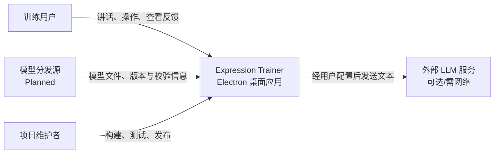

# Expression Trainer 架构入口

> 方法：arc42-lite + C4（Context/Container）+ ADR  
> 状态：Current Documentation Index
> 基线日期：2026-08-29
> 源码基线：当前开发分支，已包含 Phase 4 / R-01～R-09

## 1. 如何阅读

| 文档 | 回答的问题 | 生命周期 |
|---|---|---|
| [需求基线](../requirements/requirements.md) | 系统需要做什么？ | Existing 与 Planned 持续维护 |
| [当前架构](current.md) | 现在实际如何实现？ | 必须与可运行代码一致 |
| [目标架构](target.md) | 本轮迁移准备变成什么？ | 仅在迁移期间存在 |
| [ADR](adr/README.md) | 为什么做出关键决策？ | 永久保留，变更时 Supersede |
| [Roadmap](../roadmap.md) | 按什么顺序落地？ | 随执行状态更新 |
| [支持矩阵](../support-matrix.md) | 首发平台和验证边界是什么？ | 随制品证据提升等级 |

迁移完成后，应把已实现的目标内容合并进 `current.md`，再归档或删除失去意义的 `target.md`；ADR 不删除。

## 2. 架构目标

1. 保留已经克制的技术栈：Electron + 原生 JS/HTML/CSS + Sherpa-ONNX。
2. 将 Audio、ASR、Analysis、LLM、UI 分成少量且边界明确的职责。
3. 降低最终用户安装、模型获取、应用升级和跨平台发布成本。
4. 让第三方 ASR 模型与 LLM 服务成为可替换件，但不建设通用插件框架。
5. 先用测试和 benchmark 建立证据，再接受关键 ADR。

## 3. 关键质量属性

优先级从高到低：

1. 可维护性与可复现构建
2. 音频正确性与识别体验
3. 安装/升级简单性
4. UI/Main 响应性与故障隔离
5. 跨平台可验证性
6. 安全、隐私与可诊断性

## 4. C4 Level 1：系统上下文



系统边界内完成麦克风采集、本地 ASR、词库分析、设置和结果展示；LLM 请求与模型下载是明确的外部依赖。

## 5. 架构原则

- **总体复杂度优先**：不为减少 Electron 体积而默认引入 Rust/C++/FFI 或第二套 UI 技术栈。
- **必要边界，不造框架**：Provider 是小型契约，不是依赖注入容器；Model Manager 是清单 + 文件操作，不是模型平台。
- **事实先于结论**：候选 benchmark 结果与产品默认决策分别记录；当前 ADR-0005 保留 Paraformer 默认。
- **渐进迁移**：先包住现有行为，再替换内部实现；每一步都应保持可运行和可回退。
- **用户零开发依赖**：开发者可使用 Node/npm/Forge，最终用户不安装 Node、Python 或编译工具链。
- **当前即事实**：代码变化应同步更新 `current.md`；未来意图只写入 `target.md` 或 Proposed ADR。

## 6. 当前状态摘要

源码确认当前链路为：

```text
Renderer/Web Audio → 10-block 有界队列 → Preload/IPC → Main Router
                                                        ↓
                                            ASR utility process
                                                        ↓
                                          sherpa-onnx-node/Paraformer
```

停止尾部文本、LLM 请求控制、安全渲染、ASR session/Provider、AudioCapture、AudioWorklet、10-block 有界音频发送、utility-process 推理隔离、版本化模型自动准备和原子配置持久化已完成；真实 Electron smoke 覆盖执行单元退出报告与下一 session 重建。剩余技术债主要是逐块 invoke/structured-clone 复制、真实模型与设备性能证据、可导出诊断以及打包交付未闭环。详情见 [current.md](current.md)。

## 7. 目标状态摘要

目标保留 Electron 和原生 Web UI，同时形成：

```text
Renderer UI + Chromium graph/AudioWorklet collector
                ↓ 有界音频流
Preload 最小桥接 → Main（窗口/设置/生命周期/模型协调）
                              ↓
                    独立 ASR 执行单元
                              ↓
                 轻量 AsrProvider + Sherpa-ONNX
                              ↓
                   可版本化 Model Manager
```

详细模块、数据流、错误处理和迁移约束见 [target.md](target.md)。

## 8. 决策状态快照

| ADR | 状态 | 摘要 |
|---|---|---|
| [0001](adr/0001-retain-electron-and-native-web-stack.md) | Accepted | 保留 Electron + 原生 Web 技术栈 |
| [0002](adr/0002-retain-sherpa-onnx.md) | Accepted | 保留 Sherpa-ONNX 作为默认 ASR 引擎 |
| [0003](adr/0003-separate-audio-and-asr.md) | Accepted | 分离 Audio 与 ASR，使用轻量契约 |
| [0004](adr/0004-manage-models-separately.md) | Accepted | 模型与应用解耦并校验安装 |
| [0005](adr/0005-select-default-asr-model-by-benchmark.md) | Accepted | 保留 Paraformer 默认，候选结果作为后续优化基线 |
| [0006](adr/0006-move-asr-out-of-main.md) | Accepted | 使用单个 Electron utility process 隔离 ASR |
| [0007](adr/0007-package-with-electron-forge.md) | Proposed | 使用 Electron Forge 打包发布 |
| [0008](adr/0008-keep-benchmark-as-isolated-non-shipping-tool.md) | Accepted | 核心 benchmark 同仓库隔离保留，一次性数据流程归档 |

## 9. 文档维护规则

- 每个 PR 若改变运行边界、数据流、外部依赖或模型策略，必须检查架构文档。
- Accepted ADR 不改写结论；新建 ADR 并把旧 ADR 标为 Superseded。
- `TBD` 必须对应 Roadmap 中的核验任务；已确认后删除标记并附提交/测试证据。
- Mermaid 图只维护 C4 Context/Container 两级；没有必要时不增加 Component/Code 图。
