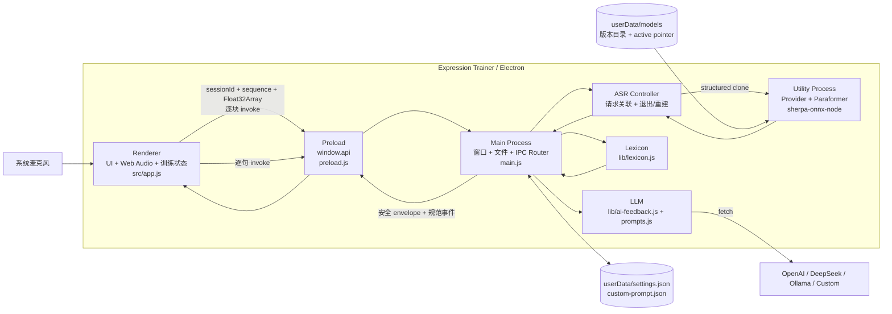

# 当前架构（As-Is）

> 状态：Verified from Source + Electron 43 Smoke；内部开发/测试，BM-02/D-03 Completed，Phase 4 / R-01～R-09 Completed（保留 Paraformer 默认）
> 基线日期：2026-08-29
> 仓库：`https://github.com/morigejile/expression-trainer-pro.git`  
> 描述对象：截至 Phase 4 / R-09；保留 Electron 43 与 T-04～T-08 行为基线

## 1. 证据边界

本文件检查了当前源码、README、依赖清单和 Git 状态，并完成 Node 测试、自动化 Electron smoke 与 D-03 native-load spike。smoke 实际加载 Main、Preload、主页面和设置页，通过真实 utility-process IPC 验证 Fake ASR session/event、活动执行单元退出后的安全失败和下一 session 重建，并覆盖协调式 Fake LLM 与粘贴分析；隐藏 fixture 窗口还在真实 Electron 43 AudioWorklet/OfflineAudioContext 中验证 16/44.1/48 kHz 双声道时变输入适配到 16 kHz、320 帧分块和时序过渡。尚未连接真实麦克风、初始化/运行真实 Paraformer 模型或请求真实 LLM，因此隔离/固定图证据与真实设备/完整识别运行严格区分。

| 标记 | 含义 |
|---|---|
| **Source-verified** | 可由当前本地源码、配置或 Git 状态直接确认 |
| **Runtime-TBD** | 需要真实启动、设备、模型、网络或性能测试确认 |
| **Product-TBD** | 需要产品选择，代码不能回答 |

核心文件：

```text
main.js                         Electron Main、窗口、设置、IPC、ASR/分析/LLM 调度
preload.js                      contextBridge API
src/index.html / app.js         主 UI、录音、训练状态和展示
src/safe-rendering.js           安全高亮 token、DOM 渲染、报告允许列表和 HTML 转义
src/settings.html / settings.js LLM 设置
src/prompt-editor.html          自定义训练规则
shared/expression-rules.js      Renderer 高亮与 Main 分析共用的确定性规则
lib/asr-provider.js             initialize/start/feed/stop/cancel/dispose 契约校验
lib/asr-session.js              单 active session、输入/事件 sequence 与规范事件
lib/asr-ipc.js                  ASR command 校验、安全 envelope 与错误归一化
lib/asr-process-controller.js   utility process 请求、退出、重建与有界关闭
lib/asr-utility-process.js      独立 Provider/Sherpa 执行入口
lib/managed-asr-provider.js     版本化默认模型准备、native 探测、激活与一次回退
lib/fake-asr-provider.js        业务与 smoke 使用的 session-aware Fake Provider
lib/asr.js                      Paraformer adapter；封装 Sherpa、role 文件路径和固定配置
lib/model-manager.js            模型下载、校验、安装锁、原子发布/激活和回退
models/registry.json            默认产品模型的版本、兼容性、来源与 hash
src/asr-event-state.js          Renderer 侧 session/sequence 过滤与失效
src/audio-capture.js            麦克风、16 kHz context、AudioWorklet、epoch/flush 与资源生命周期
src/audio-chunk-collector.mjs   可变量子下混、320 帧汇集和非空 tail
src/audio-worklet.mjs           AudioWorklet port/epoch 适配层
src/audio-feed-queue.js         10-block 串行队列、drain、overrun 与指标
lib/lexicon.js                  本地确定性文本分析
lib/ai-feedback.js              多 LLM 后端 fetch
lib/prompts.js                  实时反馈/报告 prompt
lib/settings-config.js          设置默认值、解析和 schema 迁移纯函数
lib/custom-prompt-config.js     自定义规则 schema、迁移与有界口癖解析
lib/atomic-json-store.js        userData JSON 的同盘原子写
lib/safe-log.js                 有界错误文本与凭据模式脱敏
data/*.json                     词库数据
package.json / package-lock.json
test/electron-smoke.test.js      Node 测试父进程、超时、日志和清理
smoke/electron-smoke-runner.js  Electron 内 smoke 驱动与 Fake ASR/LLM
benchmark/run.js                 独立 benchmark CLI；不进入生产 ASR/Audio/IPC/Main 路径
benchmark/lib/*.js               manifest、CER、metrics、environment、results 与 adapter 契约
```

## 2. 当前目标与范围

当前系统实现两条输入路径：

```text
麦克风 → 本地 ASR ┐
                  ├→ 词库分析 → 可选 LLM 实时反馈/报告 → UI/Markdown
粘贴逐字稿 ───────┘
```

应用支持训练开始/暂停/继续/结束、partial/final 字幕、填充词/犹豫词/笼统词/表达密度统计、精准词建议、自定义训练规则、LLM 反馈、原文/报告复制和 Markdown 保存。

它没有大型前端框架、独立后端、数据库或微服务。问题不是业务模块过多，而是音频、ASR、Electron Main、模型、安全和交付边界仍停留在原型工程阶段。

## 3. 当前技术栈与版本

| 区域 | 当前选择 | 证据/备注 |
|---|---|---|
| 应用 | `expression-trainer` / product `宇宙无敌表达训练` / `1.0.0` | `package.json`；版本与 README/代码注释的 V2 口径未治理 |
| 桌面运行时 | Electron `43.4.1`（精确版本） | 当前 lock 与 `node_modules` 一致；Windows x64 实测内置 Node 24.18.1、Chromium 150.0.7871.224、modules ABI 148、N-API 10 |
| UI | 原生 HTML/CSS/JavaScript | 无 bundler/前端框架 |
| 音频 | 独立 AudioCapture：`getUserMedia` + `AudioContext({sampleRate:16000,latencyHint:'interactive'})` | Renderer 只编排 session/UI；请求/context/可用 track rate 可诊断 |
| 音频节点 | AudioWorklet + 320 帧 mono Float32 collector | capture epoch 隔离暂停前旧块；正常 stop flush tail；固定 Electron fixture 覆盖 16/44.1/48 kHz |
| 权限桥接 | Preload `contextBridge` + `ipcRenderer.invoke` | `contextIsolation:true`、`nodeIntegration:false` |
| ASR 引擎 | `sherpa-onnx-node` `1.13.3`（精确版本） | 仅由 utility process 内的 Paraformer Provider 延迟加载，Main 不 require；packaged native-load smoke 已通过 |
| ASR 模型 | `paraformer-bilingual-zh-en/2024-03-10` | registry 固定 archive/runtime；INT8 encoder/decoder + tokens 安装到 `userData/models`，权重不纳入 Git |
| 本地分析 | `lib/lexicon.js` + `data/emotion-lexicon.json` | 最大正向词表匹配；`tiered-lexicon.json` 保留为未启用候选数据，不参与运行时分析 |
| LLM | Node 原生 `fetch`，OpenAI/DeepSeek/Ollama/自定义 OpenAI-compatible | 在 Main 中发请求；连接/实时/报告分别为 10/15/60 秒超时，并支持 AbortSignal、按 Renderer 取消和异常响应验证 |
| 设置 | `userData/settings.json`、`userData/custom-prompt.json` | 两者 schema version 1；旧结构迁移、未来 schema 防降级覆盖；小文件同步但以同盘临时文件/fsync/rename 原子发布；API Key 明文 |
| 输出 | Clipboard + Electron Save Dialog + Markdown | 原文与报告 |
| 构建/测试 | Node test + Electron smoke + Electron Forge 7.5/Squirrel | `package`/`make` 固定 Windows x64；packaged smoke 覆盖 Fake 产品流、utility-only Sherpa native load、完整 DLL unpack 和外部模型目录；尚无 CI |

开发工具基线固定为 Node 22.23.x/npm 12.0.x，与 Electron 内置 Node 24.18.1 明确区分。当前只验证 Windows 11 Home 25H2 build 26200 x64；PKG-01 已把 Windows 11 25H2+ x64 选为首个 Tier 1 目标。Windows ARM64、macOS 与 Linux 为 Experimental，仍没有 CI、打包配置或制品测试证明。

### 3.1 BM-02 harness（Completed）

BM-02 提供独立 benchmark CLI，用 manifest 输出每个 sample/repetition 的 JSONL、汇总 JSON/CSV、环境快照及 tag 分层统计；失败的 init、sample、timeout 和 dispose 事件也会被落盘。它不改动生产 `lib/asr.js`、Audio、IPC、Main 或默认模型，且没有新增依赖。2026-08-27，harness 在 clean commit `703f1630ba2bbcfcb98c914bc67c95e0b120ddc1` 上完成 Paraformer、small Zipformer 与 SenseVoiceSmall 各一轮 100 条比较，全部 0 失败；结果见 `docs/benchmark/bm02-comparison-2026-08-27.md`。维护者接受 ADR-0005 并保留现有 Paraformer 默认，因此生产代码无需切换；模型再分发许可仍是后续发布门禁。

当前源码已把 Zipformer Large CTC INT8 与 FireRedASR2 CTC INT8 加入 pending benchmark registry。前者通过现有 `zipformer-ctc` / `zipformer2Ctc` 在线适配契约；后者使用 `OfflineRecognizer` 的 `fireRedAsrCtc` 单模型配置，整段 16 kHz 单声道 utterance 只解码一次、只输出 final，并覆盖取消后下一调用的隔离。两者均尚未下载，没有文件 hash、native-load 或 benchmark 证据，也未进入生产模型选择；Paraformer 默认不变。

### 3.2 R-07/R-08 Model Manager 与生产接入（Completed）

产品层已有独立 `models/registry.json` 与 `lib/model-manager.js`，不依赖 `benchmark/`。registry 只固定 ADR-0005 接受的 Paraformer archive/runtime 文件 URL、大小和 SHA-256；模型安装位于 `userData/models`，使用跨 utility 安装锁、按年龄清理的同盘 `.staging`、流式下载大小上限、archive/runtime 双重校验、白名单解压、不可变 `model/version` 目录、active pointer 和显式上一版本 rollback。中断、错误 hash、解压失败或空间不足不会替换旧 active。

R-08 已由 Main 向正常 utility process 传入 `userData` 与 app version；Fake smoke 分支仍先行且不加载 Sherpa/Model Manager。生产 provider 解析 active 版本，无 active 时安装但不立即激活；只有 role 路径通过 Paraformer native 初始化后才更新 active。当前版本损坏或 native 加载失败时，上一版本也先 native 探测，成功后才切换指针，且不循环回退。初始化可取消并使用独立 30 分钟预算。内部阶段 `.tar.bz2` 默认调用系统 `tar`；真实 1 GB archive、系统工具可用性和首次安装行为是 PKG-03 待办。

### 3.3 PKG-02 Windows x64 packaging（Completed）

`forge.config.js` 是唯一打包配置：只构建 Windows x64 Squirrel，排除 docs/test/benchmark 等开发树，并使用 ASAR；整个 `sherpa-onnx-win-x64` 目录保持 unpack，确保 `.node` 与四个相邻 DLL 的加载关系不被破坏。模型不进入应用资源，继续位于 `userData/models`。

干净 `npm ci → npm run make` 已生成 `ExpressionTrainerSetup.exe`、`ExpressionTrainer-1.0.0-full.nupkg` 与 `RELEASES`。`smoke:package` 在未安装目录制品上验证 Fake 产品流程、utility process 中的 Sherpa native load、native 文件集合和不创建模型目录。安装器执行、真实约 1 GB Paraformer 下载/系统 `tar`/初始化及离线二次启动属于 PKG-03。

## 4. C4 Level 2：当前容器/运行边界



Main 负责 Electron 控制面、词库分析、小型 userData JSON 原子文件 I/O 和 LLM 请求编排；ASR 初始化与同步 decode 已移入单个 utility process。

## 5. 模块职责

### 5.1 Renderer / `src/app.js`

- 持有 `ExpressionTrainer` 的录音、暂停、计时、完整文本、句子和统计状态。
- 开始时创建 UUID `sessionId`，调用 `startASR({sessionId,sampleRateHz:16000})`，成功后再请求麦克风；初始化或麦克风失败显示字幕错误并使当前 ASR session 失效。
- 通过 `AudioCapture` 接收带 session/sequence/rate/channels/format/frames 的 320 帧或 final-tail chunk；暂停/恢复使用递增 capture epoch，旧 epoch 消息不消耗序列。
- 每块以 `feedAudio({sessionId,sequence,samples})` invoke 进入单发送者队列；总深度最多 10 块（200 ms），记录 peak/rejected/discarded/overrun，溢出以 `audio-overrun` 失败关闭而不静默丢音频。正常 stop 先 flush capture tail，再关闭入口并只调用一次 drain。
- 只接受当前 `sessionId` 且 event `sequence` 严格递增的 `ready/partial/final/error/stopped`；旧 session、重复/倒序、未知或 malformed 事件不产生 UI 副作用，`stopped` 使 session 失效。
- final 文本追加到 `fullText`，逐句做本地分析；每新增约 30 字触发一次 LLM 实时反馈。
- 展示 partial 临时字幕；final 与粘贴字幕通过 text node 和受控 `span` token 高亮词语，不解析输入中的 HTML。
- 支持粘贴逐字稿、生成报告、复制/保存原文和报告、清空当前内存状态。
- LLM 报告只渲染标题、加粗、行内代码、引用、普通行和换行等严格允许列表；LLM/HTTP 错误作为纯文本显示。

R-02 已建立 ASR session/event 状态，R-03/R-04 已把采集生命周期和 Web Audio 节点移出 `ExpressionTrainer`，但尚未形成覆盖权限、录音、分析等全部阶段的显式训练状态机。替换 session、启动/麦克风/worklet/feed 失败和清空会立即使旧 session 失效；正常 stop 使用单飞操作完成 tail flush、feed drain、ASR stop/final 和 UI 收尾。T-06 的 LLM pending 请求协调和 Renderer 代际过滤继续独立生效。

### 5.2 Preload / `preload.js`

使用 `contextBridge.exposeInMainWorld('api', ...)` 暴露设置、Prompt、ASR、分析、LLM 和文件保存共 17 个能力方法。BrowserWindow 均设置 `contextIsolation:true`、`nodeIntegration:false`。

关键事实：

- ASR 公开能力名为 `startASR`、`feedAudio`、`stopASR`、`cancelASR`；`feedAudio` 保留 command 元数据并把 samples 规范为 `Float32Array`，再逐块 `ipcRenderer.invoke('feed-audio', ...)`。
- LLM API 暴露反馈、报告、连接测试和显式取消；取消只作用于当前 Renderer 的 pending LLM 请求。
- ASR Router 对四类 command 做精确字段、非空 session、16 kHz、sequence、有限 Float32 样本等校验；settings、文本和 filename 等其他 payload 仍没有同等级 schema/大小校验。

### 5.3 Main / `main.js`

- 创建主窗口、设置 modal 和 Prompt 编辑窗口；设置应用菜单和生命周期。
- 同步读取并原子写入 `settings.json` 与 `custom-prompt.json`。
- 通过 settings/custom-prompt config 模块规范化、迁移旧 schema；损坏 JSON 回退默认值且不覆盖原文件，未来 schema 兼容读取但不被旧版本自动写回。
- 在启动时同步加载词库。
- 注册所有 IPC handlers。
- 仅在显式 `--smoke-test` 参数下让 utility process 组合最小 Fake ASR，并在 Main 组合 Fake LLM、临时 `userData` 和自动驱动；正常启动向 utility process 传入 `userData`/app version 并组合 managed Paraformer Provider。
- `start-asr`、`feed-audio`、`stop-asr`、`cancel-asr` 通过 ASR Router 与 Controller 返回安全 envelope；Main 不加载 `lib/asr.js` 或 Sherpa。执行单元退出会拒绝 pending 命令，下一次 start 重新创建；应用退出最多等待 5 秒 dispose 后强杀。
- `analyze-text` 在 Main 中执行本地分析。
- `get-realtime-feedback`、`get-final-report` 和连接测试在 Main 中发起受超时约束的 fetch；同一 Renderer 的同类新请求会取消旧请求，显式取消可终止该 Renderer 的全部 LLM 请求。
- `save-file` 通过系统对话框把 Markdown 写到用户选择的位置。

设置和 Prompt 文件仍使用同步 API，但数据量很小，写入通过同目录临时文件、fsync 与 rename 防止中断留下半文件；只有实测 Main 卡顿时才改异步 store。

### 5.4 ASR Provider / `lib/asr-provider.js`、`lib/asr-session.js`、`lib/asr.js`

R-08 后，Main 只持有同一 Provider 契约形状的 `AsrProcessController`；实际 session wrapper、managed provider、Paraformer adapter、Sherpa 对象和模型均位于 utility process。`lib/asr-session.js` 维护单一 active session：start 创建 session 并发出 `ready`，feed 验证连续 input sequence 并发出 `partial/final/error`，stop flush 后发出可选 `final` 和必有 `stopped`，cancel 不 flush 且发出 `stopped`。生产 `createParaformerAsrProvider()` 仍只支持一个并发识别流，其固定配置包括：

- 从 active/default 版本取得 encoder、decoder、tokens 的绝对 role 路径；
- feat sample rate 16000、feature dim 80；
- CPU、2 threads、greedy search、endpoint rules。

adapter `feed()` 总以 `sampleRate:16000` 调用 `acceptWaveform`，同步循环 decode，并保持 `{text,isFinal}` / `null` 结果；adapter `stop()` flush 并返回最后的未确认文本。重复 `initialize()` 复用 recognizer，session start 创建新 stream。`lib/fake-asr-provider.js` 通过同一 session wrapper 用于普通测试与 Electron smoke；没有加入多模型注册、通用依赖注入或新依赖。

T-04/R-02 后，`src/app.js` 会把当前 session 的 `final` 事件经 `mergeFinalText()` 去重后合并；非空尾部文本进入逐字稿、分析统计和后续报告，空文本或与 endpoint 相同的文本不会重复更新状态。`stopRecording()` 等待 stop envelope 中尾部 final 的本地分析完成，再开放报告操作；分析或取消失败显示安全错误，但 `finally` 仍复位录音状态和 UI。

### 5.5 Lexicon / `lib/lexicon.js`

启动时读取 `data/emotion-lexicon.json`，并结合代码内 FILLER/HEDGE/VAGUE 表执行最长 6 字的最大正向匹配。输出：

- `totalWords`；
- fillers/hedges/vagueWords/emotionWords 及位置；
- `density`；
- 替代和提醒 suggestions。

UI 的 `src/safe-rendering.js` 与 Main 的 `lib/lexicon.js` 共用 `shared/expression-rules.js`，以最长优先词匹配保持高亮与统计分类一致；自定义 `customWords` 经去重、长度和 64 项上限后作为本地 filler 参与统计，同时继续进入 LLM prompt。`data/tiered-lexicon.json` 当前未发现 import；它使用分层替代词 schema，与运行时 `emotion-lexicon.json` 不兼容，按维护者决定保留为未启用候选数据。启用前必须单独设计合并规则并建立行为测试。

### 5.6 LLM / `lib/ai-feedback.js`、`lib/prompts.js`

- Provider：OpenAI、DeepSeek、Ollama、自定义 OpenAI-compatible。
- OpenAI/DeepSeek endpoint 固定；Ollama 默认 localhost；自定义 base URL 自动追加 `/chat/completions`。
- 实时反馈 max_tokens 150；最终报告 8192；temperature 0.7。
- 自定义训练目标/规则/风格/口癖被附加到 prompt。

T-06 后的请求边界具有以下事实：

- 连接测试、实时反馈、最终报告的超时分别为 10、15、60 秒，并把 AbortSignal 传给原生 `fetch`；
- 同一 Renderer 的同类新请求会取消旧请求，会话边界可显式取消全部 pending LLM 请求；Main 协调层抑制不配合 AbortSignal 的迟到结果，Renderer 代际校验继续抑制取消前已完成 IPC 返回的旧结果；
- 无 Key、429、其他 HTTP 错误、超时、取消、坏 JSON，以及缺失 `choices[0].message.content` 均返回稳定错误；
- 不读取或透传 HTTP 错误正文，未知 fetch 异常被泛化，避免错误信息泄露 API Key、Authorization 或完整敏感响应；
- 没有自动重试。设置保存后才测试连接，测试失败不会回滚刚保存的配置。

### 5.7 设置与数据

`settings.json` 位于 Electron `userData`，当前 schema 是：

```text
schemaVersion: 1
provider
providers.openai     { apiKey, model }
providers.deepseek   { apiKey, model }
providers.ollama     { ollamaUrl, model }
providers.custom     { apiKey, baseUrl, model, customModel }
```

旧版扁平字段和缺失 provider 字段在加载时迁移为 schema version 1；损坏 JSON 使用默认配置运行并保留原文件，未知 provider 配置块不会在规范化时被删除。future schema 可读取已知子集但不会被旧应用降级写回。settings 与 custom-prompt 都使用同盘原子写，发布失败保留旧文件并清理临时文件。API Key 仍为明文；当前内部阶段不为此增加 native keychain 依赖，发布前再按平台成本评估。`custom-prompt.json` 保存 versioned goals、customRules、styleRef、customWords。训练文本、统计和报告仅在 Renderer 内存中，除非用户手动复制/保存。

### 5.8 Benchmark dataset boundary (BM-01)

长期契约由 `benchmark/datasets/manifest.schema.json` 和 `benchmark/lib/dataset-manifest.js` 维护。Validator 以 Node 内置模块执行 canonical realpath、打开后复检、SHA-256、RIFF/WAVE 16-bit PCM 元数据及来源/许可检查；该路径不接入产品 Main、Preload、Renderer 或 ASR。仓库内的 1 秒 16 kHz/单声道/16-bit PCM/1 kHz 合成 WAV 只用于契约测试，不代表人声或正式语料。

原始音频位于 Git 外的受控 dataset root，manifest 仅存相对音频路径和已脱敏元数据，不记录个人身份、联系方式、同意书原件或本机绝对路径。2026-08-27 已冻结 `expression-zh-fleurs/v1`：100 条人工核查终稿、1,201,680 ms、CC-BY-4.0 public-corpus，manifest SHA-256 `600bf66fe11273e0c34b5f8859f7a59efce6eddf607cf5fa13ad186cb0469593`。它满足当前简单候选比较的 ground-truth 输入要求；只覆盖 `mandarin`，不代表完整产品场景分层。

## 6. 当前关键数据流

### 6.1 音频到识别

```text
getUserMedia({audio:true})
→ new AudioContext({sampleRate:16000,latencyHint:'interactive'})
→ createMediaStreamSource
→ AudioWorkletNode('expression-trainer-audio-collector')
→ Chromium graph 将输入适配到 16 kHz
→ 可变量子多声道平均为 mono，汇集 320 帧 Float32 chunk / stop tail
→ feedAudio({sessionId,sequence,samples})
→ Preload 规范为 Float32Array
→ ipcRenderer.invoke('feed-audio')
→ Main ASR command 校验
→ AsrProcessController / utility process structured clone
→ stream.acceptWaveform({samples,sampleRate:16000})
→ synchronous decode/getResult/isEndpoint
→ {ok:true,events:[partial/final]}
→ Renderer session/sequence 过滤后更新 UI
```

AudioCapture 返回并保留请求值、`audioContext.sampleRate` 与可用的 track rate；实际 context 不是 16000 时在创建 worklet 前失败关闭。固定 Electron fixture 已证明 16/44.1/48 kHz 确定性缓冲进入 16 kHz graph 后的总帧数、平台均值与时间过渡；真实麦克风/驱动仍为 Runtime-TBD。

每个 320 样本块仍会在 Preload 规范为新的 TypedArray，并经 request/response IPC 与 utility-process structured clone 复制。D-03 证明该小块复制有充足空载吞吐，因此当前不增加共享内存；Renderer 队列严格限制 10 块并暴露 overrun/discarded/peak 指标。

### 6.2 结束与尾部文本

```text
Renderer 请求 AudioCapture flush，关闭队列入口并 drain 已接受 chunk
→ stopASR({sessionId}) / stop-asr
→ stream.inputFinished + decode
→ utility process 返回可选 final + stopped 事件
→ Renderer 过滤当前 session/sequence，并经 mergeFinalText 去重 final
→ 非空新文本进入字幕、统计、分析和报告
```

### 6.3 分析与 LLM

```text
endpoint/final sentence
→ analyze-text invoke → Main lexicon → stats/建议
→ 累计文本较上次反馈增加 >=30 字
→ get-realtime-feedback invoke → Main 受控 fetch → 成功时更新右侧反馈

停止/粘贴完成后用户点击生成报告
→ fullText + stats → Main fetch → Renderer 受控 Markdown token/DOM 渲染 → 可保存 Markdown
```

LLM 失败只返回安全的 `{success:false,error}`，不会修改本地词库结果；粘贴模式在请求 LLM 前完成本地分析，实时模式的分析 IPC 与 LLM IPC 也彼此独立。

Phase 0 已把 README 的反馈触发口径改为源码实际的约 30 字，并明确本地 ASR/词库与可选联网 LLM 的边界。

### 6.4 设置与 Prompt

```text
Settings/Prompt Renderer
→ Preload invoke
→ Main 同步读取、同盘原子写入 userData JSON
→ LLM 请求前重新读取
```

## 7. 部署与安装现状

- `package.json` 有开发、测试、benchmark、Forge package/make 与 packaged smoke scripts；没有 publish script。
- Electron Forge 7.5/Squirrel 已固定为 Windows x64 最小打包配置；没有 GitHub Actions。
- `models/` 跟踪版本化产品 registry；模型权重由首次 ASR 初始化自动下载、校验并安装到 `userData/models`。
- 已有 canonical 支持矩阵、Windows x64 首发选择和未签名内部安装制品；仍无真实安装/模型闭环、签名、公证、自动更新或升级/卸载数据保留测试。
- 原有 `package-lock.json` 清理已由负责人确认纳入 Phase 0；陈旧 `node-microphone` 条目已删除，lockfile 与 `package.json` 一致。
- 开发基线为 Node 22.23.0/npm 12.0.2。T-08 的 Electron 43.4.1 JS 依赖经 clean `npm ci` 安装；Electron 42+ 改为首次 CLI 调用时下载 binary，本轮首次 43.4.1 下载成功，后续 clean install 从官方校验缓存恢复相同 executable（SHA-256 `E885FFC2A09DAB4C14DE706E3662A5929D1E65EA4EA347C56FD0964640EB923B`）。显式清空所有 npm/Electron 缓存后的复跑仍为 Runtime-TBD。

这些发布级缺口及未确认的模型再分发权利在当前内部开发/测试中是非阻塞后续工作；若它们使本地技术实验无法运行或使结论失效，才需要提前处理。

## 8. 已确认技术债与风险

| ID | 风险 | 影响 | 证据 | 推荐验证/处理 |
|---|---|---|---|---|
| TD-01 | **R-06 已关闭结构风险**：ASR 初始化/decode 位于 utility process | Main 不加载 native addon；Fake smoke 覆盖退出报告和重建 | Controller tests、Electron smoke、D-03 spike | 真实 Paraformer 高负载下补量化响应数据 |
| TD-02 | **R-04 已关闭**：`ScriptProcessorNode` 已由 AudioWorklet/320 帧 collector 替换 | 废弃节点不再存在于生产/测试/smoke 路径 | 源码、collector tests、Electron smoke | 保留回归；不增加 fallback |
| TD-03 | **R-04 已缓解**：请求/context/track rate 可诊断，固定 Electron graph 已覆盖 16/44.1/48 kHz | 确定性图适配已有证据；真实麦克风/驱动差异仍未知 | AudioCapture tests 与 Electron graph fixture | 真实可配置设备作为非阻塞 follow-up；实测失败才评估 WASM 备选 |
| TD-04 | **R-05 已缓解**：逐块 TypedArray/invoke/structured-clone 仍复制，但队列为 10 块且可观测 | 不再无限增长或静默丢音频；复制成本仍需真实推理 profile | Queue/Renderer tests 与 D-03 spike | 只有真实 profile 证明必要时再换通道 |
| TD-05 | **R-06/PKG-02 已关闭当前边界**：Main 只持有 Controller，Provider/Sherpa/模型在 utility process | 退出可见、下一 start 重建；packaged Main 不加载 native addon | Controller tests、Electron smoke 与 packaged native-load smoke | PKG-03 验证真实 Paraformer 初始化循环 |
| TD-06 | **R-07/R-08 已关闭内部开发边界** | registry、校验、安装锁、原子安装/激活、native 成功后切换和一次安全回退已接入 utility process | Model Manager/managed provider 聚焦测试与产品 registry | PKG-03 验证真实 archive/system tar、native model 与首次/离线二次启动 |
| TD-07 | **T-04/R-02/R-04 已缓解**：stop 单飞执行 worklet tail flush、feed drain、ASR final 与分析；旧 session、迟到/倒序事件和清空/重启竞态受过滤 | 尾部语音进入字幕、统计、分析和报告；完整训练阶段状态机仍未建立 | AudioCapture、ASR event state 与 transcript 竞态回归测试 | 后续只在实际状态复杂度需要时收敛状态机 |
| TD-08 | 已有 Node/Electron/packaged smoke 与 Windows x64 Forge 打包，但无 CI | 已可发现启动、页面、Preload/IPC、ASR session/event、设置窗口、粘贴分析和 packaged native 回归；仍无法证明真实模型/麦克风、跨平台或安装升级 | 集成测试、Forge 配置与 PKG-02 制品 | PKG-03/PKG-04 接安装/模型闭环；OPS-01 再加 CI |
| TD-09 | **R-09 已关闭配置损坏/降级覆盖风险**；API Key 仍明文 | settings/custom-prompt 原子发布，损坏文件保留，future schema 不降级；明文凭据仍是发布前权衡 | atomic store、older/current/future schema 与脱敏测试 | PKG-04 验证安装升级；只有收益超过 native/跨平台成本时才采用 keychain |
| TD-10 | **R-02 已部分缓解**：ASR command 已校验精确字段、session、sequence、16 kHz 与有限样本；其他 IPC payload 仍缺少同等级校验 | settings、文本、filename 等大 payload 或类型错误仍可能影响 Main | ASR IPC 测试与其余 handler 源码确认 | 后续按当前具体风险逐 channel 限定类型/长度，不建设通用 schema 框架 |
| TD-11 | **T-05 已缓解**：ASR/粘贴文本使用受控 DOM token，LLM 报告使用严格允许列表，错误使用纯文本 | 主应用不再从不可信文本创建标签或事件属性 | `src/safe-rendering.js`、安全渲染测试、Electron smoke、`src/app.js` 无 `innerHTML` | 后续若词库改为外部数据，继续按不可信输入处理 |
| TD-12 | LLM fetch 控制风险已由 T-06 缓解；仍无自动重试 | 请求已有超时、取消、Main/Renderer 双层迟到抑制、结构验证和脱敏错误；瞬时失败仍需用户重试 | 25 项 fake-fetch 与 3 项 Renderer 竞态测试、源码确认 | 保留错误契约回归测试；是否重试需单独产品策略，不在请求层盲目加入 |
| TD-13 | **R-09 已关闭**：UI 高亮与 lexicon 使用唯一共享规则源 | 内置 filler/hedge/vague 分类一致；customWords 进入有界本地 filler 统计 | shared rule 与 lexicon 聚焦测试 | 新规则只修改 canonical shared 文件；候选 tiered lexicon 仍独立设计 |
| TD-14 | README 与实现漂移风险 | 用户预期错误 | Phase 0 已修正触发字数、联网边界和平台口径 | 后续行为变更同步 README 与架构文档 |
| TD-15 | 未启用候选词库容易被误认为运行时数据 | 维护者可能误删或直接接入不兼容 schema | `tiered-lexicon.json` 无 import，Phase 0 决定保留 | 明确标记未启用；在 T-01/T-02 后以独立任务设计 schema、合并规则和测试 |
| TD-16 | 版本口径不一致 | 发布历史和兼容性不清 | package 1.0.0、代码 V2、历史提交 v1.1 | SemVer + CHANGELOG + release policy |
| TD-17 | 生产依赖审计为 0；Forge 7.5/Squirrel 的仅开发传递依赖有 19 high/1 critical 告警 | 不进入应用运行依赖，但打包工具仍处理源码和制品；为避开 Forge 新版 `@electron/rebuild` 的 Git 依赖，本轮保留已验证的 registry-only 组合 | 2026-08-29 `npm audit --omit=dev --json` 为 0；完整 audit 为 20；未使用 `audit fix --force` 或通配 Git/script 放行 | OPS-03 以 registry-only 新组合受控升级；每次重跑干净 make 与 packaged native smoke |

## 9. 当前架构评价

### 应保留

- 单一 Electron 桌面应用，无独立服务端和数据库；
- 原生 JS/HTML/CSS；
- 本地 Sherpa-ONNX 路线；
- 本地确定性分析 + 可选 LLM 的降级结构；
- `contextIsolation:true`、`nodeIntegration:false` 的权限方向；
- 用户数据已位于 `userData` 而非安装目录。

### 应降低的偶然复杂度

- Audio 逐块 invoke、TypedArray 规范化与跨进程 structured-clone 复制；
- 真实模型路径/性能仍未闭环；utility-process 与 native addon 制品打包已闭环；
- 真实约 1 GB 模型下载、系统 `tar` 与 Paraformer 初始化尚未闭环；
- 非 ASR IPC 与完整训练状态仍缺少同等级边界；
- 安全编码、密钥、超时和输入验证不足；
- 安装、升级和 Experimental 平台支持仍不可复现；Windows Tier 1 已有内部制品但尚待首次安装/真实模型闭环。

结论：当前项目不是“架构过重”，而是“核心闭环已存在，产品工程边界尚未收敛”。推荐渐进重构，不推倒重写。

## 10. 仍需运行验证

1. 在显式清空 npm 与 Electron 下载缓存的独立环境复跑 Electron 43 首次 CLI 下载；当前首次 43.4.1 下载和后续校验缓存恢复均成功。
2. 验证当前模型下载源、大小、hash、许可证和三个文件的兼容性。
3. 自动 Electron smoke 已覆盖 BrowserWindow、17 项 Preload API、设置页、utility-process Fake ASR 的 session/event、stale feed、强制退出报告与重建、Fake LLM、粘贴分析以及 16/44.1/48 kHz graph fixture，并确认 Main 不加载真实 Sherpa。PKG-02 进一步证明打包后的 utility process 可加载 native addon；真实 Paraformer 模型循环、设置持久化、报告保存对话框、麦克风和人工交互仍需运行验证。
4. 以真实可配置的 16/44.1/48 kHz 麦克风/驱动复核已记录的请求、context 与 track rate；该项为非阻塞 follow-up。
5. profile TD-01～TD-04 的 Main 延迟、GC、CPU、RAM 和队列。
6. 在 Windows 11 25H2+ x64 完成 Forge 安装/升级闭环；其他 OS/arch 在各自产生 package/smoke/native-model 证据前保持 Experimental。
