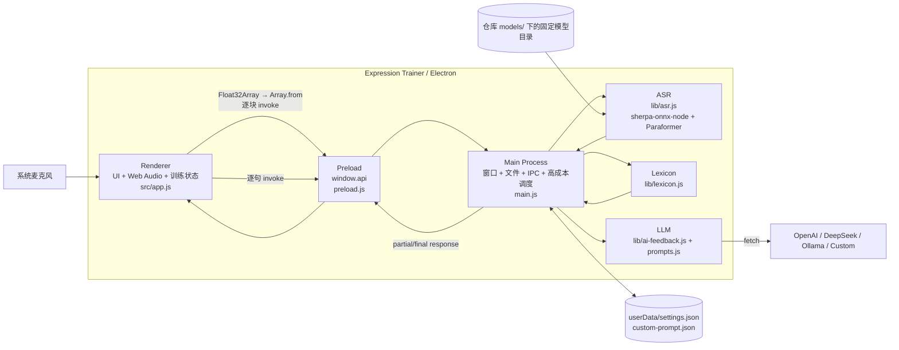

# 当前架构（As-Is）

> 状态：Verified from Source（尚未完成运行验收）  
> 基线日期：2026-08-22
> 仓库：`https://github.com/morigejile/expression-trainer-pro.git`  
> 描述对象：Phase 0 实现 `b16a1d0bf799887cf7ece1283d73463961346030`（本地 `chore/reproducible-build`）；已确认并纳入原有 `package-lock.json` 清理

## 1. 证据边界

本文件检查了 `D:\Codex_projects\expression-trainer-pro` 的源码、README、依赖清单和 Git 状态，并完成依赖安装、语法检查与桌面启动 smoke。尚未连接麦克风、加载 ASR 模型或请求真实 LLM，因此“代码存在”“启动通过”与“完整运行通过”严格区分。

| 标记 | 含义 |
|---|---|
| **Source-verified** | 可由当前本地源码、配置或 Git 状态直接确认 |
| **Runtime-TBD** | 需要真实启动、设备、模型、网络或性能测试确认 |
| **Product-TBD** | 需要产品选择，代码不能回答 |

核心文件：

```text
main.js                         Electron Main、窗口、设置、IPC、ASR/分析/LLM 调度
preload.js                      contextBridge API
src/index.html / app.js         主 UI、录音、训练状态和展示
src/settings.html / settings.js LLM 设置
src/prompt-editor.html          自定义训练规则
lib/asr.js                      Sherpa + Paraformer 具体集成
lib/lexicon.js                  本地确定性文本分析
lib/ai-feedback.js              多 LLM 后端 fetch
lib/prompts.js                  实时反馈/报告 prompt
data/*.json                     词库数据
package.json / package-lock.json
```

## 2. 当前目标与范围

当前系统实现两条输入路径：

```text
麦克风 → 本地 ASR ┐
                  ├→ 词库分析 → 可选 LLM 实时反馈/报告 → UI/Markdown
粘贴逐字稿 ───────┘
```

应用支持训练开始/暂停/继续/结束、partial/final 字幕、填充词/犹豫词/笼统词/表达密度统计、精准词建议、自定义训练规则、LLM 反馈、原文/报告复制和 Markdown 保存。

它没有大型前端框架、独立后端、数据库或微服务。问题不是业务模块过多，而是音频、ASR、Electron Main、模型、安全和交付边界仍停留在原型工程阶段。

## 3. 当前技术栈与版本

| 区域 | 当前选择 | 证据/备注 |
|---|---|---|
| 应用 | `expression-trainer` / product `宇宙无敌表达训练` / `1.0.0` | `package.json`；版本与 README/代码注释的 V2 口径未治理 |
| 桌面运行时 | Electron `^33.0.0` | 当前 lock 与 `node_modules` 为 33.4.11；正式构建仍需记录 Node/npm/OS |
| UI | 原生 HTML/CSS/JavaScript | 无 bundler/前端框架 |
| 音频 | Renderer 中 `getUserMedia` + `AudioContext({sampleRate:16000})` | `src/app.js` |
| 音频节点 | `createScriptProcessor(4096, 1, 1)` | 已废弃 API；无显式 resampler |
| 权限桥接 | Preload `contextBridge` + `ipcRenderer.invoke` | `contextIsolation:true`、`nodeIntegration:false` |
| ASR 引擎 | `sherpa-onnx-node` `^1.10.0` | 当前 lock 与 `node_modules` 为 1.13.3；Main 中加载 |
| ASR 模型 | `sherpa-onnx-streaming-paraformer-bilingual-zh-en` | 固定目录；INT8 encoder/decoder + tokens；模型未纳入 Git |
| 本地分析 | `lib/lexicon.js` + `data/emotion-lexicon.json` | 最大正向词表匹配；`tiered-lexicon.json` 保留为未启用候选数据，不参与运行时分析 |
| LLM | Node 原生 `fetch`，OpenAI/DeepSeek/Ollama/自定义 OpenAI-compatible | 在 Main 中发请求；无超时/AbortController |
| 设置 | `userData/settings.json`、`userData/custom-prompt.json` | 同步 JSON 文件；API Key 明文；有旧扁平结构迁移 |
| 输出 | Clipboard + Electron Save Dialog + Markdown | 原文与报告 |
| 构建/测试 | scripts 为 `start`、`dev`、`check` | `check` 使用 Node 语法检查；无 test/build/package/CI 配置 |

开发基线已固定为 Node 22.23.x/npm 12.0.x，并只记录 Windows NT 10.0.26200.0 x64 的本轮验证；macOS/Linux 与正式最低 Windows 版本没有 CI、打包配置或制品测试证明。

## 4. C4 Level 2：当前容器/运行边界



Main 既是 Electron 控制面，又直接执行同步 ASR decode、词库分析、同步文件 I/O 和 LLM 请求编排。

## 5. 模块职责

### 5.1 Renderer / `src/app.js`

- 持有 `ExpressionTrainer` 的录音、暂停、计时、完整文本、句子和统计状态。
- 开始时先 `initASR()`，再请求麦克风；初始化或麦克风失败显示字幕错误。
- 创建 16 kHz 意图的 AudioContext 和 4096 帧 ScriptProcessor。
- 在每个 `onaudioprocess` 中等待一次 `feedAudio` invoke；暂停仅跳过 feed，MediaStream/AudioContext 仍运行。
- endpoint/final 文本追加到 `fullText`，逐句做本地分析；每新增约 30 字触发一次 LLM 实时反馈。
- 展示 partial 临时字幕；final 字幕高亮词语。
- 支持粘贴逐字稿、生成报告、复制/保存原文和报告、清空当前内存状态。

当前没有显式 session ID 或训练状态机。连续调用、迟到异步反馈、stop 与 pending feed 的竞态依赖 UI 按钮和事件时序。

### 5.2 Preload / `preload.js`

使用 `contextBridge.exposeInMainWorld('api', ...)` 暴露设置、Prompt、ASR、分析、LLM 和文件保存共 16 个左右的能力方法。BrowserWindow 均设置 `contextIsolation:true`、`nodeIntegration:false`。

关键事实：

- `feedAudio` 在 Preload 中执行 `Array.from(samples)`，再 `ipcRenderer.invoke('feed-audio', ...)`。
- 暴露的 `onASRResult/removeASRListener` 监听 `asr-result`，但 Main 没有发现对应 `webContents.send`，属于疑似死接口。
- Preload 和 Main 对 settings、文本、filename、音频数组等 payload 没有 schema/大小校验。

### 5.3 Main / `main.js`

- 创建主窗口、设置 modal 和 Prompt 编辑窗口；设置应用菜单和生命周期。
- 同步读写 `settings.json` 与 `custom-prompt.json`。
- 在启动时同步加载词库。
- 注册所有 IPC handlers。
- `init-asr`、`feed-audio`、`stop-asr` 直接调用 `lib/asr.js`；ASR 完全位于 Main。
- `analyze-text` 在 Main 中执行本地分析。
- `get-realtime-feedback`、`get-final-report` 和连接测试在 Main 中发起 fetch。
- `save-file` 通过系统对话框把 Markdown 写到用户选择的位置。

`session` 被 import 但未使用；文件读写使用同步 API。它们不是首要性能瓶颈，但反映了 Main 职责持续累积。

### 5.4 ASR / `lib/asr.js`

全局持有单一 `recognizer`、`stream`、`isRunning`，只支持一个并发会话。固定配置包括：

- 模型目录 `models/sherpa-onnx-streaming-paraformer-bilingual-zh-en`；
- `encoder.int8.onnx`、`decoder.int8.onnx`、`tokens.txt`；
- feat sample rate 16000、feature dim 80；
- CPU、2 threads、greedy search、endpoint rules。

`feedAudio` 总以 `sampleRate:16000` 调用 `acceptWaveform`，同步循环 decode，并返回 `{text,isFinal}`。`stopRecognition` 会 flush 并返回最后的未确认文本。

重要缺陷：`main.js` 把最后文本包装为 `{success, finalText}`，但 `src/app.js` 在停止时忽略返回值，因此未形成 endpoint 的尾部文本可能丢失，也不会进入统计/报告。

### 5.5 Lexicon / `lib/lexicon.js`

启动时读取 `data/emotion-lexicon.json`，并结合代码内 FILLER/HEDGE/VAGUE 表执行最长 6 字的最大正向匹配。输出：

- `totalWords`；
- fillers/hedges/vagueWords/emotionWords 及位置；
- `density`；
- 替代和提醒 suggestions。

UI 的 `highlightText` 另有一套硬编码词表/正则，与 `lib/lexicon.js` 不完全同源，存在规则漂移风险。`data/tiered-lexicon.json` 当前未发现 import；它使用分层替代词 schema，与运行时 `emotion-lexicon.json` 不兼容，按维护者决定保留为未启用候选数据。启用前必须单独设计合并规则并建立行为测试。

### 5.6 LLM / `lib/ai-feedback.js`、`lib/prompts.js`

- Provider：OpenAI、DeepSeek、Ollama、自定义 OpenAI-compatible。
- OpenAI/DeepSeek endpoint 固定；Ollama 默认 localhost；自定义 base URL 自动追加 `/chat/completions`。
- 实时反馈 max_tokens 150；最终报告 8192；temperature 0.7。
- 自定义训练目标/规则/风格/口癖被附加到 prompt。

没有请求超时、取消、重试或响应 schema 防御；错误响应 body 被拼入错误消息。设置保存后才测试连接，测试失败不会回滚刚保存的配置。

### 5.7 设置与数据

`settings.json` 位于 Electron `userData`，当前 schema 是：

```text
provider
providers.openai     { apiKey, model }
providers.deepseek   { apiKey, model }
providers.ollama     { ollamaUrl, model }
providers.custom     { apiKey, baseUrl, model/customModel }
```

旧版扁平字段在加载时迁移为 per-provider 结构，但没有显式 `schemaVersion`。API Key 明文保存。`custom-prompt.json` 保存 goals、customRules、styleRef、customWords。训练文本、统计和报告仅在 Renderer 内存中，除非用户手动复制/保存。

## 6. 当前关键数据流

### 6.1 音频到识别

```text
getUserMedia({audio:true})
→ new AudioContext({sampleRate:16000})
→ createMediaStreamSource
→ createScriptProcessor(4096,1,1)
→ inputBuffer.getChannelData(0) : Float32Array
→ Preload Array.from(samples)
→ ipcRenderer.invoke('feed-audio')
→ Main new Float32Array(samplesArray)
→ stream.acceptWaveform({samples,sampleRate:16000})
→ synchronous decode/getResult/isEndpoint
→ invoke response
→ partial 或 endpoint/final UI
```

源码没有显式 resampler，也没有检查 `audioContext.sampleRate` 是否实际为 16000。Chromium/OS 是否满足请求属于 Runtime-TBD；一旦实际值不是 16000，代码仍把样本声明为 16000。

每个 4096 样本块都发生 TypedArray → 普通 Array → structured clone → TypedArray，并采用 request/response IPC。没有显式有界队列、背压或丢块指标。

### 6.2 结束与尾部文本

```text
Renderer 断开/关闭音频资源
→ stop-asr
→ stream.inputFinished + decode
→ Main 返回 finalText
→ Renderer 忽略返回值   # 已确认缺陷
```

### 6.3 分析与 LLM

```text
endpoint/final sentence
→ analyze-text invoke → Main lexicon → stats/建议
→ 累计文本较上次反馈增加 >=30 字
→ get-realtime-feedback invoke → Main fetch → 右侧反馈

停止/粘贴完成后用户点击生成报告
→ fullText + stats → Main fetch → Renderer innerHTML 格式化 → 可保存 Markdown
```

Phase 0 已把 README 的反馈触发口径改为源码实际的约 30 字，并明确本地 ASR/词库与可选联网 LLM 的边界。

### 6.4 设置与 Prompt

```text
Settings/Prompt Renderer
→ Preload invoke
→ Main 同步 JSON 读写 userData
→ LLM 请求前重新读取
```

## 7. 部署与安装现状

- `package.json` 有 `start`、`dev`、`check`；无 test/build/package/make/publish scripts。
- 没有 Electron Forge/electron-builder 配置，没有 GitHub Actions。
- `models/` 仅跟踪 `.gitkeep`；README 要求用户手工下载和解压模型。
- 无安装包、签名、公证、自动更新、升级/卸载数据保留测试或正式支持矩阵。
- 原有 `package-lock.json` 清理已由负责人确认纳入 Phase 0；陈旧 `node-microphone` 条目已删除，lockfile 与 `package.json` 一致。
- 开发基线为 Node 22.23.0/npm 12.0.2；连续两次 clean `npm ci` 的安装树和 Electron 二进制 hash 一致。两次均使用已校验的官方 Electron 下载缓存；2026-08-22 的空缓存网络探测在 GitHub 下载阶段等待约 10 分钟后中止，仍为非阻塞 Runtime-TBD。

## 8. 已确认技术债与风险

| ID | 风险 | 影响 | 证据 | 推荐验证/处理 |
|---|---|---|---|---|
| TD-01 | ASR 在 Main 同步初始化/decode | Main 控制面阻塞；native 故障影响应用 | 源码确认 | event-loop 指标、故障注入后移出 Main |
| TD-02 | `ScriptProcessorNode` | 废弃 API；音频依赖 Renderer 线程 | 源码确认 | AudioWorklet 对照测试 |
| TD-03 | 无显式重采样且强制声明 16 kHz | 实际设备率不符时识别速度/准确率错误 | 源码确认风险 | 记录实际率，频率/时长 fixture |
| TD-04 | 每块 Array.from + invoke + 重建 TypedArray | 复制、GC、IPC 延迟 | 源码确认 | profile 后改 TypedArray/MessagePort/有界流 |
| TD-05 | 全局单例 ASR + 模型/路径/参数写死 | 替换、测试、并发和恢复困难 | 源码确认 | 先抽轻量契约，保留现有行为 |
| TD-06 | 模型完全手工管理 | 首次安装、升级、校验和支持成本高 | README/models 确认 | Model Manager + hash + 原子安装 |
| TD-07 | 停止时 finalText 被忽略 | 尾部语音丢失，报告不完整 | 源码确认 | session/去重测试并合并 stop 结果 |
| TD-08 | 仅有语法检查和启动 smoke，无测试、CI、打包脚本 | 仍无法证明重构、跨平台或发布可用 | 仓库与 Phase 0 验证 | 最小 Node test + smoke + Forge |
| TD-09 | API Key 明文保存、无 schemaVersion | 凭据暴露与升级迁移风险 | 源码确认 | 权限/凭据策略 ADR，版本化配置 |
| TD-10 | IPC payload 无校验 | 大 payload、类型错误或不可信输入影响 Main | 源码确认 | 每个 channel 限定类型/长度/session |
| TD-11 | ASR/粘贴/LLM 文本进入 `innerHTML` 未统一转义 | HTML 注入/XSS，尤其粘贴文本和远程 LLM 输出 | 源码确认 | DOM text nodes/允许列表 sanitizer + 测试 |
| TD-12 | LLM fetch 无 timeout/cancel/schema 验证 | 请求悬挂、迟到反馈、异常响应导致错误 | 源码确认 | AbortController、session、响应验证 |
| TD-13 | UI 高亮词表与 lexicon 规则重复 | 显示和统计不一致 | 源码确认 | 统一由分析结果驱动高亮或共享规则 |
| TD-14 | README 与实现漂移风险 | 用户预期错误 | Phase 0 已修正触发字数、联网边界和平台口径 | 后续行为变更同步 README 与架构文档 |
| TD-15 | 未启用候选词库容易被误认为运行时数据 | 维护者可能误删或直接接入不兼容 schema | `tiered-lexicon.json` 无 import，Phase 0 决定保留 | 明确标记未启用；在 T-01/T-02 后以独立任务设计 schema、合并规则和测试 |
| TD-16 | 版本口径不一致 | 发布历史和兼容性不清 | package 1.0.0、代码 V2、历史提交 v1.1 | SemVer + CHANGELOG + release policy |
| TD-17 | Electron 33 依赖树存在已知安全告警 | `npm audit` 汇总为 `electron` 与传递依赖 `extract-zip` 两个 high 风险节点 | 2026-08-22，Node 22.23.0/npm 12.0.2；`boolean@3.2.0` 仅废弃且未被列为漏洞 | T-01/T-07 后执行受控 Electron 大版本升级，不运行 `npm audit fix --force` |

## 9. 当前架构评价

### 应保留

- 单一 Electron 桌面应用，无独立服务端和数据库；
- 原生 JS/HTML/CSS；
- 本地 Sherpa-ONNX 路线；
- 本地确定性分析 + 可选 LLM 的降级结构；
- `contextIsolation:true`、`nodeIntegration:false` 的权限方向；
- 用户数据已位于 `userData` 而非安装目录。

### 应降低的偶然复杂度

- Audio 采样契约不清和重复复制；
- ASR 具体模型、全局状态和 Main 生命周期耦合；
- 用户手工模型管理；
- IPC/异步会话缺少明确协议；
- 安全编码、密钥、超时和输入验证不足；
- 构建、测试、打包、升级和支持矩阵不可复现。

结论：当前项目不是“架构过重”，而是“核心闭环已存在，产品工程边界尚未收敛”。推荐渐进重构，不推倒重写。

## 10. 仍需运行验证

1. 在空 Electron 下载缓存的独立环境复跑 `npm ci`；当前已验证两次 clean `node_modules` 安装，但使用了经过 SHA-256 校验的缓存。
2. 验证当前模型下载源、大小、hash、许可证和三个文件的兼容性。
3. 启动应用并检查 BrowserWindow、设置迁移、粘贴分析和报告保存。
4. 在 44.1/48 kHz 设备记录 `audioContext.sampleRate` 与 ASR 接收时序。
5. profile TD-01～TD-04 的 Main 延迟、GC、CPU、RAM 和队列。
6. 在目标 macOS/Linux/Windows 版本验证安装与运行；在证据前继续保持 TBD，不作支持承诺。
