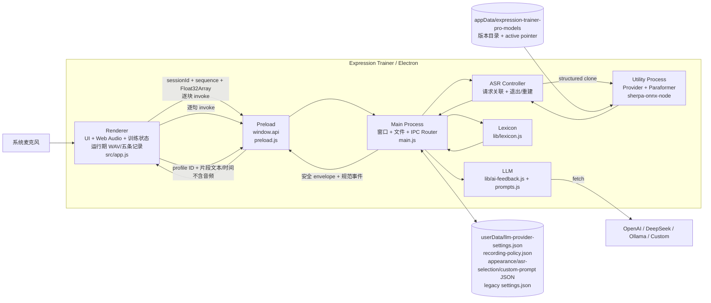

# 当前架构（As-Is）

> 状态：Verified from Source + Electron 43 / packaged smoke；内部开发/测试，录音回放、结构化同步分析、三款 streaming ASR、模型管理和内部包内默认资格已实现；公开模型分发仍受外部门禁约束
> 基线日期：2026-09-01
> 仓库：`https://github.com/morigejile/expression-trainer-pro.git`  
> 描述对象：当前集成分支的产品运行时、开发工具边界与已验证的内部安装基线

## 1. 证据边界

当前事实来自源码、依赖清单和 Git 状态，并由 Node 测试、Electron smoke、packaged native-load、真实 Paraformer 首次安装及升级 smoke 支持。已验证 Main/Preload/Renderer、utility-process IPC、执行单元退出与重建、Fake LLM、粘贴分析、首次录音告知、运行期 WAV 回放与结构化片段分析，以及 Electron AudioWorklet 对 16/44.1/48 kHz fixture 的适配。真实可配置麦克风、真实外部 LLM、接近资格线硬件及非 Windows x64 制品仍未形成证据。

| 标记 | 含义 |
|---|---|
| **Source-verified** | 可由当前本地源码、配置或 Git 状态直接确认 |
| **Runtime-TBD** | 需要真实启动、设备、模型、网络或性能测试确认 |
| **Product-TBD** | 需要产品选择，代码不能回答 |

核心文件：

```text
main.js                         Electron Main、窗口、设置、IPC、ASR/分析/LLM 调度
preload.js                      contextBridge API
src/index.html / app.js         主 UI、录音、训练状态和展示
src/pcm-wav.js                  Renderer 内 Float32→Int16、20 分钟有界累积和 WAV Blob
src/training-records.js         Renderer 内五条记录队列、Blob URL 释放和片段定位
src/safe-rendering.js           安全高亮 token、DOM 渲染、报告允许列表和 HTML 转义
src/settings.html / settings.js 外观与 LLM 设置
src/appearance.js               Renderer 根节点主题/布局应用与广播订阅
src/prompt-editor.html          自定义训练规则
shared/expression-rules.js      Renderer 高亮与 Main 分析共用的确定性规则
lib/asr-provider.js             initialize/start/feed/stop/cancel/dispose 契约校验
lib/asr-session.js              单 active session、输入/事件 sequence 与规范事件
lib/asr-ipc.js                  ASR command 校验、安全 envelope 与错误归一化
lib/asr-process-controller.js   utility process 请求、退出、重建与有界关闭
lib/asr-utility-process.js      独立 Provider/Sherpa 执行入口
lib/managed-asr-provider.js     版本化默认模型准备、native 探测、激活与一次回退
lib/fake-asr-provider.js        业务与 smoke 使用的 session-aware Fake Provider
lib/asr.js                      Paraformer adapter；封装 Sherpa、role 文件路径和固定配置
lib/model-manager.js            模型下载、校验、安装锁、原子发布/激活和回退
models/registry.json            默认产品模型的版本、兼容性、来源与 hash
src/asr-event-state.js          Renderer 侧 session/sequence 过滤与失效
src/audio-capture.js            麦克风、16 kHz context、AudioWorklet、epoch/flush 与资源生命周期
src/audio-chunk-collector.mjs   可变量子下混、320 帧汇集和非空 tail
src/audio-worklet.mjs           AudioWorklet port/epoch 适配层
src/audio-feed-queue.js         10-block 串行队列、drain、overrun 与指标
lib/lexicon.js                  本地确定性文本分析
lib/ai-feedback.js              多 LLM 后端 fetch
lib/playback-analysis.js        结构化回放分析响应的严格校验
lib/prompts.js                  实时反馈/报告/回放分析 prompt
lib/llm-provider-config.js      LLM provider 默认值、解析和 schema 迁移纯函数
lib/llm-provider-store.js       LLM provider 文件选择、单向迁移和 future-schema 保存保护
lib/recording-policy-store.js   首次录音策略确认布尔值的原子存储
lib/appearance-config.js        四主题/双布局外观 schema 规范化
lib/appearance-store.js         appearance.json 读取、原子保存和 future-schema 保护
lib/window-bounds.js            主显示器逻辑工作区初始尺寸计算
lib/model-catalog.js            schema-v2 产品 Catalog 的严格加载与冻结
lib/asr-provider-factory.js     受信任 streaming Provider 创建边界
lib/asr-selection-store.js      asr-selection.json 读取与原子保存
lib/asr-model-service.js        启动恢复、单 controller 切换与失败回退
lib/model-install-controller.js 独立安装任务、进度、取消和重试
lib/asr-model-management*.js    模型操作路由、脱敏状态与受限设置窗口 IPC
lib/custom-prompt-config.js     自定义规则 schema、迁移与有界口癖解析
lib/atomic-json-store.js        userData JSON 的同盘原子写
lib/safe-log.js                 有界错误文本与凭据模式脱敏
lib/diagnostics.js              固定白名单的 app/OS/model/audio/ASR 诊断快照
lib/ipc-input.js                非 ASR 文本、报告统计和 Markdown 保存输入边界
data/emotion-lexicon.json       运行时情绪词数据
package.json / package-lock.json
test/electron-smoke.test.js      Node 测试父进程、超时、日志和清理
smoke/electron-smoke-runner.js  Electron 内 smoke 驱动与 Fake ASR/LLM
benchmark/run.js                 独立 benchmark CLI；不进入生产 ASR/Audio/IPC/Main 路径
benchmark/lib/*.js               manifest、CER、metrics、environment、results 与 adapter 契约
```

## 2. 当前目标与范围

当前系统实现两条输入路径：

```text
麦克风 → 本地 ASR ┐
                  ├→ 词库分析 → 可选 LLM 实时反馈/报告 → UI/Markdown
粘贴逐字稿 ───────┘
   └→ Renderer-only Int16/WAV（最多五条）→ 本地回放
ASR 最终片段 + 时间 → 结构化 LLM 回放分析 → 随播放进度显示
```

应用支持训练开始/暂停/继续/结束、运行期最近五条录音回放、片段级同步建议、多组 LLM profile、partial/final 字幕、填充词/犹豫词/笼统词/表达密度统计、精准词建议、自定义训练规则、LLM 反馈、原文/报告复制和 Markdown 保存。

它没有大型前端框架、独立后端、数据库或微服务。音频、ASR、模型、配置和交付边界已从原型职责中拆开；Renderer 的训练编排仍集中在 `ExpressionTrainer`。

## 3. 当前技术栈与版本

| 区域 | 当前选择 | 证据/备注 |
|---|---|---|
| 应用 | `expression-trainer` / product `宇宙无敌表达训练` / `1.0.1` | `package.json#version` 是应用与制品唯一版本源；CHANGELOG 和最小 release checklist 已建立 |
| 桌面运行时 | Electron `43.4.1`（精确版本） | 当前 lock 与 `node_modules` 一致；Windows x64 实测内置 Node 24.18.1、Chromium 150.0.7871.224、modules ABI 148、N-API 10 |
| UI | 原生 HTML/CSS/JavaScript | 无 bundler/前端框架 |
| 音频 | 独立 AudioCapture：`getUserMedia` + `AudioContext({sampleRate:16000,latencyHint:'interactive'})` | Float32 继续送本地 ASR，同时在 Renderer 转为有界 Int16；完成后只保留 WAV Blob URL；请求/context/可用 track rate 可诊断 |
| 音频节点 | AudioWorklet + 320 帧 mono Float32 collector | capture epoch 隔离暂停前旧块；正常 stop flush tail；固定 Electron fixture 覆盖 16/44.1/48 kHz |
| 权限桥接 | Preload `contextBridge` + `ipcRenderer.invoke` | `contextIsolation:true`、`nodeIntegration:false` |
| ASR 引擎 | `sherpa-onnx-node` `1.13.3`（精确版本） | 仅由 utility process 内的 Paraformer Provider 延迟加载，Main 不 require；packaged native-load smoke 已通过 |
| ASR 模型 | Paraformer、Zipformer Small、Zipformer Large | schema-v2 Catalog 固定 archive/runtime；模型安装到 `appData/expression-trainer-pro-models`，权重不纳入 Git；当前 Catalog 默认是 Zipformer Large，但公开分发仍受许可约束 |
| 本地分析 | `lib/lexicon.js` + `data/emotion-lexicon.json` + `shared/expression-rules.js` | 146 个情绪词；16 个填充词、14 个犹豫词、20 组笼统词映射由 Renderer/Main 共用；未启用数据不放入活跃 `data/` 目录 |
| LLM | Node 原生 `fetch`，OpenAI/DeepSeek/Ollama/自定义 OpenAI-compatible | 在 Main 中发请求；连接/实时/报告/回放分析有独立超时，支持 AbortSignal、按 Renderer 取消和严格结构化响应验证；回放请求不含音频 |
| 设置 | `userData/appearance.json`、`userData/asr-selection.json`、`userData/llm-provider-settings.json`、`userData/recording-policy.json`、legacy `userData/settings.json`、`userData/custom-prompt.json` | Appearance、ASR 选择、多 LLM profile 与录音策略确认各自持久化且互不覆盖；只持久化确认布尔值，不保存录音内容；小文件原子发布；API Key 明文 |
| 输出 | Clipboard + Electron Save Dialog + Markdown | 原文与报告 |
| 构建/测试 | Node test + Electron smoke + Electron Forge 7.5/Squirrel | `package`/`make` 固定 Windows x64；packaged smoke 覆盖 Fake 产品流、utility-only Sherpa native load、完整 DLL unpack 和外部模型目录；尚无 CI |

开发工具基线固定为 Node 24.20.0/npm 11.19.0；npm 版本跟随 Node Active LTS 官方捆绑版本，与 Electron 内置 Node 24.18.1 明确区分。当前只验证 Windows 11 Home 25H2 build 26200 x64；PKG-01 已把 Windows 11 25H2+ x64 选为首个 Tier 1 目标。Windows ARM64、macOS 与 Linux 为 Experimental，仍没有 CI、打包配置或制品测试证明。

### 3.1 Benchmark 与模型决策

独立 benchmark CLI 从 manifest 生成逐样本结果、汇总和环境快照，不进入产品 Audio/IPC/Main。BM-02～BM-04 已完成七候选同机比较，ADR-0009 据此采用 Zipformer Large 技术默认。候选具有固定 runtime hash、native-load 和 benchmark 证据，但再分发状态仍为 `not-approved`。

### 3.2 Model Manager 与生产模型

产品层以 `models/registry.json` 作为唯一 schema-v2 Catalog，不依赖 `benchmark/`。Catalog 只描述三款 streaming 模型；Factory 只接受代码内冻结的 Paraformer 与 online CTC Provider 类型。模型安装到 `appData/expression-trainer-pro-models`（Windows 为 `%APPDATA%\expression-trainer-pro-models`），与可能本地化的 Electron `userData` 路径分离；旧 `userData/models` 在目标不存在时整目录迁移，双目录并存时拒绝覆盖。模型经过大小和 hash 校验、白名单解压、不可变版本发布与 native 初始化后才激活；中断、空间不足或校验失败不替换上一可用版本。

`AsrModelService` 按严格命令行覆盖、持久选择、Catalog 默认值启动，并保证任意时刻最多一个识别 utility。模型切换先验证目标，再销毁旧 controller；失败时创建新的原模型 controller 回退，双失败进入 unavailable。安装由独立短生命周期 utility 执行，支持有界进度、取消和重试，不占用当前识别 controller。模型管理 IPC 只允许设置窗口调用四个固定 channel，Renderer 只接收脱敏快照并提交精确模型 ID。

### 3.3 Packaging、安装与升级

`forge.config.js` 是唯一打包配置，当前只构建 Windows x64 Squirrel；native Sherpa bundle 保持 ASAR unpack，模型位于 `appData/expression-trainer-pro-models`。内部制品已验证安装、真实模型首次准备、强制离线二次启动、1.0.0→1.0.1 前向升级和卸载数据保留，终端用户无需开发工具。

受支持更新路径是向前安装。手工运行旧完整 Setup 可能降级应用二进制，并可能用旧 schema 覆盖共享用户文件；重新运行当前 Setup 只能恢复应用版本，不能恢复已被覆盖的数据。该已知边界保留在支持文档，不为内部阶段增加 updater 框架。

ASR-M04a 增加显式内部构建入口：从 Git 外的绝对归档路径读取 Catalog 默认模型，校验精确字节数和 SHA-256，只把固定 `asr-models/<modelId>/<version>/<archive>` 加入 Forge `extraResource`。普通 `package`/`make` 仍不携带模型；Main 只从 `process.resourcesPath` 派生受信任包内归档位置，ModelManager 复用既有 staging、双重校验、白名单解压、原子发布和 native 初始化后激活事务。运行时始终从 `appData/expression-trainer-pro-models` 加载，不直接使用只读应用资源。

## 4. C4 Level 2：当前容器/运行边界



Main 负责 Electron 控制面、词库分析、小型 userData JSON 原子文件 I/O 和 LLM 请求编排；ASR 初始化与同步 decode 已移入单个 utility process。

## 5. 模块职责

### 5.1 Renderer / `src/app.js`

- 持有 `ExpressionTrainer` 的录音、暂停、计时、完整文本、句子和统计状态。
- 开始时创建 UUID `sessionId`，调用 `startASR({sessionId,sampleRateHz:16000})`，成功后再请求麦克风；初始化或麦克风失败显示字幕错误并使当前 ASR session 失效。
- 通过 `AudioCapture` 接收带 session/sequence/rate/channels/format/frames 的 320 帧或 final-tail chunk；暂停/恢复使用递增 capture epoch，旧 epoch 消息不消耗序列。
- 同一 Float32 chunk 在 Renderer 转为 Int16 并进入单条最多 19,200,000 帧的有界录音缓冲；WAV 建立后释放 PCM 分块，只在内存中保留 Blob URL。最多保存五条已完成记录，第六条和删除/退出都会撤销对应 URL。
- 每块以 `feedAudio({sessionId,sequence,samples})` invoke 进入单发送者队列；总深度最多 10 块（200 ms），记录 peak/rejected/discarded/overrun，溢出以 `audio-overrun` 失败关闭而不静默丢音频。正常 stop 先 flush capture tail，再关闭入口并只调用一次 drain。
- 只接受当前 `sessionId` 且 event `sequence` 严格递增的 `ready/partial/final/error/stopped`；旧 session、重复/倒序、未知或 malformed 事件不产生 UI 副作用，`stopped` 使 session 失效。
- final 文本追加到 `fullText`，逐句做本地分析；每新增约 30 字触发一次 LLM 实时反馈。
- final 文本同时形成单调、不重叠的片段时间轴。原生播放器按片段 ID 边界切换字幕高亮和最近一次成功建议；播放与拖动不触发模型推理，空格快捷键会排除表单控件、音频控件、弹窗和重复按键。
- 首次录音在麦克风权限前等待用户确认运行期保留政策。完成记录后自动用当前 profile 分析一次；切换 profile 只更新选择，用户点击“重新分析”才发起请求，失败或迟到响应不覆盖旧结果。
- 展示 partial 临时字幕；final 与粘贴字幕通过 text node 和受控 `span` token 高亮词语，不解析输入中的 HTML。
- 支持粘贴逐字稿、生成报告、复制/保存原文和报告、清空当前内存状态。
- LLM 报告只渲染标题、加粗、行内代码、引用、普通行和换行等严格允许列表；LLM/HTTP 错误作为纯文本显示。
- `src/appearance.js` 只更新根节点 `data-theme`/`data-layout`；四套主题共用语义 CSS token，广播不会移动或重建训练 DOM。
- 主页面使用同一套 stage/coach/insights DOM 实现 coach-rail 与 focus-hud；代表性最小、标准和宽屏尺寸已验证控件、计时、训练状态、滚动和字幕区域保持稳定。
- 操作图标使用继承 `currentColor` 的内联 SVG；字幕循环发光、计时器循环呼吸和装饰性 DJ 元素已移除，并保留键盘焦点与减少动态效果偏好。

R-02 已建立 ASR session/event 状态，R-03/R-04 已把采集生命周期和 Web Audio 节点移出 `ExpressionTrainer`，但尚未形成覆盖权限、录音、分析等全部阶段的显式训练状态机。替换 session、启动/麦克风/worklet/feed 失败和清空会立即使旧 session 失效；正常 stop 使用单飞操作完成 tail flush、feed drain、ASR stop/final 和 UI 收尾。T-06 的 LLM pending 请求协调和 Renderer 代际过滤继续独立生效。

### 5.2 Preload / `preload.js`

使用 `contextBridge.exposeInMainWorld('api', ...)` 暴露 Appearance、设置、Prompt、ASR、分析、LLM、录音策略和文件保存等显式能力。BrowserWindow 均设置 `contextIsolation:true`、`nodeIntegration:false`。

关键事实：

- ASR 公开能力名为 `startASR`、`feedAudio`、`stopASR`、`cancelASR`；`feedAudio` 保留 command 元数据并把 samples 规范为 `Float32Array`，再逐块 `ipcRenderer.invoke('feed-audio', ...)`。
- LLM API 暴露反馈、报告、结构化回放分析、脱敏 profile 摘要/选择、连接测试和显式取消；主训练窗口不能读取 Key 或完整 endpoint，取消只作用于当前 Renderer 的 pending LLM 请求。
- 录音策略 API 只读取和确认一个布尔值；音频 Blob、PCM、时间轴和分析结果均不经过该设置边界。
- Appearance API 暴露读取、显式保存和带精确 listener 清理的变更订阅；Renderer 只接收规范化的 `{schemaVersion,theme,layout}`。
- ASR Router 对四类 command 做精确字段、非空 session、16 kHz、sequence、有限 Float32 样本等校验；文本分析、实时反馈、最终报告和 Markdown 保存另有轻量类型、大小、统计字段和文件名边界。settings/custom-prompt 继续由各自配置模块规范化，尚无外层 payload 大小上限。

### 5.3 Main / `main.js`

- 根据主显示器逻辑工作区计算主窗口初始尺寸并限制在既定范围内，保留 960×640 最小尺寸并居中；创建设置 modal 和 Prompt 编辑窗口，设置应用菜单和生命周期。
- 独立读取和原子写入 `appearance.json`；保存后向存活窗口广播规范化外观，失败不广播且不影响训练流程。
- 同步读取并原子写入 `llm-provider-settings.json` 与 `custom-prompt.json`；只在 canonical LLM provider 文件不存在时读取 legacy `settings.json`。
- 通过 LLM provider/custom-prompt config 模块规范化、迁移旧 schema；损坏 JSON 回退默认值且不覆盖原文件。LLM provider 的 canonical 或 legacy future schema 可读取已知字段，但显式保存返回 `unsupported-schema-version`；迁移不删除旧文件，也不做双向同步。
- 在启动时同步加载词库。
- 注册所有 IPC handlers。
- 仅在显式 `--smoke-test` 参数下让 utility process 组合最小 Fake ASR，并在 Main 组合 Fake LLM、临时 `userData` 和自动驱动；正常启动向 utility process 传入 `userData`、app version、受信任模型选择及可选包内默认归档，由 managed provider 和 Factory 创建 Catalog 对应的 streaming Provider。
- `start-asr`、`feed-audio`、`stop-asr`、`cancel-asr` 通过 ASR Router 与 Controller 返回安全 envelope；Main 不加载 `lib/asr.js` 或 Sherpa。执行单元退出会拒绝 pending 命令，下一次 start 重新创建；应用退出最多等待 5 秒 dispose 后强杀。
- `analyze-text` 在 Main 中执行本地分析。
- `get-realtime-feedback`、`get-final-report`、`analyze-playback` 和连接测试在 Main 中发起受超时约束的 fetch；回放分析只接受受限 profile ID 与经过大小、数量、唯一 ID 和时间范围校验的文本片段。同一 Renderer 的同类新请求会取消旧请求，显式取消可终止该 Renderer 的全部 LLM 请求。
- `save-file` 通过系统对话框把 Markdown 写到用户选择的位置。

设置和 Prompt 文件仍使用同步 API，但数据量很小，写入通过同目录临时文件、fsync 与 rename 防止中断留下半文件；只有实测 Main 卡顿时才改异步 store。

### 5.4 ASR Provider / session、managed provider 与 Factory

Main 只持有 `AsrProcessController`；实际 session wrapper、managed provider、Sherpa adapter、模型安装和模型对象均位于 utility process。`lib/asr-session.js` 维护单一 active session：start 创建 session 并发出 `ready`，feed 验证连续 input sequence 并发出 `partial/final/error`，stop flush 后发出可选 `final` 和必有 `stopped`，cancel 不 flush 且发出 `stopped`。

`lib/asr-provider-factory.js` 只接受 Catalog 中代码支持的 provider type：Paraformer 由 `lib/asr.js` 创建，Zipformer Small/Large 由 `lib/zipformer-ctc-asr-provider.js` 创建。`lib/managed-asr-provider.js` 从选中模型的不可变 active 版本取得 role 文件，完成准备和 native 初始化后才把 Provider 交给 session wrapper；Factory 不接收 Renderer 提供的路径、URL、hash 或 provider type。

三款 Provider 均只支持一个并发识别流，使用 16 kHz mono Float32 输入、CPU、2 threads 和 greedy search。Paraformer 从 encoder、decoder、tokens role 创建 recognizer；Zipformer 从 model、tokens 及可选 BPE role 创建 online CTC recognizer。adapter `feed()` 同步 decode 并返回 `{text,isFinal}` / `null`，`stop()` flush 最后的未确认文本。重复 `initialize()` 复用 recognizer，session start 创建新 stream。`lib/fake-asr-provider.js` 通过同一 session wrapper 用于普通测试与 Electron smoke；没有通用插件系统或依赖注入容器。

T-04/R-02 后，`src/app.js` 会把当前 session 的 `final` 事件经 `mergeFinalText()` 去重后合并；非空尾部文本进入逐字稿、分析统计和后续报告，空文本或与 endpoint 相同的文本不会重复更新状态。`stopRecording()` 等待 stop envelope 中尾部 final 的本地分析完成，再开放报告操作；分析或取消失败显示安全错误，但 `finally` 仍复位录音状态和 UI。

### 5.5 Lexicon / `lib/lexicon.js`

启动时读取 `data/emotion-lexicon.json`，并结合代码内 FILLER/HEDGE/VAGUE 表执行最长 6 字的最大正向匹配。输出：

- `totalWords`；
- fillers/hedges/vagueWords/emotionWords 及位置；
- `density`；
- 替代和提醒 suggestions。

UI 的 `src/safe-rendering.js` 与 Main 的 `lib/lexicon.js` 共用唯一运行时规则源 `shared/expression-rules.js`，以最长优先词匹配保持高亮与统计分类一致；自定义 `customWords` 经去重、长度和 64 项上限后作为本地 filler 参与统计，同时继续进入 LLM prompt。`data/emotion-lexicon.json` 只保留 `lib/lexicon.js` 实际读取的情绪词与元数据；未启用且 schema 不兼容的分层候选词库已从活跃数据树和发布载荷移除。

### 5.6 LLM / `lib/ai-feedback.js`、`lib/prompts.js`

- Provider：OpenAI、DeepSeek、Ollama、自定义 OpenAI-compatible。
- OpenAI/DeepSeek endpoint 固定；Ollama 默认 localhost；自定义 base URL 自动追加 `/chat/completions`。
- 实时反馈 max_tokens 150；最终报告 8192；回放分析 4096；回放分析使用较低 temperature 并要求精确 JSON 结构。
- 自定义训练目标/规则/风格/口癖被附加到 prompt。

T-06 后的请求边界具有以下事实：

- 连接测试、实时反馈、最终报告的超时分别为 10、15、60 秒，并把 AbortSignal 传给原生 `fetch`；
- 同一 Renderer 的同类新请求会取消旧请求，会话边界可显式取消全部 pending LLM 请求；Main 协调层抑制不配合 AbortSignal 的迟到结果，Renderer 代际校验继续抑制取消前已完成 IPC 返回的旧结果；
- 无 Key、429、其他 HTTP 错误、超时、取消、坏 JSON，以及缺失 `choices[0].message.content` 均返回稳定错误；
- 回放分析结果只接受请求中存在且不重复的 segment ID、精确字段和有界建议文本；Main 返回实际使用的 profile ID/name/provider/model 摘要。请求只含文本与时间，不含 PCM、WAV、Blob URL 或路径；
- 不读取或透传 HTTP 错误正文，未知 fetch 异常被泛化，避免错误信息泄露 API Key、Authorization 或完整敏感响应；
- 没有自动重试。设置页的“保存设置”和“测试连接”是独立动作：保存只校验并持久化当前草稿，测试只验证当前草稿且不保存；两者分别显示忙碌状态和安全错误原因。

### 5.7 设置与数据

`llm-provider-settings.json` 位于 Electron `userData`，当前 schema 是：

```text
schemaVersion: 2
activeProfileId
profiles[] { id, name, provider, apiKey, model, ollamaUrl, baseUrl, customModel }
```

旧 schema-v1 provider 配置和旧文件名 `settings.json` 在读取时单向迁移为一个或多个具名 profile；canonical 文件优先，迁移后不删除 legacy 文件，也不按时间戳合并。设置页可新建、复制、重命名、选择、测试、保存和删除 profile，并始终保留至少一个。损坏 JSON 使用默认配置运行并保留原文件；canonical 或 legacy future schema 可读取已知子集，显式保存则返回稳定错误且不写文件。LLM profile 与 custom-prompt 都使用同盘原子写，发布失败保留旧文件并清理临时文件。API Key 仍为明文；当前内部阶段不为此增加 native keychain 依赖，发布前再按平台成本评估。`custom-prompt.json` 保存 versioned goals、customRules、styleRef、customWords。

`recording-policy.json` 只保存 `{schemaVersion:1,acknowledged:true}`。录音、逐字稿片段时间轴、本地统计和回放分析只存在于 Renderer 内存；关闭窗口释放全部五条记录和 Blob URL，不形成跨重启训练历史。用户主动复制或保存的原文/报告仍沿用现有明确操作边界。

`appearance.json` 只保存四个主题和两个布局标识；缺失、损坏或未知值回退 Graphite/coach-rail，future schema 可读取已知值但拒绝显式保存。`asr-selection.json` 只保存 `selectedModelId`；缺失或稳定损坏在默认模型成功后原子恢复，瞬时初始化失败不改写选择。外观和模型操作都独立于 LLM 保存/连接测试。

### 5.8 Benchmark dataset boundary (BM-01)

长期契约由 `benchmark/datasets/manifest.schema.json` 和 `benchmark/lib/dataset-manifest.js` 维护。Validator 以 Node 内置模块执行 canonical realpath、打开后复检、SHA-256、RIFF/WAVE 16-bit PCM 元数据及来源/许可检查；该路径不接入产品 Main、Preload、Renderer 或 ASR。仓库内的 1 秒 16 kHz/单声道/16-bit PCM/1 kHz 合成 WAV 只用于契约测试，不代表人声或正式语料。

原始音频位于 Git 外的受控 dataset root，manifest 仅存相对音频路径和已脱敏元数据，不记录个人身份、联系方式、同意书原件或本机绝对路径。2026-08-27 已冻结 `expression-zh-fleurs/v1`：100 条人工核查终稿、1,201,680 ms、CC-BY-4.0 public-corpus，manifest SHA-256 `600bf66fe11273e0c34b5f8859f7a59efce6eddf607cf5fa13ad186cb0469593`。它满足当前简单候选比较的 ground-truth 输入要求；只覆盖 `mandarin`，不代表完整产品场景分层。

## 6. 当前关键数据流

### 6.1 音频到识别

```text
getUserMedia({audio:true})
→ new AudioContext({sampleRate:16000,latencyHint:'interactive'})
→ createMediaStreamSource
→ AudioWorkletNode('expression-trainer-audio-collector')
→ Chromium graph 将输入适配到 16 kHz
→ 可变量子多声道平均为 mono，汇集 320 帧 Float32 chunk / stop tail
├→ feedAudio({sessionId,sequence,samples})
→ Preload 规范为 Float32Array
→ ipcRenderer.invoke('feed-audio')
→ Main ASR command 校验
→ AsrProcessController / utility process structured clone
→ stream.acceptWaveform({samples,sampleRate:16000})
→ synchronous decode/getResult/isEndpoint
→ {ok:true,events:[partial/final]}
→ Renderer session/sequence 过滤后更新 UI
└→ Renderer Float32→Int16 → 当前有界 PCM 录音缓冲（不经 IPC）
```

AudioCapture 返回并保留请求值、`audioContext.sampleRate` 与可用的 track rate；实际 context 不是 16000 时在创建 worklet 前失败关闭。固定 Electron fixture 已证明 16/44.1/48 kHz 确定性缓冲进入 16 kHz graph 后的总帧数、平台均值与时间过渡；真实麦克风/驱动仍为 Runtime-TBD。

每个 320 样本块仍会在 Preload 规范为新的 TypedArray，并经 request/response IPC 与 utility-process structured clone 复制。D-03 证明该小块复制有充足空载吞吐，因此当前不增加共享内存；Renderer 队列严格限制 10 块并暴露 overrun/discarded/peak 指标。

### 6.2 结束与尾部文本

```text
Renderer 请求 AudioCapture flush，关闭队列入口并 drain 已接受 chunk
→ stopASR({sessionId}) / stop-asr
→ stream.inputFinished + decode
→ utility process 返回可选 final + stopped 事件
→ Renderer 过滤当前 session/sequence，并经 mergeFinalText 去重 final
→ 非空新文本进入字幕、统计、片段时间轴、分析和报告
→ Renderer 组装 16-bit mono WAV Blob，释放 PCM 分块
→ 加入最近五条内存队列；第六条撤销最老 Blob URL
→ 原生播放器显示当前记录；应用退出撤销全部 URL
```

### 6.3 分析与 LLM

```text
endpoint/final sentence
→ analyze-text invoke → Main lexicon → stats/建议
→ 累计文本较上次反馈增加 >=30 字
→ get-realtime-feedback invoke → Main 受控 fetch → 成功时更新右侧反馈

停止/粘贴完成后用户点击生成报告
→ fullText + stats → Main fetch → Renderer 受控 Markdown token/DOM 渲染 → 可保存 Markdown

录音正常结束后自动分析，或用户选择 profile 后点击“重新分析”
→ Renderer 提交 {profileId, segments:[{id,text,startMs,endMs}]}，不提交音频
→ Preload / Main 校验输入并从设置读取完整 profile 快照
→ Main 结构化 LLM fetch → 严格校验 segment ID/JSON/长度
→ Renderer 仅在请求代际和当前记录仍匹配时整体替换上次成功结果
→ 播放/拖动跨越片段边界时更新当前字幕与建议，不再次推理
```

LLM 失败只返回安全的 `{success:false,error}`，不会修改本地词库结果或覆盖上一份成功的回放分析；粘贴模式在请求 LLM 前完成本地分析，实时模式的分析 IPC 与 LLM IPC 也彼此独立。

Phase 0 已把 README 的反馈触发口径改为源码实际的约 30 字，并明确本地 ASR/词库与可选联网 LLM 的边界。

### 6.4 设置与 Prompt

```text
Settings/Prompt Renderer
→ Preload invoke
→ Main 同步读取、同盘原子写入 userData JSON
→ LLM 请求前重新读取

首次录音
→ Renderer 读取 recording-policy.json 的确认布尔值
→ 未确认时先显示阻塞说明，确认后才启动 ASR/申请麦克风
```

## 7. 部署与安装现状

- `package.json` 有开发、测试、benchmark、Forge package/make 与 packaged smoke scripts；没有 publish script。
- Electron Forge 7.5/Squirrel 已固定为 Windows x64 最小打包配置；没有 GitHub Actions。
- `smoke/` 随安装包进入 ASAR，只在显式 smoke 参数和隔离 `userData` 下执行；`test/`、`benchmark/`、`scripts/` 与 `docs/` 不进入制品。普通启动不得进入 Fake ASR/LLM 路径。
- `models/` 跟踪版本化产品 registry；模型权重由首次 ASR 初始化自动下载、校验并安装到 `appData/expression-trainer-pro-models`。
- 已有 canonical 支持矩阵、Windows x64 首发选择、未签名内部安装制品，以及真实首次安装/模型和 1.0.0→1.0.1 升级/卸载数据保留闭环；仍无签名、公证或自动更新。
- 主窗口可按需导出固定 JSON 诊断；Main 组合系统/active 模型/controller 状态，Renderer 只提供经过严格字段校验的采样率，不后台记录或上传用户内容。
- 开发版本由 `.nvmrc`、`package.json#packageManager/engines` 和 lockfile 共同约束；当前精确基线的 clean install、完整测试、Forge make 与 packaged smoke 已通过。具体命令和环境限制维护在[开发与验证](../development.md)。
- ASR-M04a 已验证普通 model-free Squirrel 制品、显式 `ExpressionTrainerInternalOnly` 制品、全新隔离 `userData` 的首次离线导入/native 初始化和二次离线启动。内部源归档必须位于项目树外，内部资源树只允许 Catalog 固定默认归档；普通打包全局排除已支持的模型权重/归档后缀并在验收时检查 ASAR 清单。模型归档不进入 Git；公开安装、升级、签名和再分发许可仍归完整 ASR-M04。

这些发布级缺口及未确认的模型再分发权利在当前内部开发/测试中是非阻塞后续工作；若它们使本地技术实验无法运行或使结论失效，才需要提前处理。

## 8. 当前开放风险

已由源码和现有验证关闭的历史边界不再逐项复制到本表；理由与落地证据保留在 ADR、Roadmap 和 Git 历史。当前仍会影响后续决策的风险如下：

| ID | 当前风险 | 已有边界 | 下一次触发条件 |
|---|---|---|---|
| TD-03 | 真实麦克风/驱动的采样率行为仍无设备证据 | 固定 Electron graph 已覆盖 16/44.1/48 kHz | 有可配置真实设备时复核；实测失败才评估 WASM 备选 |
| TD-04 | 320 样本块仍经两次 structured clone | 10-block 队列可观测且失败关闭 | 真实推理 profile 证明复制成为瓶颈时再换通道 |
| TD-07 | `ExpressionTrainer` 仍编排多个训练阶段 | session、stop single-flight、迟到结果和 overrun 已分别受控 | 新状态使现有局部状态无法可靠组合时再抽取状态机 |
| TD-08 | 无 CI，Experimental 平台无制品证据 | Windows x64 Node/Electron/安装/升级 smoke 已建立 | OPS-01 或实际新增支持平台时增加最小验证 |
| TD-09 | API Key 仍明文保存在 userData | 原子写、future-schema 防降级与日志脱敏已覆盖 | 公开发布且 keychain 收益超过 native/跨平台成本时复审 |
| TD-10 | settings/custom-prompt 尚无外层 payload 大小上限；页面也未启用 CSP/sandbox | ASR、文本分析、实时反馈、报告统计和 Markdown 保存已有精确或轻量输入边界；Renderer 无 Node integration | 对应 payload 出现具体资源风险，或进入公开发布安全收口时逐项处理 |
| TD-12 | LLM 瞬时失败仍需用户重试 | 超时、取消、迟到抑制、响应验证和错误脱敏已覆盖 | 产品确认重试语义后再实现，不在 fetch 层盲目重试 |
| TD-17 | Forge/Squirrel 的仅开发传递依赖仍有安全告警 | 生产依赖审计为 0，当前组合已有完整打包证据 | 出现具体安全/兼容风险时受控升级并重跑 make/native smoke |

已关闭的结构边界包括：ASR 移出 Main、AudioWorklet 替换废弃节点、Model Manager 安装与回退、配置原子写、安全 DOM 渲染、表达规则同源、未启用数据移出发布树，以及应用/模型版本口径分离。后续行为变化只更新受影响的当前事实，不恢复完整历史台账。

## 9. 当前架构评价

### 应保留

- 单一 Electron 桌面应用，无独立服务端和数据库；
- 原生 JS/HTML/CSS；
- 本地 Sherpa-ONNX 路线；
- 本地确定性分析 + 可选 LLM 的降级结构；
- `contextIsolation:true`、`nodeIntegration:false` 的权限方向；
- 用户数据已位于 `userData` 而非安装目录。

### 继续控制的复杂度

- Audio 逐块 invoke、TypedArray 规范化与跨进程 structured-clone 复制；
- 完整训练状态仍由一个 Renderer 编排类组合，只有状态继续增长时才做局部抽取；
- settings/custom-prompt 外层大小、页面 CSP/sandbox 与明文密钥留到对应具体风险或公开发布收口；
- 接近资格线性能、真实麦克风和 Experimental 平台仍无证据；
- 首次安装与 1.0.0→1.0.1 升级已可复现，后续只维护能发现实质回归的验证。

结论：当前内部基线的运行时、评测和交付边界已经收敛。剩余风险应随 ASR-M04、utterance 轨道或公开发布的实际变化渐进处理，不开展脱离当前任务的全面重构。

需要补充的设备、平台和公开发布证据统一维护在[支持矩阵](../support-matrix.md)与[Roadmap](../roadmap.md)，本文件不复制验证待办。
