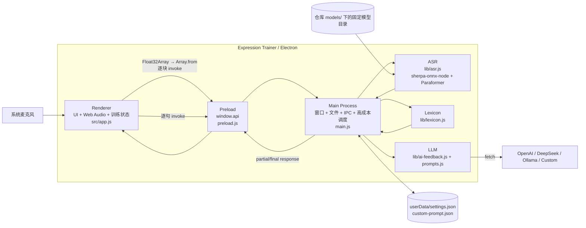

# 当前架构（As-Is）

> 状态：Verified from Source + Electron 43 Smoke；BM-02 三候选简单比较 Completed，ADR-0005 Accepted（保留 Paraformer 默认）
> 基线日期：2026-08-23
> 仓库：`https://github.com/morigejile/expression-trainer-pro.git`  
> 描述对象：截至 Phase 1 / T-08 状态；基于 T-04～T-07 集成提交 `33a6ee59c321f613d66357bff4ead09835387010` 的受控升级

## 1. 证据边界

本文件检查了独立 T-08 worktree 的源码、README、依赖清单和 Git 状态，并完成依赖安装、语法检查、Node 测试、自动化 Electron smoke、Electron runtime 中的 Sherpa native require 与正常非 smoke 启动。smoke 实际加载 Main、Preload、主页面和设置页，通过真实 IPC 验证 Fake ASR、协调式 Fake LLM 与粘贴分析；尚未连接麦克风、初始化/运行真实 ASR 模型或请求真实 LLM，因此“native require / smoke 通过”与“完整识别运行通过”严格区分。

| 标记 | 含义 |
|---|---|
| **Source-verified** | 可由当前本地源码、配置或 Git 状态直接确认 |
| **Runtime-TBD** | 需要真实启动、设备、模型、网络或性能测试确认 |
| **Product-TBD** | 需要产品选择，代码不能回答 |

核心文件：

```text
main.js                         Electron Main、窗口、设置、IPC、ASR/分析/LLM 调度
preload.js                      contextBridge API
src/index.html / app.js         主 UI、录音、训练状态和展示
src/safe-rendering.js           安全高亮 token、DOM 渲染、报告允许列表和 HTML 转义
src/settings.html / settings.js LLM 设置
src/prompt-editor.html          自定义训练规则
lib/asr.js                      Sherpa + Paraformer 具体集成
lib/lexicon.js                  本地确定性文本分析
lib/ai-feedback.js              多 LLM 后端 fetch
lib/prompts.js                  实时反馈/报告 prompt
lib/settings-config.js          设置默认值、解析和 schema 迁移纯函数
data/*.json                     词库数据
package.json / package-lock.json
test/electron-smoke.test.js      Node 测试父进程、超时、日志和清理
smoke/electron-smoke-runner.js  Electron 内 smoke 驱动与 Fake ASR/LLM
benchmark/run.js                 独立 benchmark CLI；不进入生产 ASR/Audio/IPC/Main 路径
benchmark/lib/*.js               manifest、CER、metrics、environment、results 与 adapter 契约
```

## 2. 当前目标与范围

当前系统实现两条输入路径：

```text
麦克风 → 本地 ASR ┐
                  ├→ 词库分析 → 可选 LLM 实时反馈/报告 → UI/Markdown
粘贴逐字稿 ───────┘
```

应用支持训练开始/暂停/继续/结束、partial/final 字幕、填充词/犹豫词/笼统词/表达密度统计、精准词建议、自定义训练规则、LLM 反馈、原文/报告复制和 Markdown 保存。

它没有大型前端框架、独立后端、数据库或微服务。问题不是业务模块过多，而是音频、ASR、Electron Main、模型、安全和交付边界仍停留在原型工程阶段。

## 3. 当前技术栈与版本

| 区域 | 当前选择 | 证据/备注 |
|---|---|---|
| 应用 | `expression-trainer` / product `宇宙无敌表达训练` / `1.0.0` | `package.json`；版本与 README/代码注释的 V2 口径未治理 |
| 桌面运行时 | Electron `43.4.1`（精确版本） | 当前 lock 与 `node_modules` 一致；Windows x64 实测内置 Node 24.18.1、Chromium 150.0.7871.224、modules ABI 148、N-API 10 |
| UI | 原生 HTML/CSS/JavaScript | 无 bundler/前端框架 |
| 音频 | Renderer 中 `getUserMedia` + `AudioContext({sampleRate:16000})` | `src/app.js` |
| 音频节点 | `createScriptProcessor(4096, 1, 1)` | 已废弃 API；无显式 resampler |
| 权限桥接 | Preload `contextBridge` + `ipcRenderer.invoke` | `contextIsolation:true`、`nodeIntegration:false` |
| ASR 引擎 | `sherpa-onnx-node` `^1.10.0` | 当前 lock 与 `node_modules` 为 1.13.3；Main 中加载 |
| ASR 模型 | `sherpa-onnx-streaming-paraformer-bilingual-zh-en` | 固定目录；INT8 encoder/decoder + tokens；模型未纳入 Git |
| 本地分析 | `lib/lexicon.js` + `data/emotion-lexicon.json` | 最大正向词表匹配；`tiered-lexicon.json` 保留为未启用候选数据，不参与运行时分析 |
| LLM | Node 原生 `fetch`，OpenAI/DeepSeek/Ollama/自定义 OpenAI-compatible | 在 Main 中发请求；连接/实时/报告分别为 10/15/60 秒超时，并支持 AbortSignal、按 Renderer 取消和异常响应验证 |
| 设置 | `userData/settings.json`、`userData/custom-prompt.json` | settings schema version 1；纯函数迁移旧扁平结构；文件同步写入且 API Key 明文 |
| 输出 | Clipboard + Electron Save Dialog + Markdown | 原文与报告 |
| 构建/测试 | scripts 为 `start`、`dev`、`test`、`check` | `node:test` 覆盖模块入口、词库、设置迁移、尾部文本、安全渲染、LLM 请求控制和真实 Electron smoke；LLM 单测使用 fake fetch，smoke 使用 Fake ASR/LLM；无 build/package/CI 配置 |

开发工具基线固定为 Node 22.23.x/npm 12.0.x，与 Electron 内置 Node 24.18.1 明确区分。本轮只验证 Windows NT 10.0.26200.0 x64；Electron 38 起的 macOS 12+ 下限、Linux GTK/Wayland 和正式最低 Windows 版本仍没有 CI、打包配置或制品测试证明。

### 3.1 BM-02 harness（Completed）

BM-02 提供独立 benchmark CLI，用 BM-01 manifest 输出每个 sample/repetition 的 JSONL、汇总 JSON/CSV、环境快照及 tag 分层统计；失败的 init、sample、timeout 和 dispose 事件也会被落盘。它不改动生产 `lib/asr.js`、Audio、IPC、Main 或默认模型，且没有新增依赖。fake adapter 的重复运行和故障注入证据见 `benchmark/results/fixtures/reproducibility-report.md`。2026-08-27，harness 在 clean commit `703f1630ba2bbcfcb98c914bc67c95e0b120ddc1` 上完成 Paraformer、small Zipformer 与 SenseVoiceSmall 各一轮 100 条比较，全部 0 失败；结果见 `docs/benchmark/bm02-comparison-2026-08-27.md`。维护者接受 ADR-0005 并保留现有 Paraformer 默认，因此生产代码无需切换；模型再分发许可仍是后续发布门禁。

## 4. C4 Level 2：当前容器/运行边界



Main 既是 Electron 控制面，又直接执行同步 ASR decode、词库分析、同步文件 I/O 和 LLM 请求编排。

## 5. 模块职责

### 5.1 Renderer / `src/app.js`

- 持有 `ExpressionTrainer` 的录音、暂停、计时、完整文本、句子和统计状态。
- 开始时先 `initASR()`，再请求麦克风；初始化或麦克风失败显示字幕错误。
- 创建 16 kHz 意图的 AudioContext 和 4096 帧 ScriptProcessor。
- 在每个 `onaudioprocess` 中等待一次 `feedAudio` invoke；暂停仅跳过 feed，MediaStream/AudioContext 仍运行。
- endpoint/final 文本追加到 `fullText`，逐句做本地分析；每新增约 30 字触发一次 LLM 实时反馈。
- 展示 partial 临时字幕；final 与粘贴字幕通过 text node 和受控 `span` token 高亮词语，不解析输入中的 HTML。
- 支持粘贴逐字稿、生成报告、复制/保存原文和报告、清空当前内存状态。
- LLM 报告只渲染标题、加粗、行内代码、引用、普通行和换行等严格允许列表；LLM/HTTP 错误作为纯文本显示。

当前没有完整的训练 session ID 或状态机。T-06 已在 LLM 边界按 Renderer 和请求类型管理 pending 请求，并在开始、停止、粘贴替换和清空时取消该 Renderer 的 LLM 请求；Renderer 同时递增 LLM 代际并忽略旧代际的 feedback/report，即使成功结果已经越过 IPC 也不会回填新会话。ASR 的 stop 与 pending feed 竞态仍依赖 UI 按钮和事件时序。

### 5.2 Preload / `preload.js`

使用 `contextBridge.exposeInMainWorld('api', ...)` 暴露设置、Prompt、ASR、分析、LLM 和文件保存共 16 个左右的能力方法。BrowserWindow 均设置 `contextIsolation:true`、`nodeIntegration:false`。

关键事实：

- `feedAudio` 在 Preload 中执行 `Array.from(samples)`，再 `ipcRenderer.invoke('feed-audio', ...)`。
- LLM API 暴露反馈、报告、连接测试和显式取消；取消只作用于当前 Renderer 的 pending LLM 请求。
- Preload 和 Main 对 settings、文本、filename、音频数组等 payload 没有 schema/大小校验。

### 5.3 Main / `main.js`

- 创建主窗口、设置 modal 和 Prompt 编辑窗口；设置应用菜单和生命周期。
- 同步读写 `settings.json` 与 `custom-prompt.json`。
- 通过 `lib/settings-config.js` 规范化设置、迁移 schema；损坏的 settings JSON 回退默认配置且不自动覆盖原文件。
- 在启动时同步加载词库。
- 注册所有 IPC handlers。
- 仅在显式 `--smoke-test` 参数下，从 smoke-only runner 注入 Fake ASR/LLM、使用测试提供的临时 `userData` 并自动驱动/退出；正常启动仍加载真实 ASR/LLM 模块。
- `init-asr`、`feed-audio`、`stop-asr` 直接调用 `lib/asr.js`；ASR 完全位于 Main。
- `analyze-text` 在 Main 中执行本地分析。
- `get-realtime-feedback`、`get-final-report` 和连接测试在 Main 中发起受超时约束的 fetch；同一 Renderer 的同类新请求会取消旧请求，显式取消可终止该 Renderer 的全部 LLM 请求。
- `save-file` 通过系统对话框把 Markdown 写到用户选择的位置。

设置和 Prompt 文件读写仍使用同步 API。它不是当前首要性能瓶颈，但反映了 Main 职责持续累积。

### 5.4 ASR / `lib/asr.js`

全局持有单一 `recognizer`、`stream`、`isRunning`，只支持一个并发会话。固定配置包括：

- 模型目录 `models/sherpa-onnx-streaming-paraformer-bilingual-zh-en`；
- `encoder.int8.onnx`、`decoder.int8.onnx`、`tokens.txt`；
- feat sample rate 16000、feature dim 80；
- CPU、2 threads、greedy search、endpoint rules。

`feedAudio` 总以 `sampleRate:16000` 调用 `acceptWaveform`，同步循环 decode，并返回 `{text,isFinal}`。`stopRecognition` 会 flush 并返回最后的未确认文本。

T-04 后，`src/app.js` 会把 `{success, finalText}` 经 `mergeFinalText()` 去重后合并到当前 session；非空尾部文本进入逐字稿、分析统计和后续报告，空文本或与 endpoint 相同的文本不会重复更新状态。集成修复还让 `stopRecording()` 等待尾部文本的本地分析完成，再结束 stop 并开放报告操作，避免报告文本与统计不同步；分析或取消失败会显示安全错误，但 `finally` 仍复位录音状态和 UI。

### 5.5 Lexicon / `lib/lexicon.js`

启动时读取 `data/emotion-lexicon.json`，并结合代码内 FILLER/HEDGE/VAGUE 表执行最长 6 字的最大正向匹配。输出：

- `totalWords`；
- fillers/hedges/vagueWords/emotionWords 及位置；
- `density`；
- 替代和提醒 suggestions。

UI 通过 `src/safe-rendering.js` 的 `renderHighlightedText` 使用另一套硬编码词表/正则生成受控高亮 token；它与 `lib/lexicon.js` 不完全同源，仍存在规则漂移风险。`data/tiered-lexicon.json` 当前未发现 import；它使用分层替代词 schema，与运行时 `emotion-lexicon.json` 不兼容，按维护者决定保留为未启用候选数据。启用前必须单独设计合并规则并建立行为测试。

### 5.6 LLM / `lib/ai-feedback.js`、`lib/prompts.js`

- Provider：OpenAI、DeepSeek、Ollama、自定义 OpenAI-compatible。
- OpenAI/DeepSeek endpoint 固定；Ollama 默认 localhost；自定义 base URL 自动追加 `/chat/completions`。
- 实时反馈 max_tokens 150；最终报告 8192；temperature 0.7。
- 自定义训练目标/规则/风格/口癖被附加到 prompt。

T-06 后的请求边界具有以下事实：

- 连接测试、实时反馈、最终报告的超时分别为 10、15、60 秒，并把 AbortSignal 传给原生 `fetch`；
- 同一 Renderer 的同类新请求会取消旧请求，会话边界可显式取消全部 pending LLM 请求；Main 协调层抑制不配合 AbortSignal 的迟到结果，Renderer 代际校验继续抑制取消前已完成 IPC 返回的旧结果；
- 无 Key、429、其他 HTTP 错误、超时、取消、坏 JSON，以及缺失 `choices[0].message.content` 均返回稳定错误；
- 不读取或透传 HTTP 错误正文，未知 fetch 异常被泛化，避免错误信息泄露 API Key、Authorization 或完整敏感响应；
- 没有自动重试。设置保存后才测试连接，测试失败不会回滚刚保存的配置。

### 5.7 设置与数据

`settings.json` 位于 Electron `userData`，当前 schema 是：

```text
schemaVersion: 1
provider
providers.openai     { apiKey, model }
providers.deepseek   { apiKey, model }
providers.ollama     { ollamaUrl, model }
providers.custom     { apiKey, baseUrl, model, customModel }
```

旧版扁平字段和缺失 provider 字段在加载时迁移为 schema version 1；损坏 JSON 使用默认配置运行并保留原文件，未知 provider 配置块不会在规范化时被删除。API Key 仍为明文，文件写入仍为同步且非原子；这些风险留给 R-09。`custom-prompt.json` 保存 goals、customRules、styleRef、customWords。训练文本、统计和报告仅在 Renderer 内存中，除非用户手动复制/保存。

### 5.8 Benchmark dataset boundary (BM-01)

BM-01 已建立 Git 可提交的契约层：`benchmark/datasets/manifest.schema.json` 定义 schema version 1，`benchmark/lib/dataset-manifest.js` 以 Node 内置模块执行相对路径、受控 root、SHA-256、元数据、来源和分层检查，`benchmark/lib/dataset-quality.js` 输出可复核的覆盖/时长/许可证/再分发/采样率汇总。该契约不接入应用运行路径，也不修改 Main、Preload、Renderer 或现有 ASR 实现。

当前治理 manifest 为 `expression-zh-v1` / `0.1.0`，SHA-256 为 `1dadf62bace0cdd8961718b9dd9c50cb0bdb0136a8c08fb0ac480a8a8326b948`。截至 2026-08-25，它包含 0 条、0 ms：普通话、快/慢语速、轻口音、中英混合、数字/专名和轻噪声均为 0；没有许可证或再分发观察。仓库另有 1 秒 16 kHz/单声道/16-bit PCM/1 kHz 合成 WAV 作为无隐私合同 fixture，但它不代表人声、不计入 benchmark 语料，也不能作为人工复核证据。

原始音频位于 Git 外的受控 dataset root，manifest 仅存相对音频路径和已脱敏元数据，不记录个人身份、联系方式、同意书原件或本机绝对路径。2026-08-27 已冻结 `expression-zh-fleurs/v1`：100 条人工核查终稿、1,201,680 ms、CC-BY-4.0 public-corpus，manifest SHA-256 `600bf66fe11273e0c34b5f8859f7a59efce6eddf607cf5fa13ad186cb0469593`。它满足当前简单候选比较的 ground-truth 输入要求；只覆盖 `mandarin`，不代表完整产品场景分层。

## 6. 当前关键数据流

### 6.1 音频到识别

```text
getUserMedia({audio:true})
→ new AudioContext({sampleRate:16000})
→ createMediaStreamSource
→ createScriptProcessor(4096,1,1)
→ inputBuffer.getChannelData(0) : Float32Array
→ Preload Array.from(samples)
→ ipcRenderer.invoke('feed-audio')
→ Main new Float32Array(samplesArray)
→ stream.acceptWaveform({samples,sampleRate:16000})
→ synchronous decode/getResult/isEndpoint
→ invoke response
→ partial 或 endpoint/final UI
```

源码没有显式 resampler，也没有检查 `audioContext.sampleRate` 是否实际为 16000。Chromium/OS 是否满足请求属于 Runtime-TBD；一旦实际值不是 16000，代码仍把样本声明为 16000。

每个 4096 样本块都发生 TypedArray → 普通 Array → structured clone → TypedArray，并采用 request/response IPC。没有显式有界队列、背压或丢块指标。

### 6.2 结束与尾部文本

```text
Renderer 断开/关闭音频资源
→ stop-asr
→ stream.inputFinished + decode
→ Main 返回 finalText
→ Renderer 经 mergeFinalText 去重
→ 非空新文本进入字幕、统计、分析和报告
```

### 6.3 分析与 LLM

```text
endpoint/final sentence
→ analyze-text invoke → Main lexicon → stats/建议
→ 累计文本较上次反馈增加 >=30 字
→ get-realtime-feedback invoke → Main 受控 fetch → 成功时更新右侧反馈

停止/粘贴完成后用户点击生成报告
→ fullText + stats → Main fetch → Renderer 受控 Markdown token/DOM 渲染 → 可保存 Markdown
```

LLM 失败只返回安全的 `{success:false,error}`，不会修改本地词库结果；粘贴模式在请求 LLM 前完成本地分析，实时模式的分析 IPC 与 LLM IPC 也彼此独立。

Phase 0 已把 README 的反馈触发口径改为源码实际的约 30 字，并明确本地 ASR/词库与可选联网 LLM 的边界。

### 6.4 设置与 Prompt

```text
Settings/Prompt Renderer
→ Preload invoke
→ Main 同步 JSON 读写 userData
→ LLM 请求前重新读取
```

## 7. 部署与安装现状

- `package.json` 有 `start`、`dev`、`test`、`check`；无 build/package/make/publish scripts。
- 没有 Electron Forge/electron-builder 配置，没有 GitHub Actions。
- `models/` 仅跟踪 `.gitkeep`；README 要求用户手工下载和解压模型。
- 无安装包、签名、公证、自动更新、升级/卸载数据保留测试或正式支持矩阵。
- 原有 `package-lock.json` 清理已由负责人确认纳入 Phase 0；陈旧 `node-microphone` 条目已删除，lockfile 与 `package.json` 一致。
- 开发基线为 Node 22.23.0/npm 12.0.2。T-08 的 Electron 43.4.1 JS 依赖经 clean `npm ci` 安装；Electron 42+ 改为首次 CLI 调用时下载 binary，本轮首次 43.4.1 下载成功，后续 clean install 从官方校验缓存恢复相同 executable（SHA-256 `E885FFC2A09DAB4C14DE706E3662A5929D1E65EA4EA347C56FD0964640EB923B`）。显式清空所有 npm/Electron 缓存后的复跑仍为 Runtime-TBD。

## 8. 已确认技术债与风险

| ID | 风险 | 影响 | 证据 | 推荐验证/处理 |
|---|---|---|---|---|
| TD-01 | ASR 在 Main 同步初始化/decode | Main 控制面阻塞；native 故障影响应用 | 源码确认 | event-loop 指标、故障注入后移出 Main |
| TD-02 | `ScriptProcessorNode` | 废弃 API；音频依赖 Renderer 线程 | 源码确认 | AudioWorklet 对照测试 |
| TD-03 | 无显式重采样且强制声明 16 kHz | 实际设备率不符时识别速度/准确率错误 | 源码确认风险 | 记录实际率，频率/时长 fixture |
| TD-04 | 每块 Array.from + invoke + 重建 TypedArray | 复制、GC、IPC 延迟 | 源码确认 | profile 后改 TypedArray/MessagePort/有界流 |
| TD-05 | 全局单例 ASR + 模型/路径/参数写死 | 替换、测试、并发和恢复困难 | 源码确认 | 先抽轻量契约，保留现有行为 |
| TD-06 | 模型完全手工管理 | 首次安装、升级、校验和支持成本高 | README/models 确认 | Model Manager + hash + 原子安装 |
| TD-07 | **T-04 已缓解**：停止时 finalText 经最小去重路径合并，stop 等待尾部分析并以 `finally` 收敛状态 | 未形成 endpoint 的尾部语音进入字幕、统计、分析和报告；分析失败仍结束录音；完整 ASR session 协议仍待 R-02 | `mergeFinalText()` 与 8 项 transcript/迟到结果/异常生命周期回归测试 | R-02 增加完整 sessionId/sequence 协议与 pending feed 竞态覆盖 |
| TD-08 | 已有 Node 测试和 Electron 自动化 smoke，但无 CI 和打包脚本 | 已可发现启动、页面、Preload/IPC、设置窗口和粘贴分析回归；仍无法证明跨平台或发布制品可用 | T-01～T-07 集成测试基线、仓库配置 | 后续接 CI 与 Forge，并在目标平台运行 smoke |
| TD-09 | API Key 明文保存、设置同步且非原子写入 | 凭据暴露；写入中断可能损坏设置 | 源码确认；schema version 1 和损坏 JSON 运行回退已由 T-03 建立 | R-09 处理原子写、脱敏日志，并评估凭据策略 |
| TD-10 | IPC payload 无校验 | 大 payload、类型错误或不可信输入影响 Main | 源码确认 | 每个 channel 限定类型/长度/session |
| TD-11 | **T-05 已缓解**：ASR/粘贴文本使用受控 DOM token，LLM 报告使用严格允许列表，错误使用纯文本；playground 用户输入先转义 | 主应用不再从不可信文本创建标签或事件属性；playground 剩余 `innerHTML` 仅消费静态模板和文件内硬编码数据 | `src/safe-rendering.js`、4 项安全渲染测试、T-07 页面级 smoke、`src/app.js` 无 `innerHTML` | 后续若词库改为外部数据，继续按不可信输入处理 |
| TD-12 | LLM fetch 控制风险已由 T-06 缓解；仍无自动重试 | 请求已有超时、取消、Main/Renderer 双层迟到抑制、结构验证和脱敏错误；瞬时失败仍需用户重试 | 25 项 fake-fetch 与 3 项 Renderer 竞态测试、源码确认 | 保留错误契约回归测试；是否重试需单独产品策略，不在请求层盲目加入 |
| TD-13 | UI 高亮词表与 lexicon 规则重复 | 显示和统计不一致 | 源码确认 | 统一由分析结果驱动高亮或共享规则 |
| TD-14 | README 与实现漂移风险 | 用户预期错误 | Phase 0 已修正触发字数、联网边界和平台口径 | 后续行为变更同步 README 与架构文档 |
| TD-15 | 未启用候选词库容易被误认为运行时数据 | 维护者可能误删或直接接入不兼容 schema | `tiered-lexicon.json` 无 import，Phase 0 决定保留 | 明确标记未启用；在 T-01/T-02 后以独立任务设计 schema、合并规则和测试 |
| TD-16 | 版本口径不一致 | 发布历史和兼容性不清 | package 1.0.0、代码 V2、历史提交 v1.1 | SemVer + CHANGELOG + release policy |
| TD-17 | **T-08 已关闭当前告警**：Electron 33.4.11 依赖树的两个 high 节点已通过升级到受支持的 43.4.1 移除 | 当前 `npm audit --json` 为 0；旧 `extract-zip@2.0.1`、`boolean` 与旧下载栈已从 lockfile 删除 | 2026-08-23，Node 22.23.0/npm 12.0.2；升级前 `2 high / 0 critical`，升级后 0；未使用 `npm audit fix --force` | OPS-03 持续受控升级；每次验证 native load、smoke 与发布制品 |

## 9. 当前架构评价

### 应保留

- 单一 Electron 桌面应用，无独立服务端和数据库；
- 原生 JS/HTML/CSS；
- 本地 Sherpa-ONNX 路线；
- 本地确定性分析 + 可选 LLM 的降级结构；
- `contextIsolation:true`、`nodeIntegration:false` 的权限方向；
- 用户数据已位于 `userData` 而非安装目录。

### 应降低的偶然复杂度

- Audio 采样契约不清和重复复制；
- ASR 具体模型、全局状态和 Main 生命周期耦合；
- 用户手工模型管理；
- IPC/异步会话缺少明确协议；
- 安全编码、密钥、超时和输入验证不足；
- 构建、测试、打包、升级和支持矩阵不可复现。

结论：当前项目不是“架构过重”，而是“核心闭环已存在，产品工程边界尚未收敛”。推荐渐进重构，不推倒重写。

## 10. 仍需运行验证

1. 在显式清空 npm 与 Electron 下载缓存的独立环境复跑 Electron 43 首次 CLI 下载；当前首次 43.4.1 下载和后续校验缓存恢复均成功。
2. 验证当前模型下载源、大小、hash、许可证和三个文件的兼容性。
3. 自动 Electron smoke 已覆盖 BrowserWindow、16 项 Preload API、设置页、Fake ASR/Fake LLM 和粘贴分析；正常非 smoke 入口已在 Windows x64 保持 5 秒存活并加载真实 Sherpa 模块。真实设置文件持久化、报告保存对话框、真实模型/麦克风和人工交互仍需运行验证。
4. 在 44.1/48 kHz 设备记录 `audioContext.sampleRate` 与 ASR 接收时序。
5. profile TD-01～TD-04 的 Main 延迟、GC、CPU、RAM 和队列。
6. 在目标 macOS/Linux/Windows 版本验证安装与运行；在证据前继续保持 TBD，不作支持承诺。
