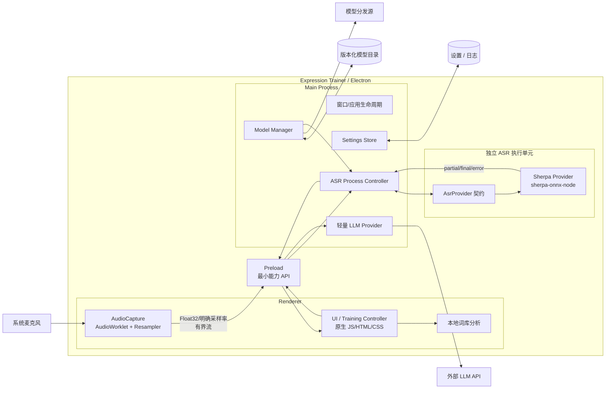

# 目标架构（To-Be）

> 状态：Proposed  
> 基线日期：2026-08-28
> 目标：在保持功能闭环的前提下降低总体维护、依赖、跨平台安装和升级复杂度
> 当前源码基线：`main`，已完成 benchmark 选型和 Phase 4 / R-01 最小 Provider 适配

## 1. 范围与设计约束

本目标架构是迁移方向，不表示已经实现。它保留：

- Electron；
- 原生 JavaScript/HTML/CSS；
- Web Audio；
- Sherpa-ONNX Node API；
- Node 内置 API 与原生 `fetch`。

默认不引入 React/Vue、Vite/Webpack、TypeScript、Python/PyTorch/FunASR、服务端、数据库或容器。若未来评估 WASM/Tauri，必须作为独立技术验证和新 ADR，不进入本次默认迁移。

## 2. 架构目标

1. **正确**：音频格式和采样率契约明确，可自动验证。
2. **响应**：录音和推理不阻塞 Renderer UI 或 Electron Main。
3. **可替换**：模型变化不穿透业务；引擎变化被小型 Provider 隔离。
4. **可交付**：安装包封装 Electron 与 native runtime，模型可独立下载和升级。
5. **可恢复**：模型、ASR 和 LLM 失败有明确状态、错误与回退。
6. **不过度设计**：只为真实变化源建立边界，不建设平台或框架。

## 3. C4 Level 2：目标容器/运行边界



> Audio 数据究竟通过单独 `MessagePort`、Main 转发还是执行单元专用通道传递，应在技术 spike 中选择；目标是不逐块使用 request/response IPC、存在有界队列并可观测丢弃/背压。

## 4. 建议代码结构

目录是指导而非强制重排；迁移时遵循现有仓库习惯，文件只有在职责确实分离时才拆分。

```text
src/
├── main/
│   ├── main.js                 # 窗口与应用生命周期
│   ├── ipc.js                  # 有限控制命令，不承载业务实现
│   ├── settings-store.js       # 版本化设置读写/迁移
│   └── asr-process.js          # ASR 执行单元生命周期与消息协议
├── renderer/
│   ├── app.js                  # UI/训练流程
│   ├── audio-capture.js        # AudioContext、权限、生命周期
│   ├── resampler.js            # 可测试的采样率转换
│   └── audio-worklet.js        # 实时音频线程处理
├── asr/
│   ├── contract.js             # 小型消息/Provider 契约
│   ├── sherpa-provider.js      # Sherpa 具体实现
│   └── worker.js               # 独立执行入口
├── models/
│   ├── model-manager.js        # 下载、校验、原子安装、选择
│   └── registry.json           # 版本化模型清单
├── analysis/
│   └── lexicon.js
└── llm/
    ├── provider.js             # fetch、超时、取消、错误归一化
    └── prompts.js
```

如果现有项目很小，可合并 `main/ipc.js` 与 `main/main.js`、`audio-capture.js` 与 `resampler.js`；不得为了匹配目录图而机械拆文件。

## 5. 核心模块与契约

### 5.1 Renderer / Training Controller

负责用户状态和训练编排，不负责 Sherpa 初始化、模型文件或高权限文件操作。建议显式状态：

```text
idle → requesting-permission → preparing-model → listening
     → stopping → analyzing → completed
                          ↘ recoverable-error
```

每次训练使用 `sessionId`，忽略来自旧会话的迟到结果。UI 只消费规范化事件：`ready`、`partial`、`final`、`error`、`stopped`。

ASR、粘贴文本和 LLM 返回均视为不可信文本。高亮通过 text node/token 渲染；报告只允许受控 Markdown 子集，不把原始内容直接赋给 `innerHTML`。

### 5.2 AudioCapture

职责：

- 请求/释放麦克风；
- 记录设备实际 `AudioContext.sampleRate`；
- 使用 AudioWorklet 接收单声道 Float32 音频；
- 依据当前模型元数据重采样；
- 按固定时长或样本数分块；
- 在停止时 flush，并关闭 tracks/context。

输出契约示例（形状而非最终 API）：

```js
{
  sessionId,
  sequence,
  sampleRate,
  channels: 1,
  format: 'f32',
  samples: Float32Array
}
```

禁止用 `Array.from()` 把每块转成普通数组。优先传递 ArrayBuffer/TypedArray；通道必须有队列上限和 backpressure 策略。

### 5.3 AsrProvider

Provider 是约定，不要求抽象类或依赖注入框架。最小语义：

```js
await initialize({ modelPath, modelConfig })
await start({ sessionId, sampleRate })
feed({ sessionId, sequence, samples })
await stop({ sessionId })
await dispose()
```

它输出规范化事件，不把 Sherpa 对象泄漏给 UI/Main。Fake Provider 用于业务测试；生产仅默认实现 Sherpa Provider。

### 5.4 独立 ASR 执行单元

目标是让 Main 只管理生命周期和路由，不加载模型或执行推理。隔离候选：

1. Electron `utilityProcess`/Node 子进程：优先验证，native 崩溃隔离更强；
2. Node `worker_threads`：消息和部署较轻，但需验证 native addon 兼容性及崩溃边界。

在 spike 前不把二者之一写成 Accepted。选择标准：

- `sherpa-onnx-node` 能稳定加载和释放；
- 打包后跨平台可定位共享库/模型；
- 音频吞吐不堆积；
- 进程退出可发现、可重启、不会丢失设置/模型；
- Main 事件循环延迟满足基线预算。

### 5.5 Model Manager

轻量职责：

```text
读取 registry
→ 检查兼容性/可用空间
→ 下载到临时文件
→ SHA-256 校验
→ 解压/安装到临时目录
→ 原子重命名为版本目录
→ 更新当前模型指针/设置
→ 返回模型路径
```

建议清单字段：

```json
{
  "modelId": "candidate-id",
  "version": "source-version",
  "engine": "sherpa-onnx",
  "architecture": "zipformer-or-sensevoice",
  "languages": ["zh"],
  "mode": "streaming-or-utterance",
  "sampleRate": 16000,
  "files": [{ "url": "https://...", "sha256": "..." }],
  "minAppVersion": "0.x"
}
```

示例值不是最终 registry。真实 URL、hash、许可证、体积和采样率必须来自获准分发的模型版本。模型安装失败时保留上一版本。

### 5.6 Settings Store

配置位于 Electron 的用户数据目录，而非安装目录，至少包含 `schemaVersion`。配置迁移必须可测试。敏感 Key 不记录到日志；是否使用系统凭据库需要单独权衡，不能为了加密盲目增加 native 依赖。

当前实现已经使用 `userData/settings.json`，迁移重点是 schemaVersion、原子写、损坏恢复和明文 API Key 风险，而不是重新选择目录。

### 5.7 LLM Provider

继续使用原生 `fetch`，只做必要隔离：请求构造、AbortController 超时/会话取消、响应结构验证、错误归一化和敏感日志过滤。没有必要为多个假想厂商建设通用插件框架。LLM 失败不得阻断本地 ASR 与词库分析。

## 6. 关键运行时流程

### 6.1 首次启动/模型准备

```text
启动 → 读取设置/registry → 检查当前模型
  ├─ 可用且校验通过 → 初始化独立 ASR 执行单元
  └─ 缺失/不兼容 → 用户确认下载 → 临时下载 → 校验 → 原子安装 → 初始化
```

模型下载不得静默上传用户数据；下载失败提供重试并允许用户进入不含 ASR 的可解释状态。

### 6.2 实时训练

```text
用户开始
→ 创建 sessionId
→ AudioCapture 获取真实设备采样率
→ AudioWorklet 产生音频
→ Resampler 转为模型要求
→ 有界流发送 ASR 执行单元
→ partial/final 事件
→ UI 展示
→ 结束时 flush/stop，并合并/去重尾部 final text
→ 词库分析
→ 可选 LLM 反馈
```

### 6.3 故障与恢复

| 故障 | 目标行为 |
|---|---|
| 麦克风拒绝/丢失 | 停止会话，显示授权/设备操作建议，释放已创建资源 |
| 音频队列满 | 按已记录策略背压或丢弃并计数；不得无限增长 |
| ASR 初始化失败 | 标明模型/平台/错误类别，允许重新初始化或更换上一模型 |
| ASR 执行单元退出 | Main 检测退出，终止当前 session，允许受控重启 |
| 模型下载/校验失败 | 删除临时内容，不激活，不覆盖上一可用版本 |
| LLM 超时/限流 | 取消请求，保留本地结果，提供重试 |
| 应用退出 | 停止采集、flush/终止 ASR、保存非敏感设置，不长时间挂起 |

## 7. ASR 模型策略

ADR-0005 已接受保留 Paraformer 为默认模型。2026-08-27 的简单比较仍保留以下候选证据：

- 小型中文 streaming Zipformer CTC；
- SenseVoiceSmall INT8（需明确其 utterance/VAD 使用方式与 streaming 模型的体验差异）。

不得把公开榜单或模型发布时间当作项目结论。后续重开模型优化时沿用统一 benchmark：

- 经过授权且脱敏的 50～100 条真实中文表达训练音频（最终数量以数据可得性为准）；
- 普通话、语速变化、轻口音、中英混合、数字/专名、安静与轻噪声；
- 固定硬件、线程数、warm/cold start、相同音频与标注；
- CER、首个 partial、最终延迟、RTF、CPU、峰值 RAM、模型大小、初始化时间；
- 识别质量之外同时评估安装体积、许可证、跨平台包和集成复杂度。

当前维持逐步显示 partial 的 streaming 交互，因此选择 Paraformer；SenseVoiceSmall 的准确率优势与 Zipformer 的体积/partial 延迟优势作为复审证据保留。若未来接受 utterance-only 交互或目标硬件/性能预算变化，再按 ADR-0005 的复审条件重开选择。

## 8. 部署与发布

使用 Electron Forge 统一 package/make 配置，并按实际支持矩阵选择 makers。目标包括：

- 把 Electron 和 `sherpa-onnx-node` runtime 封装进制品；
- 正确 rebuild/包含 native addon 与共享库；
- 对需要的二进制/模型使用正确的 ASAR unpack 或外部资源路径；
- 程序文件、用户数据和模型分离；
- 先完成一个 Tier 1 平台的可重复安装/升级，再扩展矩阵；
- 代码签名、公证和自动发布作为后续 release gate，不在无凭据时伪装完成。

最终用户路径应接近：下载安装包 → 安装 → 启动 → 首次选择/下载模型 → 训练，不要求 Node/Python/编译器。

## 9. 测试策略

| 层级 | 优先覆盖 |
|---|---|
| 单元 | lexicon、settings migration、model registry/sha256/atomic install、resampler、Provider 契约 |
| 集成 | Preload/IPC schema、ASR 消息协议、Sherpa 模型 smoke、LLM 错误归一化 |
| 冒烟 | 应用启动、麦克风开始/停止、模型初始化、安装制品启动 |
| Benchmark | 音频正确性、CER、延迟、RTF、CPU/RAM、冷启动、模型体积 |
| 发布 | `npm ci`、测试、Forge package/make、目标平台安装/升级、用户数据保留 |

优先使用 Node 内置 test runner 和小型 fixture；除非现有仓库已经依赖测试框架，否则不为追求覆盖率引入重型工具。

## 10. 安全与隐私

- Renderer 通过 Preload 获取最小能力，IPC payload 做类型、长度和 session 校验。
- 本地音频默认只进入本地 ASR，不写日志、不上传。
- LLM 发送范围和供应商对用户可见；不发送原始音频。
- 下载模型仅使用允许的 HTTPS 来源，必须验证 SHA-256 与许可证元数据。
- 日志脱敏 API Key、Authorization、完整 transcript 和用户路径中的敏感段。

## 11. 迁移约束与完成定义

迁移必须保持每个阶段可运行：

1. 构建/测试基线、三候选 benchmark、默认模型 ADR 和最小 Paraformer Provider 已完成。
2. 下一步先补全 session/event 契约，再分别替换 Audio、ASR 执行边界和模型管理。
3. 每次迁移保留独立回归证据，最后建立 Forge 制品、支持矩阵和发布机制。

当下列条件全部满足时，本目标可合并为 Current：

- [ ] `npm ci`、测试和至少 Tier 1 平台打包可重复执行；
- [ ] AudioWorklet/重采样通过自动化与真实设备检查；
- [x] 业务只依赖轻量 ASR 契约（完整 session/event 语义仍待补全）；
- [ ] ASR 不在 Main 内执行，退出可恢复；
- [ ] 模型可校验安装且失败不破坏上一版本；
- [x] 默认模型由可复跑 benchmark 和 Accepted ADR 支持；
- [ ] 安装/升级保留设置与模型；
- [ ] `current.md` 已按实际实现更新。

## 12. 未决问题

1. Tier 1 平台和最低支持硬件。
2. ASR 隔离采用 utility process、child process 还是 worker thread。
3. 音频传输通道、块大小、队列上限和背压策略。
4. 未来是否接受 utterance-only UX 并重开默认模型选择。
5. 模型 registry 的托管位置、许可证与更新信任链。
6. API Key 是否需要系统凭据库，以及跨平台成本是否可接受。
7. 首个稳定版本是否需要代码签名/公证和自动更新。
