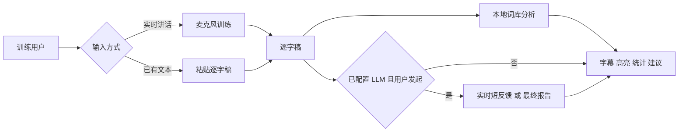
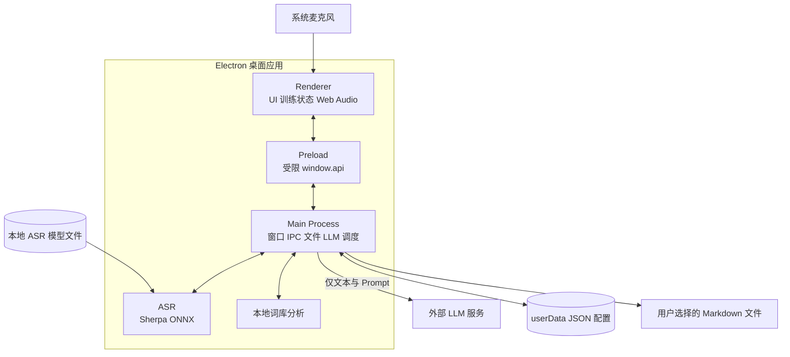
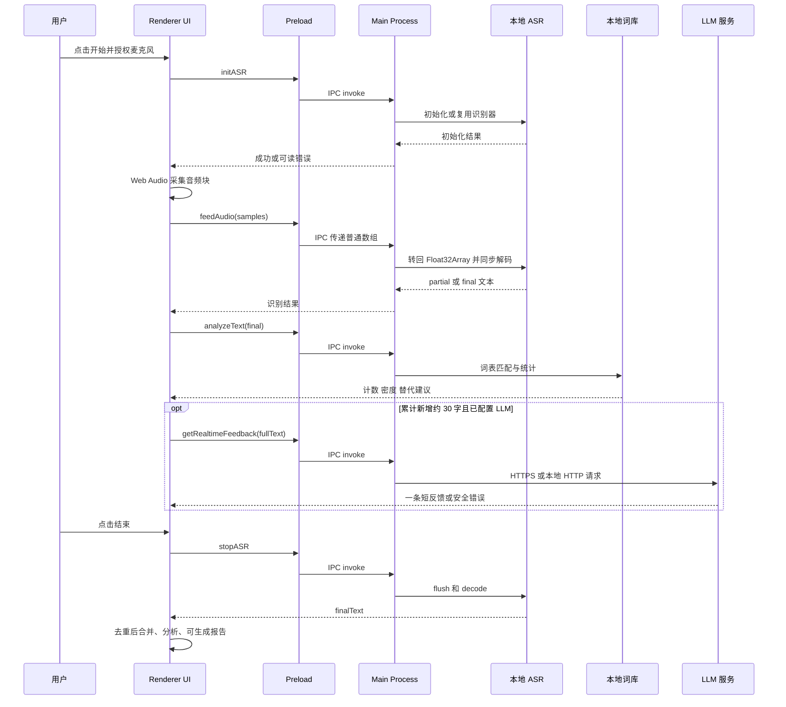

# 新成员项目交接手册

> **项目**：宇宙无敌表达训练（Expression Trainer）
> **代码快照**：`94e192d`（2026-08-25）
> **阅读对象**：刚加入项目的产品、设计、开发、测试与维护成员
> **可信边界**：本文以当前源码、测试和既有架构文档为准；标为“待验证”的事项不能视为已在线上/真实设备通过。
> **文档定位**：临时快照交接，不是核心长期维护文档；后续事实以当前分支的 requirements、architecture、ADR 与 roadmap 为准。

---

## 30 秒认识项目

这是一个帮助用户练习中文口语表达的**本地桌面应用**。用户可以直接说话，或粘贴逐字稿；应用会识别/接收文本，分析填充词、犹豫词、笼统词与表达密度，并可在配置 LLM 后给出即时建议和完整报告。

**一句话定位：把一段口语，变成可见、可复盘、可练习的表达改进建议。**

| 已是当前能力 | 不是当前能力 |
|---|---|
| Windows 上的 Electron 桌面训练界面 | 云端账号、同步或多人协作 |
| 本地 Sherpa-ONNX 流式识别 | 独立后端、数据库、微服务 |
| 本地词库的确定性分析 | 已完成的安装包、自动更新与 CI |
| 可选的 OpenAI/DeepSeek/Ollama/兼容 API 反馈 | 已验证的三平台正式支持 |

---

## 1. 用户需求与产品闭环

### 谁在使用

| 角色 | 想完成的事 | 系统如何支持 |
|---|---|---|
| 表达训练用户 | 边说边发现口头禅、模糊表达和犹豫表达 | 实时字幕、高亮、统计和短反馈 |
| 需要复盘的用户 | 在结束后知道自己哪里需要改、怎么改 | 词库建议与 LLM 完整报告 |
| 没有麦克风/已有录音稿的用户 | 直接分析一段逐字稿 | 粘贴逐字稿后复用本地分析和 LLM 报告 |
| 维护者 | 可复现安装、诊断问题、替换模型与发布 | 需求、架构、ADR、路线图和测试文档 |

### 用户的两条主路径



### 功能地图（现状）

| 功能 | 入口/行为 | 状态 |
|---|---|---|
| 训练控制 | 开始、暂停、继续、结束；结束时释放音频资源 | 已实现 |
| 实时转写 | partial 字幕与 endpoint/final 文本 | 已实现；真实模型/麦克风尚待实测 |
| 文本分析 | 填充词、犹豫词、笼统词、情绪词、密度与替代表达 | 已实现、本地运行 |
| 逐字稿分析 | 粘贴文本、分句、显示、高亮、统计 | 已实现 |
| AI 教练 | 每新增约 30 字触发短反馈；用户可请求最终报告 | 已实现；LLM 网络调用待真实服务验收 |
| 配置 | OpenAI、DeepSeek、Ollama、自定义兼容端点；旧配置迁移 | 已实现 |
| 导出 | 复制或保存逐字稿/报告为 Markdown | 已实现 |
| 模型下载管理 | 版本、校验、下载、回退 | 规划中 |
| 打包发布 | Electron Forge 制品、安装/升级/卸载验证 | 规划中 |

---

## 2. 当前技术栈与架构

### 技术选型

| 层次 | 当前技术 | 说明 |
|---|---|---|
| 桌面容器 | Electron `43.4.1` | `main.js` 是主进程入口 |
| 前端 | 原生 HTML、CSS、JavaScript | 没有 React/Vue、打包器或 TypeScript |
| 进程隔离 | `contextBridge` + IPC | `contextIsolation: true`，`nodeIntegration: false` |
| 音频采集 | Web Audio + `getUserMedia` | Renderer 使用 `ScriptProcessorNode`（已废弃，属后续改造项） |
| 语音识别 | `sherpa-onnx-node` + Paraformer 中英双语模型 | 本地 CPU 推理，模型不纳入 Git |
| 文本分析 | 项目内置词表 + `emotion-lexicon.json` | 最大正向匹配，确定性、无需网络 |
| AI 能力 | Node 原生 `fetch` | OpenAI、DeepSeek、Ollama、OpenAI-compatible |
| 持久化 | Electron `userData` 下 JSON | 设置与自定义 Prompt；无数据库 |
| 测试 | `node:test` + Electron smoke | 单测及 Fake ASR/LLM 冒烟；非真实设备端到端测试 |

### 架构图：边界与职责



**关键理解：** Renderer 负责交互与音频采集；Preload 是安全桥；Main 目前既负责 Electron 生命周期，也直接运行 ASR、词库分析、配置文件读写和 LLM 请求。这个 Main 职责过重是后续架构演进的主因，但不是立刻推倒重写的理由。

---

## 3. 数据流程图

### A. 实时语音训练（最重要）



### B. 数据去向与隐私边界

| 数据 | 默认去向 | 是否离开设备 | 保留方式 |
|---|---|---|---|
| 原始麦克风音频 | Renderer → Main → 本地 ASR | 否 | 不持久化 |
| ASR 文本 | Renderer/Main 内存、词库 | 默认否 | 当前训练只在内存中 |
| 本地统计与建议 | Renderer 内存 | 否 | 可由用户手动导出 |
| LLM 请求文本与自定义 Prompt | Main → 用户选定的 Provider | **会**，仅在请求 AI 功能时 | 由外部 Provider 的政策决定 |
| API Key/LLM 配置 | 本地 `userData/settings.json` | 否 | 当前明文 JSON，须谨慎保护 |
| 自定义训练规则 | 本地 `userData/custom-prompt.json` | 默认否；使用 LLM 时作为 Prompt 一部分发送 | 本地 JSON |

**对用户应说清：** 本地识别和词库分析可离线完成；配置并请求 AI 反馈时，逐字稿文本和自定义 Prompt 会发送给所选 LLM 服务。当前不应把 API Key 视作加密保存。

---

## 4. 代码地图：从哪里开始读

| 优先级 | 文件 | 你会获得什么 |
|---|---|---|
| 1 | `README.md` | 产品说明、安装、基本使用 |
| 2 | `docs/requirements/requirements.md` | 用户需求、范围、验收与待确认项 |
| 3 | `docs/architecture/current.md` | 事实化的当前架构、风险和运行证据边界 |
| 4 | `src/app.js` | 训练会话、UI 状态、音频采集、文本与报告展示 |
| 5 | `preload.js` + `main.js` | Renderer 可调用的能力、IPC、窗口、存储、服务编排 |
| 6 | `lib/asr.js` | 模型路径、16 kHz 假设、识别器生命周期 |
| 7 | `lib/lexicon.js` + `data/emotion-lexicon.json` | 本地规则如何计算统计与建议 |
| 8 | `lib/ai-feedback.js` + `lib/prompts.js` | Provider、超时/取消、Prompt 和报告行为 |
| 9 | `docs/architecture/adr/README.md` + `docs/roadmap.md` | 为什么不换技术栈，以及下一步顺序 |
| 10 | `test/` + `smoke/` | 当前哪些行为受到自动化保护 |

### IPC 能力清单

`window.api` 是 Renderer 与本机能力之间唯一的设计入口，包含：

- 设置与 Prompt：读取、保存、打开窗口、迁移旧设置；
- ASR：初始化、送入音频、停止；
- 分析：`analyzeText`；
- LLM：测试连接、实时反馈、最终报告、取消请求；
- 文件：通过系统对话框保存 Markdown。

如需新增桌面能力，优先沿着 **Renderer → Preload 最小 API → Main 校验/实现** 的路径设计，避免把 Node 能力暴露给 Renderer。

---

## 5. 本地开发、运行与验证

### 最短启动路径

```powershell
npm ci
npm run check
npm test
npm start
```

开发基线为 Node `22.23.x`、npm `12.0.x`。若要进行真实语音识别，还需手动下载并解压模型到：

```text
models/sherpa-onnx-streaming-paraformer-bilingual-zh-en/
  encoder.int8.onnx
  decoder.int8.onnx
  tokens.txt
```

模型缺失时，应用窗口仍可启动，但 ASR 初始化会给出错误；粘贴文本分析仍可使用。

### 验证分层

| 命令/检查 | 能证明什么 | 不能证明什么 |
|---|---|---|
| `npm run check` | 关键 JavaScript 文件可被 Node 解析 | 运行时、音频设备、模型行为 |
| `npm test` | 词库、设置迁移、安全渲染、LLM 取消、文本尾段与 Electron Fake 流程 | 真实麦克风、真实模型、真实 LLM |
| 手动 `npm start` | 应用能被尝试启动 | 若无模型/麦克风，不能证明完整训练闭环 |
| 真实训练 | 采样率、模型、麦克风、延迟与反馈体验 | 仅代表所测设备与配置 |

---

## 6. 当前风险、技术债与文档注意事项

### 接手时优先知道的事实

| 优先级 | 事项 | 为什么重要 | 建议动作 |
|---|---|---|---|
| P0 | 音频链路没有显式重采样，却把样本按 16 kHz 声明 | 若设备实际采样率不是 16 kHz，速度与识别准确率可能异常 | 先记录真实 44.1/48 kHz 行为，再改用 AudioWorklet/重采样方案 |
| P0 | ASR 同步运行在 Electron Main | 初始化/解码负载可能影响窗口与 IPC 响应 | benchmark 后按 ADR-0006 做隔离验证 |
| P0 | API Key 明文写入 `settings.json` | 设备本地凭据泄露风险 | 设计安全存储策略、原子写与脱敏日志 |
| P1 | 每个音频块经历数组转换和一次 request/response IPC | 性能与背压不可观测，可能丢块/卡顿 | 先测吞吐，再设计有界队列与新音频边界 |
| P1 | UI 高亮词表与后端分析词表不是同一来源 | 展示和统计可能不一致 | 收敛为共享词表/生成产物并补回归测试 |
| P1 | 模型由用户手工下载，未管理版本/hash/许可证 | 难复现、升级与支持 | 完成 Model Manager spike（ADR-0004） |
| P1 | 未配置打包、CI 和正式支持矩阵 | 不能把当前仓库当成可分发产品 | 按 ADR-0007 和 Roadmap 完成 Forge 制品验证 |

### 不要被旧文档误导

需求基线中的 `FR-E04` 仍写着“停止时的尾部 `finalText` 未合并”。当前 `src/app.js` 和 `test/transcript.test.js` 已实现并测试了去重合并、分析和报告同步，因此这是**需求文档落后于代码**，应在下一次文档维护中修正。其他文档中的 “Planned / Proposed / TBD” 不可当作现成功能。

---

## 7. 已经做出的架构选择

这些不是个人偏好，而是当前 ADR 记录的项目约束：

| ADR | 状态 | 对新成员的含义 |
|---|---|---|
| 0001：保留 Electron 与原生 Web 技术栈 | Accepted | 不因“现代化”而默认引入 React/Vue/Vite/TypeScript |
| 0002：保留 Sherpa-ONNX | Accepted | 不在没有基准数据前替换 ASR 引擎 |
| 0003：分离 Audio 与 ASR | Proposed | 未来以轻量 Provider 契约解耦，不做大框架 |
| 0004：模型独立管理 | Proposed | 模型应逐步脱离固定仓库目录与应用版本 |
| 0005：基准选默认模型 | Proposed | Paraformer、Zipformer、SenseVoiceSmall 需实测后再选 |
| 0006：ASR 移出 Main | Proposed | 先验证隔离方案、打包与故障恢复 |
| 0007：Electron Forge 打包 | Proposed | 普通用户不应被要求安装 Node/Python/编译器 |

---

## 8. 新成员建议的第一个工作周

### 第 1 天：建立事实感

1. 按“最短启动路径”运行 `check` 与 `test`。
2. 阅读本手册、当前架构和 ADR 索引。
3. 不带真实凭据先完成粘贴逐字稿分析；再确认模型是否已安装。

### 第 2–3 天：观察真实链路

1. 用真实麦克风测试 16 kHz、44.1 kHz、48 kHz 设备表现。
2. 记录启动、ASR 初始化、首字、端点、停止尾部文本等数据。
3. 用非敏感样本测试一个批准的 LLM Provider，确认超时/取消/错误提示。

### 第 4–5 天：选一个小而可验证的改进

- 若目标是正确性：先完成音频基线记录和 fixture；
- 若目标是安全：先梳理 API Key 存储、文件权限与日志；
- 若目标是交付：先做最小 Forge 打包 spike；
- 若目标是词库：先统一 UI 和分析器的词表来源，并覆盖行为测试。

避免同时改 UI、音频、ASR、模型和打包；路线图要求每一阶段保持应用可运行。

---

## 9. 需要向负责人确认的问题

以下问题仅靠代码无法回答，建议尽早明确：

1. 目标用户、核心训练场景和优先指标是什么？词库计数/密度是否是认可的产品评分？
2. 是否要持久化训练历史？保存在哪里、保存多久、能否导出/删除？
3. LLM 文本出境的告知、默认 Provider、数据处理与许可证要求是什么？
4. API Key 是否必须使用系统凭据库？
5. 支持的 Windows/macOS/Linux 范围、最低硬件与实时性指标是什么？
6. 模型的版本、校验值、体积、许可证与分发方式由谁负责？
7. 发布通道、签名、升级策略及错误反馈渠道是什么？

---

## 延伸阅读

- [需求基线](../requirements/requirements.md)：系统要做什么、验收与范围。
- [当前架构](../architecture/current.md)：源码已证实的技术细节与风险。
- [目标架构](../architecture/target.md)：演进方向，不代表已实现。
- [ADR 索引](../architecture/adr/README.md)：为什么做出这些选型。
- [开发与可复现安装](../development.md)：环境、安装与已验证边界。
- [路线图](../roadmap.md)：任务顺序与依赖关系。
