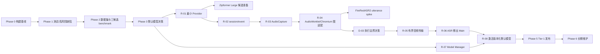

# Expression Trainer TODO / Roadmap

> 状态：Active execution baseline
> 更新日期：2026-08-29
> 当前进度：Phase 0-2、D-01～D-04、R-01～R-09、PKG-01～PKG-03 与 C-01/C-02 最小集成已完成；下一主线为 PKG-04 升级/卸载闭环
> 当前模式：内部开发/测试。发布级 review、审计、签名、广泛平台支持和未解决的模型再分发权利均是非阻塞后续工作；只有它们使当前技术实验无法运行或结论失效时，才阻塞当前路径。

## 1. 目标与排序原则

路线图保持以下主线，不因阶段记录清理而改变：

```text
事实/构建基线
→ 最小测试与真实 benchmark
→ 接受关键 ADR
→ 渐进重构 Audio / ASR / Model Manager
→ Electron Forge 安装发布
→ CI、版本和长期维护
```

排序规则：

- **P0**：没有它就无法安全继续，或会产生明显正确性、数据、构建或发布风险。
- **P1**：目标架构和可发布版本所必需，但不阻塞当前最近一步。
- **P2**：稳定发布后再评估的增强。
- 每个阶段保持应用可运行；不同时重写 UI、Audio、ASR、模型和打包。
- 新增依赖、流程、门禁或抽象必须对应当前具体风险，并说明何时可以删除。
- 内部 benchmark 只服务项目模型选择与复评，不扩张为公开评测平台、通用数据治理或审计系统。

## 2. 阶段与依赖主线



## 3. 已完成基线

这里只保留继续开发所需的状态摘要；逐任务操作日志、临时工作树和阶段 handoff 由 Git 历史承担。

| 阶段 | 已完成范围 | Canonical 证据 |
|---|---|---|
| Phase 0 — B-01～B-06 | 文档/源码事实、Node 22.23.x/npm 12.0.x、lockfile 安装和开发说明 | [开发与验证](development.md)、[当前架构](architecture/current.md) |
| Phase 1 — T-01～T-08 | 核心测试、设置迁移、stop final、安全渲染、LLM 控制、Electron smoke、Electron 43 升级 | `test/`、[当前架构](architecture/current.md) |
| Phase 2 — BM-01/BM-02/BM-04～BM-06 | 100 条冻结 FLEURS 数据、可复跑 harness、三候选同机比较 | [数据集来源](../benchmark/datasets/SOURCES.md)、[Harness](benchmark/harness.md)、[比较结果](benchmark/bm02-comparison-2026-08-27.md) |
| Phase 3 — D-01/D-02 | 冻结比较规则；ADR-0005 接受继续使用 Paraformer 默认 | [ADR-0005](architecture/adr/0005-select-default-asr-model-by-benchmark.md) |
| Phase 4 — R-01～R-09 | session/event、安全 IPC、AudioCapture/AudioWorklet、有界传输与 utility process 已建立；版本化 Paraformer 安全激活/回退；settings/custom rules 原子持久化、future-schema 防降级、共享规则与当前日志脱敏边界完成 | [当前架构](architecture/current.md) |
| Phase 5 — PKG-01～PKG-03 | Windows 11 25H2+ x64 Tier 1 目标；Forge/Squirrel package/make、完整 Sherpa Windows native bundle ASAR unpack、packaged Fake/native-load smoke；静默安装、真实 Paraformer 首次准备和强制离线二次启动 | [支持矩阵](support-matrix.md)、[ADR-0007](architecture/adr/0007-package-with-electron-forge.md) |

补充边界：

- BM-01 数据 intake、review、质量报告和 freeze 工具已归档到 Git 历史；核心 harness 继续保留。
- BM-03 工作树已归档，分支 `codex/benchmark/bm03-audio-baseline` 保留；其证据不作为模型选择门禁，后续音频兼容性由 R-03/R-04 接手。
- BM-07 已以 D-03 最小执行边界 spike 完成：只比较 native load、有界小块传输、退出恢复与进程隔离，不扩张为通用性能框架。
- 仅重开 Zipformer Large CTC INT8 候选准备与 FireRedASR2 CTC INT8 utterance spike；不进行通用的新模型扩张。新语料和新的 review 流程仍不在当前关键路径。

## 4. Phase 3 未完成决策

| ID | P | TODO | 推荐解决方案 | 依赖 | 完成标准 |
|---|---|---|---|---|---|
| D-03 | P0 | 接受 ASR 执行边界 ADR（Completed） | 有界 spike 比较 worker thread 与 Electron utility process 的 native load、1,000×320-frame 传输、退出恢复和路径边界；选择单个 utility process | R-02,R-04；BM-07 spike | ADR-0006 Accepted；R-05 使用 10-block 有界队列，R-06 实现 utility process 隔离；真实模型/Forge 验证保留在对应节点 |
| D-04 | P1 | 复审目标架构（Completed） | 已用 utility process、D-03 有界传输证据、R-07～R-09 当前实现和 Windows 11 25H2+ x64 Tier 1 目标复审 `target.md`/NFR；打包、最低硬件性能和 Experimental 平台仍明确为未实现 | D-03,PKG-01 | 当前/目标边界与支持矩阵一致；可运行事实和 PKG/OPS 计划分离 |

## 5. Phase 4 — 渐进重构 Audio / ASR / Model Manager

| ID | P | TODO | 推荐解决方案 | 依赖 | 完成标准 |
|---|---|---|---|---|---|
| R-01 | P0 | 包住当前 ASR（Completed） | 建立 initialize/feed/stop 契约与 Fake，适配现有 Paraformer；不同时换模型、音频或进程 | T-07,D-02 | UI/业务不接触 Sherpa 对象或模型配置；基线行为通过 |
| R-02 | P0 | 建 session/事件协议（Completed） | 统一 ready/partial/final/error/stopped，加入 sessionId、sequence、cancel 和 dispose 语义 | R-01,T-04 | 旧 session 事件不污染新训练；stop 可重复调用；迟到事件受控 |
| R-03 | P0 | 分离 AudioCapture（Completed） | 权限、track/context/node 生命周期、chunk 元数据与幂等释放已从 UI 状态抽出 | R-02；BM-03 仅作历史输入 | Audio 输出明确 sampleRate/channels/format；生命周期测试通过 |
| R-04 | P0 | AudioWorklet + Chromium 图适配（Completed） | 请求 `AudioContext({sampleRate:16000,latencyHint:'interactive'})` 并记录请求值、实际 context rate 与可用的 track rate；worklet 下混并汇集 320 帧单声道 Float32 chunk，停止时 flush 非空 tail；ScriptProcessor 已移除 | R-03 | 固定 Electron OfflineAudioContext/AudioBufferSource fixture、epoch、tail flush、停止单飞与失败关闭测试通过；真实 MediaStream 麦克风/驱动验证保留为非阻塞 follow-up |
| R-05 | P0 | 改音频传输与背压（Completed） | 320-frame TypedArray 由单发送者按序发送；总深度最多 10 块，记录 accepted/completed/rejected/discarded/overrun/peak，溢出以 `audio-overrun` 终止 session | R-04,D-03 | 队列与 Renderer 测试证明不会无限增长或静默丢音频；D-03 已接受当前小块 structured-clone copy |
| R-06 | P0 | ASR 移出 Main（Completed） | 单个 utility process 持有 Provider/Sherpa；Main Controller 关联请求、检测退出、下一 start 重建并以 5 秒上限完成 quit dispose | R-02,R-05,D-03 | Controller 测试与真实 Electron Fake smoke 覆盖强制退出、安全失败、重建和有界关闭；真实模型负载留作非阻塞环境验证 |
| R-07 | P1 | 实现轻量 Model Manager（Completed） | 独立产品 registry 固定 Paraformer 版本与 archive/runtime hash；HTTPS 下载有流式字节上限和严格 Range 有限续传，系统 `tar` 只提取白名单文件；同盘 staging、不可变版本目录、active pointer 与显式 rollback 均位于 `userData/models` | D-02,R-01 | 聚焦测试覆盖中断/续传、错误 hash、解压失败、空间不足、成功升级和上一版本回退；PKG-03 已完成真实 1 GB archive/system tar 闭环 |
| R-08 | P1 | 激活版本化默认模型（Completed） | utility process 从 `userData/models` 解析或安装 registry 默认 Paraformer；使用 role→绝对路径配置，native 初始化成功后才原子激活；当前版本损坏或加载失败时只探测并切换一次上一版本 | R-06,R-07,D-02 | 聚焦测试覆盖首次安装、single-flight、取消、role config、激活时序、损坏 active 与失败回退；PKG-03 已完成 packaged 真实模型初始化与离线二次启动 |
| R-09 | P1 | 收敛设置/规则/日志（Completed） | settings 与 custom-prompt 使用同盘临时文件 + fsync + rename 原子写；旧 schema 自动迁移，未来 schema 只兼容读取而不降级覆盖；字幕与本地分析共用唯一规则源，customWords 作为有界 filler 生效；现有错误日志维持脱敏边界，不引入 keychain/native 依赖 | T-03,R-07 | 聚焦测试覆盖旧/当前/未来 schema、发布失败保留旧文件、规则同源、自定义 filler 与错误脱敏；API Key 明文和可导出诊断留给发布前权衡/OPS-05 |

R-01～R-09、D-03/D-04、PKG-01～PKG-03 与 C-01/C-02 已完成当前最小边界。下一步验证 Windows x64 升级/卸载与数据保留策略；Paraformer 默认不变。

### 5.1 内部 benchmark 候选（不改变产品默认）

| ID | P | TODO | 推荐解决方案 | 依赖 | 完成标准 |
|---|---|---|---|---|---|
| C-01 | P1 | 准备 Zipformer Large CTC INT8 候选（Completed） | 已在现有 `zipformer-ctc` benchmark 路径加入 pending registry/allowlist、候选列表、adapter 契约测试及模型库存文档；模型文件留在 Git 外 | Phase 0～2、R-01 | 候选准备可复核；外部下载、hash、native 初始化 smoke 与 benchmark 明确保留为待办 |
| C-02 | P1 | FireRedASR2 CTC INT8 utterance spike（Completed: minimal integration） | 已在 `fire-red-asr-ctc` family 建立 pending registry 与 adapter；标准化 16 kHz 单声道音频只在结束时解码一次并产生 final，不伪造 streaming partial | R-02,R-04 | cancel/new-session 隔离契约已验证；外部下载、native-load、冻结数据集 CER/RTF/内存/冷启动/体积比较及 utterance UX 判断保留为待办 |

Paraformer 继续是产品默认。上述候选仅用于内部技术验证和 benchmark，不构成生产模型选择、打包或再分发授权。

## 6. Phase 5 — Electron Forge 打包与发布

| ID | P | TODO | 推荐解决方案 | 依赖 | 完成标准 |
|---|---|---|---|---|---|
| PKG-01 | P0 | 选 Tier 1 平台（Completed） | 首个目标固定 Windows 11 25H2+ x64；Windows ARM64/macOS/Linux 为 Experimental；4-core/8-GB/3-GB 硬件线留给 PKG-03 实测，不冒充已证明性能 | D-02 | `docs/support-matrix.md` 明确平台、OS/arch、硬件资格线与提升条件 |
| PKG-02 | P0 | 接入 Electron Forge（Completed） | Forge 7.5 + Squirrel 集中配置；Windows x64 整个 `sherpa-onnx-win-x64` 包在 ASAR 外，模型仍在 `userData`；packaged smoke 分别验证 Fake 产品流和 utility-only Sherpa native load | R-06,R-07,PKG-01 | 干净 `npm ci → make` 成功；生成 Setup/nupkg/RELEASES，package smoke 成功且不下载模型 |
| PKG-03 | P0 | 首次安装闭环（Completed） | Squirrel 静默安装后由 packaged utility 下载固定 1,047,319,737-byte Paraformer archive，执行大小/SHA、系统 `tar` 白名单解包、runtime 校验和 native 初始化；流中断在同次安装内用严格 206/Content-Range 有限续传；同一模型目录强制断网二次启动 | PKG-02,R-08 | 当前高配 Windows 11 x64 开发机实测安装 12.798 s、在线首次闭环 563.664 s、离线二次启动 3.672 s；普通用户无需 Node、Python 或编译器；接近资格线设备仍为非阻塞 follow-up |
| PKG-04 | P0 | 升级/卸载验证 | 覆盖安装、升级、降级限制和卸载后数据策略 | PKG-03,R-09 | 升级不静默丢设置/模型；行为有文档 |
| PKG-05 | P1 | 签名与发布 | 按平台启用代码签名/公证、checksums 和 release notes；无凭据时明确阻塞 | PKG-03 | 用户可验证来源和制品完整性 |
| PKG-06 | P1 | 扩展支持矩阵 | 在对应 OS 构建并执行 install/smoke，逐个平台提升支持等级 | PKG-03 | 每个声称支持的平台都有 CI 或人工证据 |

## 7. Phase 6 — 长期维护

| ID | P | TODO | 推荐解决方案 | 依赖 | 完成标准 |
|---|---|---|---|---|---|
| OPS-01 | P1 | CI 门禁 | `npm ci → npm test → Forge package`；大模型测试分层，普通 PR 使用 Fake/small smoke | T-07,PKG-02 | 主分支每次变更有自动结果 |
| OPS-02 | P1 | 版本/变更规范 | SemVer、CHANGELOG、release checklist；统一 package/界面/制品版本 | PKG-03 | 每个 release 可追溯到 commit、模型和 ADR |
| OPS-03 | P1 | 受控依赖升级 | Electron/Sherpa/Forge 按具体安全或兼容风险批次升级 | OPS-01 | 每次验证 native load、模型 smoke 和 Tier 1 制品 |
| OPS-04 | P1 | 模型生命周期 | registry 标记 current/deprecated/removed，定义兼容期和回退 | R-07,OPS-01 | 模型替换有数据、决策和弃用记录 |
| OPS-05 | P1 | 诊断基线 | 脱敏记录 app/OS/arch、模型、sample rate、初始化时间和错误类别 | R-09 | 用户可导出不含密钥的诊断信息 |
| OPS-06 | P2 | 自动更新评估 | 至少两个稳定手工发布后再评估 updater、托管、签名和回滚成本 | PKG-05,OPS-02 | 新 ADR 说明是否采用，不默认引入 |

## 8. 里程碑

| 里程碑 | 状态 | 包含 | 可交付结果 |
|---|---|---|---|
| M0 基线可复现 | Completed | B-01～B-06 | 环境、依赖和说明一致 |
| M1 可安全修改 | Completed | T-01～T-08 | 核心契约有测试，高风险缺陷受控 |
| M2 选型有证据 | Completed | BM-01、BM-02、BM-04～BM-06、D-01、D-02 | 三候选结果和 Accepted 模型 ADR |
| M3 架构收敛 | Completed | R-01～R-09、D-03/D-04 | Audio/ASR/模型分离，Main 不推理，模型升级可回退 |
| M4 可安装发布 | In Progress | PKG-01～PKG-06（PKG-01～PKG-03 Completed） | Tier 1 安装/升级闭环 |
| M5 可长期维护 | Planned | OPS-01～OPS-06 | CI、版本、依赖、模型和诊断机制稳定 |

## 9. 明确不做

- 不把重构变成 React/Vite/TypeScript UI 重写。
- 不默认引入 Python/FunASR/PyTorch/CUDA、Tauri 或 WASM。
- 除 Zipformer Large CTC INT8 和 FireRedASR2 CTC INT8 这两个已重开候选外，不新增模型；不新增语料或公开 benchmark，也不进行通用模型扩张。
- 不建设插件系统、模型市场、数据库、云端账户或通用评测平台。
- 不把内部模型选择升级为复杂审批、不可抵赖审计链或针对本地恶意管理员的防御系统。
- 不为覆盖率数字增加无法发现实质回归的测试。

## 10. 人工与外部跟进（当前非阻塞）

以下事项需要外部证据或人工判断；在内部开发/测试中仅当它们使当前技术实验无法运行或结论失效时才升级为阻塞项：

- 在打包或公开发布前确认模型和数据集再分发权利；
- 用真实可配置麦克风验证 16/44.1/48 kHz；
- 确定 Tier 1 OS、最低硬件和生产性能预算；
- 获得代码签名/公证凭据并检查最终安装器体验；
- 验证 macOS/Linux 的 native addon 与 package 行为；
- 确认 FireRedASR2 的 utterance/VAD 交互是否适合最终用户；
- 确认公开隐私告知、LLM 披露和发布支持口径。

## 11. Roadmap 维护规则

- 任务状态改变时更新本文件；逐步命令、worktree 路径和一次性验收日志不写入 Roadmap。
- 依赖未满足不得把下游标为完成；spike 结论必须回写对应 ADR。
- 每完成一个里程碑，更新 [current.md](architecture/current.md)；目标实现后把有效内容从 [target.md](architecture/target.md) 合并进当前架构。
- 新依赖、新平台或新云服务若改变约束，先更新 requirements，并在需要时创建或 supersede ADR。
- Owner、Issue/PR 只在确有协作或跟踪价值时记录，不作为每项任务的固定流程。
