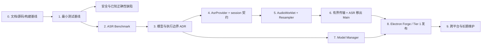

# Expression Trainer TODO / Roadmap

> 状态：Active execution baseline
> 基线日期：2026-08-22
> 源码：`morigejile/expression-trainer-pro`；Phase 0 实现基线：`b16a1d0bf799887cf7ece1283d73463961346030`（本地 `chore/reproducible-build`）

## 1. 目标与排序原则

路线图按以下主线执行：

```text
事实/构建基线
→ 依赖清理与可复现安装
→ 最小测试与真实 benchmark
→ 接受目标 ADR
→ 渐进重构 Audio / ASR / Model Manager
→ Electron Forge 安装发布
→ CI、版本和长期维护
```

排序规则：

- **P0**：没有它就无法安全继续或会产生明显数据/安全/构建风险。
- **P1**：目标架构和可发布版本所必需。
- **P2**：建立稳定发布后再做的增强。
- 每个阶段保持应用可运行；不同时重写 UI、Audio、ASR、模型和打包。
- 原有 `package-lock.json` 清理属于既存工作，已由仓库负责人确认并纳入 Phase 0；后续不得把不相关改动夹带进同一提交。

## 2. 依赖关系



## 3. 推荐执行清单

### Phase 0 — 基线、依赖与可复现构建

| ID | P | TODO | 推荐解决方案 | 依赖 | 完成标准 |
|---|---|---|---|---|---|
| B-01 | P0 | 建立文档基线 | 采用本套 requirements/current/target/ADR/roadmap；把交付文件复制到仓库 `docs/` 后以 PR 审查 | 无 | 文档链接有效；源码 SHA、事实与 TBD 清晰 |
| B-02 | P0 | 保护并解释当前工作树 | 记录 `git status`；确认 `package-lock.json` 删除陈旧 `node-microphone` 是期望改动，不还原、不夹带其他修改 | B-01 | 负责人确认改动归属；后续工作基于干净分支/副本 |
| B-03 | P0 | 固定开发环境 | 在干净 clone/worktree 记录 Node/npm/OS；选择与 Electron 33、Sherpa 和 Forge 兼容的 Node LTS 后写入 `engines`/开发说明（版本以实测为准） | B-02 | 新环境不靠全局包即可安装；版本记录可复制 |
| B-04 | P0 | 使依赖可复现 | 先在干净副本运行 `npm ci`；若失败，解释并只更新 lock；核心运行时依赖采用受控升级，不在本任务中盲目升到 latest | B-03 | `package.json`/lock 一致；连续两次干净安装结果一致 |
| B-05 | P0 | 依赖/死代码清点 | 用 import 搜索 + 启动 smoke 确认后删除 `node-microphone`、未用 `session` import 和无生产者的 `asr-result` listener；`tiered-lexicon.json` 经维护者确认保留为未启用候选数据 | B-04 | 每个删除有搜索/测试证据；候选数据状态明确；功能不变 |
| B-06 | P1 | 补最小开发说明 | 记录 setup、模型手工准备（现状）、start/dev/check/test 命令和已验证平台；纠正 README 的 30/50 字与“全程离线”表述 | B-04 | 新维护者在 30 分钟内按文档启动或得到明确缺失模型提示 |

#### Phase 0 执行记录（2026-08-21～2026-08-22）

| ID | 状态 | Owner | 证据 |
|---|---|---|---|
| B-01 | Completed | Codex + maintainer | `docs/` 相对链接全部解析；源码路径、分支基线与 TBD 已更新 |
| B-02 | Completed | maintainer | 已明确确认原有 `package-lock.json` 清理归属，并纳入 `chore/reproducible-build` |
| B-03 | Completed | Codex | Windows NT 10.0.26200.0 x64、Node 22.23.0、npm 12.0.2 已实测并写入 `.nvmrc`/`engines`/开发说明 |
| B-04 | Completed | Codex | 两次 clean `npm ci` 成功且安装树/Electron hash 一致；空 Electron 下载缓存探测在 GitHub 下载阶段等待约 10 分钟后中止，作为非阻塞 Runtime-TBD 保留 |
| B-05 | Completed | Codex + maintainer | 搜索、语法检查与启动 smoke 后删除 `node-microphone` lock 条目、未用 `session` import 和孤立 `asr-result` bridge；恢复并保留未引用的 `tiered-lexicon.json`，明确暂不启用 |
| B-06 | Completed | Codex | 新增 `docs/development.md`；README 改为 `npm ci`、30 字触发、可选联网和实测平台口径 |

### Phase 1 — 最小测试与高风险缺陷

| ID | P | TODO | 推荐解决方案 | 依赖 | 完成标准 |
|---|---|---|---|---|---|
| T-01 | P0 | 建立低依赖测试入口 | 优先使用 Node 内置 test runner；只为可测试性抽取纯函数，不引入大型测试框架 | B-04 | `npm test` 存在，干净安装后可运行 |
| T-02 | P0 | 锁住确定性业务 | 为 `lib/lexicon.js` 的空输入、填充/犹豫/笼统词、位置、密度和建议写表驱动测试 | T-01 | 当前认可行为全部有可读断言 |
| T-03 | P0 | 锁住设置迁移 | 把设置解析/迁移抽成纯函数；覆盖旧扁平配置、缺失 provider、损坏 JSON 和 schema 迁移 | T-01 | 配置升级不静默丢字段；失败可恢复 |
| T-04 | P0 | 修复尾部文本丢失 | 先写 stop/final 去重测试，再让 Renderer 合并 `stopASR().finalText` 并进入分析/报告 | T-01 | 最后一段未 endpoint 语音不丢失、不重复 |
| T-05 | P0 | 封堵 HTML 注入 | 用 text node/安全高亮 token 渲染 ASR 和粘贴文本；LLM Markdown 使用严格允许列表或纯文本，不直接信任 HTML | T-01 | ``、`<script>`、事件属性测试均不执行 |
| T-06 | P1 | LLM 请求可控 | 给 fetch 增加 AbortController 超时、会话取消、响应结构验证和脱敏错误；本地分析不依赖 LLM 成功 | T-01 | 超时/限流/无 Key/坏 JSON 有稳定错误且不覆盖本地结果 |
| T-07 | P1 | 最小 smoke | 覆盖 Electron 启动、页面加载、设置窗口、粘贴分析；ASR 用 Fake Provider，不把大模型放入普通单测 | T-01～T-03 | 每次变更能发现启动/Preload 契约回归 |
| T-08 | P0 | Electron 安全升级 spike | 基于 `npm audit` 结果评估从 Electron 33 升级到受支持版本；不得使用 `npm audit fix --force`，逐项验证 native Sherpa、Preload/IPC、窗口与后续 Forge 兼容性 | T-01,T-07 | audit 风险关闭或有明确接受/缓解记录；升级前后 smoke 证据完整 |

#### Phase 1 执行记录（2026-08-22）

| ID | 状态 | Owner | 证据 |
|---|---|---|---|
| T-01 | Completed | Codex + maintainer | 使用 Node 内置 `node:test` 建立 `npm test`；Node 22.23.0/npm 12.0.2 下 `npm ci`、1 项模块入口 smoke、`npm run check` 均成功；不需要 ASR 模型、麦克风或网络，未引入新依赖 |
| T-02 | Completed | Codex + maintainer | 为 `lib/lexicon.js` 增加 5 项确定性测试，覆盖空输入、分类、token 位置、情绪元数据、密度和建议阈值；未修改生产实现或启用候选词库 |
| T-03 | Completed | Codex + maintainer | 将设置默认值、解析、schema 迁移和当前 provider 选择抽到纯模块；6 项测试覆盖旧扁平配置、缺失 provider、损坏 JSON、字段保留和 `schemaVersion: 1`，损坏文件不自动覆盖 |
| T-06 | Completed | Codex + maintainer | 基于完整 T-03 修复提交 `99f4707`，为原生 fetch 增加 10/15/60 秒超时、AbortSignal、按 Renderer/请求类型取消和迟到结果抑制；25 项 fake-fetch 测试覆盖无 Key、429、HTTP 错误、超时、取消、坏 JSON、异常响应与敏感错误脱敏，本地分析输入不被 LLM 失败修改；未包含 T-04/T-05/T-07 |

### Phase 2 — ASR Benchmark 与技术 spike

| ID | P | TODO | 推荐解决方案 | 依赖 | 完成标准 |
|---|---|---|---|---|---|
| BM-01 | P0 | 建 benchmark 数据集 | 准备经授权、脱敏、人工校对的 50～100 条真实中文表达训练录音；按普通话/语速/轻口音/中英/数字专名/噪声分层 | T-01 | 每条有 ground truth、类别、来源/许可；数量不足时明确局限 |
| BM-02 | P0 | 建可复跑 harness | 同一入口输出逐条与汇总 JSON/CSV：CER、首 partial、最终延迟、RTF、CPU、峰值 RAM、初始化、模型大小；记录硬件/OS/线程/版本 | BM-01 | 同设备重复运行差异可解释；原始结果可审计 |
| BM-03 | P0 | 验证音频基线 | 用合成频率/时长 fixture 和真实 44.1/48 kHz 设备记录当前 AudioContext 实际率，证明当前链路是否误声明采样率 | T-01 | 得到可复现证据，不再只凭风险推断 |
| BM-04 | P0 | 跑当前对照 | 冻结当前 Paraformer 归档、hash、许可证和配置，测 cold/warm 与真实流式路径 | BM-02,BM-03 | 完整原始结果和失败日志 |
| BM-05 | P0 | 跑 Zipformer 候选 | 至少测试小型中文 streaming Zipformer；资源允许时加较大中文版本，使用同一 Sherpa/硬件规则 | BM-02 | 完整原始结果，不只记录公开榜单 |
| BM-06 | P0 | 跑 SenseVoiceSmall | 使用 Sherpa-ONNX INT8，明确 VAD/utterance 方式；分别度量句级完成体验，不能伪装为 streaming partial | BM-02 | 与产品 UX 权重一致的结果 |
| BM-07 | P1 | ASR 执行边界 spike | 用当前模型最小比较 utility/child process 与 worker thread：加载、feed、stop、退出、重启、打包路径、Main 延迟 | T-07,BM-04 | ADR-0006 所需数据齐全 |

> FunASR-Nano、Whisper、WASM 可作为研究参考，但不阻塞首轮决策，也不进入默认运行依赖。

### Phase 3 — 冻结目标决策

| ID | P | TODO | 推荐解决方案 | 依赖 | 完成标准 |
|---|---|---|---|---|---|
| D-01 | P0 | 冻结产品权重 | 在看汇总排名前确认准确率、首字/最终延迟、RAM、体积、许可证和 streaming UX 权重 | BM-01,BM-02 | 权重版本化且不会为偏好结果事后修改 |
| D-02 | P0 | 接受模型 ADR | 用 BM-04～06 数据更新 ADR-0005；记录默认模型、版本/hash/config、对照结果和回退模型 | D-01,BM-04～06 | ADR Accepted；不得只有“新模型更好” |
| D-03 | P0 | 接受执行边界 ADR | 基于 BM-07 接受 ADR-0006，明确消息协议、故障恢复和打包方式 | BM-07 | utility/child/worker 选择有数据 |
| D-04 | P1 | 复审目标架构 | 用已接受的模型/执行机制更新 `target.md`、NFR 性能门槛和支持矩阵 | D-02,D-03 | 目标中不再保留可由实测解决的 TBD |

### Phase 4 — 渐进重构 Audio / ASR / Model Manager

| ID | P | TODO | 推荐解决方案 | 依赖 | 完成标准 |
|---|---|---|---|---|---|
| R-01 | P0 | 包住当前 ASR | 先建立最小 AsrProvider/Fake 契约，让现有 Paraformer 适配；不同时换模型/音频/进程 | T-07,D-02 | UI/业务不 import Sherpa/模型路径；基线行为通过 |
| R-02 | P0 | 建 session/事件协议 | 统一 ready/partial/final/error/stopped，加入 sessionId/sequence/cancel，解决迟到反馈和 stop 竞态 | R-01,T-04 | 旧 session 事件不污染新训练；停止可重复调用 |
| R-03 | P0 | 分离 AudioCapture | 把权限、track/context 生命周期和 chunk 元数据从 UI 状态中抽出，仍先保留当前处理节点 | R-02,BM-03 | Audio 输出明确 sampleRate/channels/format；生命周期测试通过 |
| R-04 | P0 | AudioWorklet + Resampler | 以模型 registry 的采样率为目标；使用可测试 resampler；保留 A/B 开关直到真实设备回归通过 | R-03 | 16/44.1/48 kHz fixture 与真实设备通过；移除 ScriptProcessor |
| R-05 | P0 | 改音频传输与背压 | 传 TypedArray/transferable buffer，避免 Array.from；使用 MessagePort/已选通道和有界队列，记录 dropped/backpressure | R-04,D-03 | profile 证明队列不无限增长，序列连续性可观测 |
| R-06 | P0 | ASR 移出 Main | 按 ADR-0006 实现独立执行单元；Main 只管理生命周期、路由和退出 | R-01,R-02,R-05 | 强制退出可恢复；Main/UI 响应门槛通过 |
| R-07 | P1 | 实现轻量 Model Manager | 版本化 registry、HTTPS、SHA-256、临时下载/解压、原子激活、上一版本回退；模型存 userData 子目录 | D-02,R-01 | 中断/hash 错/磁盘不足不破坏现有模型 |
| R-08 | P1 | 切换默认模型 | 用 registry 配置新模型，保留当前 Paraformer 为受控回退/迁移路径；不把多模型复杂度暴露给普通用户 | R-06,R-07,D-02 | 端到端结果与 benchmark 版本一致 |
| R-09 | P1 | 收敛设置/规则/日志 | 演进 schemaVersion、增加原子写和脱敏日志；评估系统凭据库的收益与 native 成本后再决定 Key 存储 | T-03,R-07 | 升级保留配置；日志不含 Key/完整敏感文本 |

### Phase 5 — Electron Forge 打包与发布

| ID | P | TODO | 推荐解决方案 | 依赖 | 完成标准 |
|---|---|---|---|---|---|
| PKG-01 | P0 | 选 Tier 1 平台 | 按主要用户与维护资源选择一个首发平台；README 的三平台声明改为 Tier 1/2/Experimental | D-04 | 平台、OS/arch 下限明确 |
| PKG-02 | P0 | 接入 Electron Forge | 集中 forge config；验证 native rebuild、共享库、worker entry、ASAR unpack 和外部模型目录 | R-06,R-07,PKG-01 | `package`/`make` 在干净环境成功 |
| PKG-03 | P0 | 首次安装闭环 | 安装制品启动、引导模型下载、校验、初始化、离线二次启动 | PKG-02,R-08 | 普通用户不安装 Node/Python/编译器 |
| PKG-04 | P0 | 升级/卸载验证 | 覆盖安装、降级限制、卸载后数据策略；设置/模型与程序目录分离 | PKG-03,R-09 | 升级不静默丢设置/模型，行为有文档 |
| PKG-05 | P1 | 签名与发布 | 按平台启用代码签名/公证、checksums、release notes；无凭据时明确阻塞，不做假签名 | PKG-03 | 用户可验证来源和制品完整性 |
| PKG-06 | P1 | 扩展支持矩阵 | 在对应 OS 构建并跑 install/smoke；逐个平台提升支持等级 | PKG-03 | 每个声称支持的平台有 CI/人工证据 |

### Phase 6 — 长期维护机制

| ID | P | TODO | 推荐解决方案 | 依赖 | 完成标准 |
|---|---|---|---|---|---|
| OPS-01 | P1 | CI 门禁 | `npm ci → check/test → Forge package`；ASR 大模型测试分层，普通 PR 使用 Fake/small smoke | T-07,PKG-02 | 主分支每次变更有自动结果 |
| OPS-02 | P1 | 版本/变更规范 | SemVer、CHANGELOG、release checklist；统一 package/界面/制品版本 | PKG-03 | 每个 release 可追溯到 commit、模型和 ADR |
| OPS-03 | P1 | 受控依赖升级 | Electron/Sherpa/Forge 定期批次升级；每次验证 native load、模型 smoke 和 Tier 1 制品 | OPS-01 | 升级是有计划事件，不由宽范围意外触发 |
| OPS-04 | P1 | 模型生命周期 | registry 标记 current/deprecated/removed，定义兼容期和回退；升级需重跑固定 benchmark | R-07,OPS-01 | 模型替换有数据和弃用记录 |
| OPS-05 | P1 | 诊断基线 | 结构化脱敏日志记录 app/OS/arch、模型、sample rate、初始化时间、错误类别 | R-09 | 用户可导出不含密钥的诊断信息 |
| OPS-06 | P2 | 自动更新评估 | 稳定两个手工发布后再评估 updater、托管、签名和回滚成本 | PKG-05,OPS-02 | 新 ADR 说明是否采用，不默认引入 |

## 4. 建议里程碑

| 里程碑 | 包含 | 可交付结果 |
|---|---|---|
| M0 基线可复现 | B-01～B-06 | 新环境可安装/启动，事实、依赖和说明一致 |
| M1 可安全修改 | T-01～T-07 | 核心契约有测试，尾部丢字/注入/悬挂请求受控 |
| M2 选型有证据 | BM-01～D-04 | 默认模型与 ASR 隔离机制有 Accepted ADR |
| M3 架构收敛 | R-01～R-09 | Audio/ASR/模型分离，Main 不推理，升级可回退 |
| M4 可安装发布 | PKG-01～PKG-06 | Tier 1 安装/升级闭环，逐步扩展平台 |
| M5 可长期维护 | OPS-01～OPS-06 | CI、版本、依赖、模型和诊断机制稳定 |

## 5. 明确不做

- 不把重构变成 React/Vite/TypeScript UI 重写。
- 不默认引入 Python/FunASR/PyTorch/CUDA。
- 不先切 Tauri/WASM，再补回现有功能。
- 不在 benchmark 前把 Zipformer 或 SenseVoiceSmall写成赢家。
- 不一开始建设插件系统、模型市场、数据库或云端账户。
- 不为了“规范”要求 90% 覆盖率；优先覆盖会破坏产品闭环的契约。

## 6. Roadmap 维护规则

- 实际执行时给每项增加 owner、issue/PR、状态和证据链接。
- 依赖未满足不得把下游标为完成；可以做 spike，但结果必须回写 ADR。
- 每完成一个里程碑，更新 [current.md](architecture/current.md)；目标实现完毕后合并 [target.md](architecture/target.md) 的有效内容。
- 新依赖、新平台或新云服务若改变约束，先更新需求并创建 ADR。
