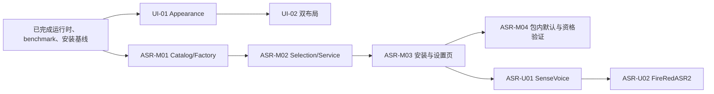

# Expression Trainer Roadmap

> 状态：Active
> 更新日期：2026-08-31
> 当前模式：内部开发/测试；UI-01/UI-02 与 ASR-M01～M03 已完成，ASR-M04 受许可和公开制品条件约束。

## 1. 排序原则

- **P0**：没有它就无法安全继续，或会产生明显正确性、数据、构建或发布风险。
- **P1**：目标版本所需，但不阻塞最近一步。
- **P2**：稳定发布后再评估的增强。
- 每个阶段保持应用可运行，不同时重写 UI、Audio、ASR、模型和打包。
- 新增依赖、流程、门禁或抽象必须对应当前具体风险，并说明何时可以移除。
- 内部 benchmark 只服务模型选择与复评，不扩张为公开评测平台或审计系统。

## 2. 当前依赖关系

UI 与 ASR 轨道可独立推进。ASR-M04 受模型再分发许可和公开制品条件约束；utterance 轨道不进入当前 streaming 关键路径。

## 3. 已完成基线

逐任务步骤和阶段 handoff 由 Git 历史承担；这里仅保留继续开发所需的结果。

| 范围 | 已完成结果 | Canonical 证据 |
|---|---|---|
| Phase 0-1 | 可复现开发基线、核心测试、安全渲染、设置迁移、LLM 请求控制、Electron smoke | [开发与验证](development.md)、[当前架构](architecture/current.md) |
| Phase 2-3 | 冻结语料、可复跑 benchmark、七候选比较、Zipformer Large 技术默认 | [Harness](benchmark/harness.md)、[BM-04 结果](benchmark/bm04-seven-model-comparison-2026-08-30.md)、[ADR-0009](architecture/adr/0009-productize-multiple-asr-models.md) |
| Phase 4 | ASR session/event、AudioCapture/AudioWorklet、有界传输、utility process、Model Manager、配置与诊断边界 | [当前架构](architecture/current.md) |
| Phase 5 | Windows x64 Forge/Squirrel 制品、真实模型首次安装、离线二次启动、升级和卸载数据保留 | [支持矩阵](support-matrix.md)、[ADR-0007](architecture/adr/0007-package-with-electron-forge.md) |
| CONV-01～03 | 文档职责收敛、benchmark writer 竞态修复、LLM provider 配置迁移 | [CHANGELOG](../CHANGELOG.md)、Git 历史 |

## 4. 当前执行轨道

### 4.1 Appearance

| ID | P | 状态 | 任务 | 完成标准 |
|---|---|---|---|---|
| UI-01 | P1 | Completed | 独立 AppearanceStore、四主题、窗口同步和响应式初始尺寸 | 外观可恢复、原子持久化和跨窗口同步；读取失败时页面仍可见 |
| UI-02 | P1 | Completed | coach-rail/focus-hud 双布局、统一图标和代表性视觉验收 | 两种布局共用现有 DOM；代表性尺寸下训练状态、控件、滚动和字幕区域保持稳定 |

### 4.2 Streaming ASR productization

| ID | P | 状态 | 任务 | 完成标准 |
|---|---|---|---|---|
| ASR-M01 | P1 | Completed | 以内含受信任映射的 Catalog/Factory 接入三款 streaming provider | 三款模型由同一工厂创建；能力来自代码，不建立空转 Registry service |
| ASR-M02 | P1 | Completed | AsrSelectionStore、AsrModelService、启动恢复和 controller 切换 | 无活动 session 时可切换；稳定损坏与瞬时失败采用不同持久化语义 |
| ASR-M03 | P1 | Completed | 独立安装任务、模型管理 IPC 和设置页模型区域 | 下载可取消重试；Renderer 只提交受信任模型 ID；安装不影响当前识别 |
| ASR-M04 | P1 | External gate | Zipformer Large 包内默认、升级保留和真实模型资格验证 | 获得再分发批准；离线首次导入、native 初始化、二次启动和升级保留通过 |

### 4.3 Deferred utterance ASR

| ID | P | 状态 | 任务 | 重开条件 |
|---|---|---|---|---|
| ASR-U01 | P2 | Deferred | SenseVoiceSmall utterance、5 分钟缓冲和停止后解码 | ASR-M03 完成且产品重新确认优先级 |
| ASR-U02 | P2 | Deferred | FireRedASR2 多来源安装和 utterance UX | ASR-U01 通过上限、cancel、失败和 session 隔离验证 |

### 4.4 Delivery and maintenance

| ID | P | 状态 | 任务 | 触发/完成条件 |
|---|---|---|---|---|
| PKG-05 | P1 | Planned | 代码签名、checksums 和 release notes | 公开发布前具备凭据并验证来源与完整性 |
| PKG-06 | P1 | Planned | 扩展支持矩阵 | 每个提升支持等级的平台均有对应 package/smoke 证据 |
| OPS-01 | P1 | Deferred | 最小 CI/内测取包自动化 | 跨机取包成为反复痛点时增加可移除的手工 Windows workflow |
| OPS-03 | P1 | Ongoing | 受控运行时与依赖升级 | 只因具体安全或兼容风险升级，并重跑能发现实质回归的验证 |
| OPS-04 | P1 | Planned | 模型生命周期 | 定义 current/deprecated/removed、兼容期和回退 |
| OPS-06 | P2 | Deferred | 自动更新评估 | 至少两个稳定手工发布后用 ADR 决定是否采用 |

## 5. 里程碑

| 里程碑 | 状态 | 包含 | 结果 |
|---|---|---|---|
| Baseline | Completed | Phase 0-5、CONV-01～03 | 当前运行时、评测和 Windows x64 内部交付基线可复现 |
| M4 UI foundation | Completed | UI-01、UI-02 | 主题与两种响应式布局已集成，并在切换中保持训练状态 |
| M5 Streaming models | In progress | ASR-M01～M04 | Catalog/Factory、选择、单 controller 切换与安装设置入口已完成；包内默认和公开资格仍受外部门槛约束 |
| M7 Public delivery | External gate | PKG-05、PKG-06 | 签名、许可和目标平台证据满足公开发布 |

## 6. 明确不做

- 不重写为 Tauri、WASM、React/Vue 或独立后端。
- 不为尚未进入产品批次的模型预建 adapter、下载器或 UI。
- 不把内部七候选结果包装为公开权威 benchmark。
- 不在没有当前风险时增加审批、审计、遥测、插件、数据库或通用状态框架。

## 7. 外部跟进

- 真实可配置麦克风和接近 4-core/8-GB/3-GB 资格线设备的运行证据。
- Zipformer Large 等模型的公开再分发许可。
- Windows 签名凭据；macOS/Linux/ARM64 对应构建与 native 模型证据。

## 8. 维护规则

- Roadmap 只保留未完成工作、依赖、外部门禁和一页已完成基线，不保存逐任务日志。
- 已完成任务移入“已完成基线”摘要；具体提交、命令和临时结论由 Git 历史承担。
- 当前实现事实写入[当前架构](architecture/current.md)，产品行为写入[需求基线](requirements/requirements.md)，决策理由写入 [ADR](architecture/adr/README.md)。
- 新增计划文件只用于尚未开始且需要跨步骤协调的工作；实施完成并吸收最终事实后删除。
