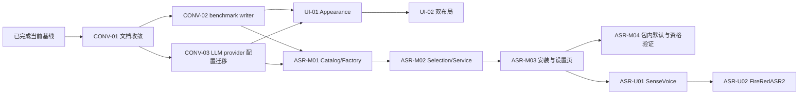

# Expression Trainer TODO / Roadmap

> 状态：Active execution baseline
> 更新日期：2026-08-31
> 当前进度：Phase 0-5 的内部基线、R-01～R-09、PKG-01～PKG-04、OPS-02/OPS-05、七候选 benchmark、CONV-01～CONV-03 与 UI-01/UI-02 已完成。下一主线是 ASR-M01～ASR-M03；ASR-M04 继续受许可和公开制品条件约束。
> 当前模式：内部开发/测试。发布级 review、审计、签名、广泛平台支持和未解决的模型再分发权利均是非阻塞后续工作；只有它们使当前技术实验无法运行或结论失效时，才阻塞当前路径。

## 1. 目标与排序原则

已完成历史主线保持不变；近期合并后的执行主线调整为：

```text
已完成 Paraformer/安装/benchmark 基线
→ CONV-01 文档与职责收敛
→ CONV-02/CONV-03 基线代码风险
→ UI-01/UI-02 与 ASR-M01～M03 可独立推进
→ ASR-M04 受许可与公开制品条件约束
→ ASR-U01/ASR-U02 在 streaming 稳定后再确认
```

排序规则：

- **P0**：没有它就无法安全继续，或会产生明显正确性、数据、构建或发布风险。
- **P1**：目标架构和可发布版本所必需，但不阻塞当前最近一步。
- **P2**：稳定发布后再评估的增强。
- 每个阶段保持应用可运行；不同时重写 UI、Audio、ASR、模型和打包。
- 新增依赖、流程、门禁或抽象必须对应当前具体风险，并说明何时可以删除。
- 内部 benchmark 只服务项目模型选择与复评，不扩张为公开评测平台、通用数据治理或审计系统。

## 2. 阶段与依赖主线



## 3. 已完成基线

这里只保留继续开发所需的状态摘要；逐任务操作日志、临时工作树和阶段 handoff 由 Git 历史承担。

| 阶段 | 已完成范围 | Canonical 证据 |
|---|---|---|
| Phase 0 — B-01～B-06 | 文档/源码事实、lockfile 安装和开发说明；工具链原基线 Node 22.23.x/npm 12.0.x 已由 OPS-03 迁移声明替代 | [开发与验证](development.md)、[当前架构](architecture/current.md) |
| Phase 1 — T-01～T-08 | 核心测试、设置迁移、stop final、安全渲染、LLM 控制、Electron smoke、Electron 43 升级 | `test/`、[当前架构](architecture/current.md) |
| Phase 2 — BM-01～BM-04 | 100 条冻结 FLEURS 数据、可复跑 harness、七候选同机比较 | [数据集来源](../benchmark/datasets/SOURCES.md)、[Harness](benchmark/harness.md)、[BM-04 结果](benchmark/bm04-seven-model-comparison-2026-08-30.md) |
| Phase 3 — D-01/D-02 | 冻结比较规则；ADR-0009 采用 Zipformer Large 技术默认 | [ADR-0009](architecture/adr/0009-productize-multiple-asr-models.md) |
| Phase 4 — R-01～R-09 | session/event、安全 IPC、AudioCapture/AudioWorklet、有界传输与 utility process 已建立；版本化 Paraformer 安全激活/回退；settings/custom rules 原子持久化、共享规则与当前日志脱敏边界完成。R-09 当时未关闭的 LLM provider 显式保存边界已由 CONV-03 补齐 | [当前架构](architecture/current.md) |
| Phase 5 — PKG-01～PKG-04 | Windows 11 25H2+ x64 Tier 1 目标；Forge/Squirrel package/make、完整 Sherpa Windows native bundle ASAR unpack、packaged Fake/native-load smoke；静默安装、真实 Paraformer 首次准备、强制离线二次启动、1.0.0→1.0.1 升级及卸载数据保留 | [支持矩阵](support-matrix.md)、[ADR-0007](architecture/adr/0007-package-with-electron-forge.md) |

补充边界：

- BM-01 数据 intake、review、质量报告和 freeze 工具已归档到 Git 历史；核心 harness 继续保留。
- BM-03 工作树已归档，分支 `codex/benchmark/bm03-audio-baseline` 保留；其证据不作为模型选择门禁，后续音频兼容性由 R-03/R-04 接手。
- BM-07 已以 D-03 最小执行边界 spike 完成：只比较 native load、有界小块传输、退出恢复与进程隔离，不扩张为通用性能框架。
- 仅重开 Zipformer Large CTC INT8 候选准备与 FireRedASR2 CTC INT8 utterance spike；不进行通用的新模型扩张。新语料和新的 review 流程仍不在当前关键路径。

## 4. 当前执行轨道

### 4.1 Baseline Convergence

| ID | P | 状态 | 任务 | 依赖 | 完成标准 |
|---|---|---|---|---|---|
| CONV-01 | P0 | Completed | 收敛 requirements、current architecture、ADR/spec、Roadmap、开发与验证文档 | 当前 main 基线 | `bb8abb7` 已使当前事实、未来设计和历史证据各有唯一来源；文档类型未扩张；13 个文档通过链接、代码块和差异检查 |
| CONV-02 | P0 | Completed | 修复 benchmark result writer 并行失败后的 staging 清理竞态 | CONV-01 | `2c01017` 等待全部写入 settled 后再清理并保留原始错误；聚焦故障注入和 Node 24.20.0 全量测试通过 |
| CONV-03 | P1 | Completed | 显式命名和迁移 LLM provider 配置 | CONV-01 | `8b93f88` 完成单向迁移、显式模块/Preload/IPC 命名、future schema 保存拒绝和迁移失败测试 |

CONV-02 与 CONV-03 使用独立实施计划和提交，不与 Appearance、多模型或彼此混合。

### 4.2 Appearance

| ID | P | 状态 | 任务 | 依赖 | 完成标准 |
|---|---|---|---|---|---|
| UI-01 | P1 | Completed | 独立 AppearanceStore、四主题、窗口同步和响应式初始尺寸 | CONV-02,CONV-03 | `appearance.json` 已实现损坏恢复、原子持久化和 future-schema 保存保护；四主题及布局标识通过根属性跨主窗口/设置/训练规则页同步；窗口按逻辑工作区计算并居中；读取失败时 HTML 默认外观仍可见 |
| UI-02 | P1 | Completed | coach-rail/focus-hud 双布局、统一图标和代表性视觉验收 | UI-01 | 同一 DOM 通过根属性切换；Electron smoke 覆盖 960×640、1366×768、1760×1000 的节点/控件/计时/状态/滚动保真和无遮挡几何；代表性 Graphite/Paper 视觉检查通过；未增加视觉审批系统 |

### 4.3 Streaming ASR Productization

| ID | P | 状态 | 任务 | 依赖 | 完成标准 |
|---|---|---|---|---|---|
| ASR-M01 | P1 | Planned | 演进产品 Catalog schema，以内含受信任映射的 ProviderFactory 接入三款 streaming provider | CONV-02,CONV-03,ADR-0009 | 当前 Paraformer 回归不变；三款模型由同一工厂创建；不建立独立空转 Registry service |
| ASR-M02 | P1 | Planned | AsrSelectionStore、AsrModelService、启动恢复和 controller 切换 | ASR-M01 | 无活动 session 时可切换；稳定文件损坏可恢复默认，瞬时 native/资源失败不永久改写选择 |
| ASR-M03 | P1 | Planned | 独立安装任务、模型管理 IPC 和设置页模型区域 | ASR-M02 | 下载可取消重试；Renderer 不提交路径、URL 或 providerType；安装不影响当前识别 |
| ASR-M04 | P1 | Planned/External Gate | Zipformer Large 包内默认、升级保留和真实模型资格验证 | ASR-M03,redistribution approved | 离线首次导入、native 初始化、二次启动和升级保留通过；公开制品满足签名与许可要求 |

### 4.4 Utterance ASR

| ID | P | 状态 | 任务 | 依赖 | 完成标准 |
|---|---|---|---|---|---|
| ASR-U01 | P2 | Deferred | SenseVoiceSmall utterance、5 分钟缓冲和停止后解码 | ASR-M03,streaming 轨道稳定 | 无 partial；上限、cancel、失败和 session 隔离通过 |
| ASR-U02 | P2 | Deferred | FireRedASR2 多来源安装和 utterance UX | ASR-U01 | 固定多来源校验、真实模型和人工等待体验通过 |

Utterance 不进入当前 streaming 关键路径；开始 ASR-U01 前必须重新确认产品优先级。

## 5. 历史 Phase 3 决策

| ID | P | TODO | 推荐解决方案 | 依赖 | 完成标准 |
|---|---|---|---|---|---|
| D-03 | P0 | 接受 ASR 执行边界 ADR（Completed） | 有界 spike 比较 worker thread 与 Electron utility process 的 native load、1,000×320-frame 传输、退出恢复和路径边界；选择单个 utility process | R-02,R-04；BM-07 spike | ADR-0006 Accepted；R-05 使用 10-block 有界队列，R-06 实现 utility process 隔离；真实模型/Forge 验证保留在对应节点 |
| D-04 | P1 | 复审目标架构（Completed） | utility process、R-07～R-09、Windows x64 打包与诊断边界均已实现；有效内容已合并进 `current.md`，短期 Target Architecture 已从活跃文档树移除 | D-03,PKG-01 | 当前事实、ADR 与 Roadmap 分工明确，不保留已实现的第二份架构真相源 |

## 6. 历史 Phase 4 — 渐进重构 Audio / ASR / Model Manager

| ID | P | TODO | 推荐解决方案 | 依赖 | 完成标准 |
|---|---|---|---|---|---|
| R-01 | P0 | 包住当前 ASR（Completed） | 建立 initialize/feed/stop 契约与 Fake，适配现有 Paraformer；不同时换模型、音频或进程 | T-07,D-02 | UI/业务不接触 Sherpa 对象或模型配置；基线行为通过 |
| R-02 | P0 | 建 session/事件协议（Completed） | 统一 ready/partial/final/error/stopped，加入 sessionId、sequence、cancel 和 dispose 语义 | R-01,T-04 | 旧 session 事件不污染新训练；stop 可重复调用；迟到事件受控 |
| R-03 | P0 | 分离 AudioCapture（Completed） | 权限、track/context/node 生命周期、chunk 元数据与幂等释放已从 UI 状态抽出 | R-02；BM-03 仅作历史输入 | Audio 输出明确 sampleRate/channels/format；生命周期测试通过 |
| R-04 | P0 | AudioWorklet + Chromium 图适配（Completed） | 请求 `AudioContext({sampleRate:16000,latencyHint:'interactive'})` 并记录请求值、实际 context rate 与可用的 track rate；worklet 下混并汇集 320 帧单声道 Float32 chunk，停止时 flush 非空 tail；ScriptProcessor 已移除 | R-03 | 固定 Electron OfflineAudioContext/AudioBufferSource fixture、epoch、tail flush、停止单飞与失败关闭测试通过；真实 MediaStream 麦克风/驱动验证保留为非阻塞 follow-up |
| R-05 | P0 | 改音频传输与背压（Completed） | 320-frame TypedArray 由单发送者按序发送；总深度最多 10 块，记录 accepted/completed/rejected/discarded/overrun/peak，溢出以 `audio-overrun` 终止 session | R-04,D-03 | 队列与 Renderer 测试证明不会无限增长或静默丢音频；D-03 已接受当前小块 structured-clone copy |
| R-06 | P0 | ASR 移出 Main（Completed） | 单个 utility process 持有 Provider/Sherpa；Main Controller 关联请求、检测退出、下一 start 重建并以 5 秒上限完成 quit dispose | R-02,R-05,D-03 | Controller 测试与真实 Electron Fake smoke 覆盖强制退出、安全失败、重建和有界关闭；真实模型负载留作非阻塞环境验证 |
| R-07 | P1 | 实现轻量 Model Manager（Completed） | 独立产品 registry 固定 Paraformer 版本与 archive/runtime hash；HTTPS 下载有流式字节上限和严格 Range 有限续传，系统 `tar` 只提取白名单文件；同盘 staging、不可变版本目录、active pointer 与显式 rollback 均位于 `userData/models` | D-02,R-01 | 聚焦测试覆盖中断/续传、错误 hash、解压失败、空间不足、成功升级和上一版本回退；PKG-03 已完成真实 1 GB archive/system tar 闭环 |
| R-08 | P1 | 激活版本化默认模型（Completed） | utility process 从 `userData/models` 解析或安装 registry 默认 Paraformer；使用 role→绝对路径配置，native 初始化成功后才原子激活；当前版本损坏或加载失败时只探测并切换一次上一版本 | R-06,R-07,D-02 | 聚焦测试覆盖首次安装、single-flight、取消、role config、激活时序、损坏 active 与失败回退；PKG-03 已完成 packaged 真实模型初始化与离线二次启动 |
| R-09 | P1 | 收敛设置/规则/日志（Completed） | settings 与 custom-prompt 使用同盘临时文件 + fsync + rename 原子写；旧 schema 自动迁移，future schema 自动加载不写回；字幕与本地分析共用唯一规则源，customWords 作为有界 filler 生效；现有错误日志维持脱敏边界，不引入 keychain/native 依赖 | T-03,R-07 | R-09 聚焦测试覆盖读取和原子发布、规则同源、自定义 filler 与错误脱敏；当时未覆盖的 LLM provider 显式保存防降级已由 CONV-03 完成；OPS-05 已补固定白名单诊断导出 |

R-01～R-09、D-03/D-04、PKG-01～PKG-04 与 BM-04 已完成当前最小边界。七候选均已验证；ADR-0009 已采用 Zipformer Large 技术默认，公开分发仍取决于许可与产品链路验收。

### 6.1 内部 benchmark 候选（不改变当前 Paraformer 运行时）

| ID | P | TODO | 推荐解决方案 | 依赖 | 完成标准 |
|---|---|---|---|---|---|
| C-01 | P1 | 验证 Zipformer Large CTC INT8 候选（Completed） | registry、runtime hash、native-load 与 BM-04 benchmark 均已完成；继续使用现有 `zipformer-ctc` streaming adapter | Phase 0～2、R-01 | 候选证据可复核；公开再分发仍未获批 |
| C-02 | P1 | 验证 FireRedASR2 CTC INT8 utterance 候选（Completed） | registry、runtime hash、native-load 与 BM-04 benchmark 均已完成；16 kHz utterance 仅输出 final | R-02,R-04 | cancel/new-session 隔离与候选证据可复核；公开再分发仍未获批 |

ADR-0009 已采用 Zipformer Large 作为后续产品化的技术默认；当前已实现的产品运行时仍使用 Paraformer，切换、打包和再分发授权尚未完成。

## 7. Phase 5 — Electron Forge 打包与发布

| ID | P | TODO | 推荐解决方案 | 依赖 | 完成标准 |
|---|---|---|---|---|---|
| PKG-01 | P0 | 选 Tier 1 平台（Completed） | 首个目标固定 Windows 11 25H2+ x64；Windows ARM64/macOS/Linux 为 Experimental；4-core/8-GB/3-GB 硬件线留给 PKG-03 实测，不冒充已证明性能 | D-02 | `docs/support-matrix.md` 明确平台、OS/arch、硬件资格线与提升条件 |
| PKG-02 | P0 | 接入 Electron Forge（Completed） | Forge 7.5 + Squirrel 集中配置；Windows x64 整个 `sherpa-onnx-win-x64` 包在 ASAR 外，模型仍在 `userData`；packaged smoke 分别验证 Fake 产品流和 utility-only Sherpa native load | R-06,R-07,PKG-01 | 干净 `npm ci → make` 成功；生成 Setup/nupkg/RELEASES，package smoke 成功且不下载模型 |
| PKG-03 | P0 | 首次安装闭环（Completed） | Squirrel 静默安装后由 packaged utility 下载固定 1,047,319,737-byte Paraformer archive，执行大小/SHA、系统 `tar` 白名单解包、runtime 校验和 native 初始化；流中断在同次安装内用严格 206/Content-Range 有限续传；同一模型目录强制断网二次启动 | PKG-02,R-08 | 当前高配 Windows 11 x64 开发机实测安装 12.798 s、在线首次闭环 563.664 s、离线二次启动 3.672 s；普通用户无需 Node、Python 或编译器；接近资格线设备仍为非阻塞 follow-up |
| PKG-04 | P0 | 升级/卸载验证（Completed） | 以 1.0.0 安装器建立数据后升级到 1.0.1，验证 settings/custom prompt/外部模型目录逐字节保留；Squirrel 卸载保留 userData。手工运行旧完整 Setup 会将应用二进制降级，重新运行当前 Setup 可恢复 1.0.1，此边界不追溯改造旧安装器 | PKG-03,R-09 | 升级与卸载不静默丢用户数据；旧完整安装器的降级行为和恢复路径有文档 |
| PKG-05 | P1 | 签名与发布 | 按平台启用代码签名/公证、checksums 和 release notes；无凭据时明确阻塞 | PKG-03 | 用户可验证来源和制品完整性 |
| PKG-06 | P1 | 扩展支持矩阵 | 在对应 OS 构建并执行 install/smoke，逐个平台提升支持等级 | PKG-03 | 每个声称支持的平台都有 CI 或人工证据 |

## 8. Phase 6 — 长期维护

| ID | P | TODO | 推荐解决方案 | 依赖 | 完成标准 |
|---|---|---|---|---|---|
| OPS-01 | P1 | 最小 CI/内测取包自动化（Deferred） | 内测快速迭代继续使用 focused tests 和本地 Forge make；只在跨机获取安装器成为反复痛点时，增加手工触发的 Windows `npm ci → npm test → Forge make → packaged smoke`，上传短期 workflow artifact。不创建 tag/Release，不引入 Forge Publisher、签名或自动更新；进入公开发布前再评估 PR/main 门禁，跨机取包需求消失时移除临时 workflow | T-07,PKG-02；触发条件：跨机取包成为实际痛点 | 需要远程取包时可手工生成、验证并下载短期内测制品；公开发布仍由 PKG-05 独立验收 |
| OPS-02 | P1 | 版本/变更规范（Completed） | `package.json#version` 作为应用/制品唯一版本源；CHANGELOG 记录内部版本、默认模型和 ADR；最小 release checklist 合并进开发文档，不新增发布框架 | PKG-03 | 已记录 1.0.0/1.0.1 基线与提交、模型、ADR；源码 V2 注释不再制造第二版本口径 |
| OPS-03 | P1 | 受控运行时与依赖升级（Ongoing） | 当前基线固定 Node 24.20.0 Active LTS + 官方捆绑 npm 11.19.0，精确基线验证已通过；npm 不独立追逐 major。后续只在 Node 新 major 进入 Active LTS 后升级，并与 Electron/Sherpa/Forge 的具体安全或兼容风险分批处理 | OPS-01 | 三处 canonical 版本一致；每次升级完成 clean `npm ci`、完整测试、Forge make、packaged native/model smoke，只保留能发现实质回归的验证 |
| OPS-04 | P1 | 模型生命周期 | registry 标记 current/deprecated/removed，定义兼容期和回退 | R-07,OPS-01 | 模型替换有数据、决策和弃用记录 |
| OPS-05 | P1 | 诊断基线（Completed） | 单一固定 JSON schema 由 Main 组合 app/OS/arch、active 模型、Renderer 三项采样率、controller 初始化耗时和受控错误类别；只在用户点击时写文件，不建日志框架/历史库/上传 | R-09 | 主窗口可导出；白名单测试证明不含设置、密钥、路径、stack、音频、逐字稿或 LLM 内容 |
| OPS-06 | P2 | 自动更新评估 | 至少两个稳定手工发布后再评估 updater、托管、签名和回滚成本 | PKG-05,OPS-02 | 新 ADR 说明是否采用，不默认引入 |

## 9. 里程碑

| 里程碑 | 状态 | 包含 | 可交付结果 |
|---|---|---|---|
| M0 基线可复现 | Completed | B-01～B-06 | 环境、依赖和说明一致 |
| M1 可安全修改 | Completed | T-01～T-08 | 核心契约有测试，高风险缺陷受控 |
| M2 选型有证据 | Completed | BM-01～BM-04、D-01、D-02 | 七候选结果和 Accepted 模型 ADR |
| M3 架构收敛 | Completed | R-01～R-09、D-03/D-04 | Audio/ASR/模型分离，Main 不推理，模型升级可回退 |
| M4 可安装发布 | In Progress | PKG-01～PKG-06（PKG-01～PKG-04 Completed；PKG-05/PKG-06 为外部发布跟进） | Windows x64 内部安装/升级闭环已完成；公开发布仍需签名与对应平台证据 |
| M5 可长期维护 | In Progress | OPS-01～OPS-06（OPS-02/OPS-05 Completed） | 版本与脱敏诊断基线已完成；CI、依赖和模型生命周期待按实际风险推进 |
| M6 合并后收敛 | Completed | CONV-01～CONV-03 | 文档真相源一致；benchmark writer 竞态与 LLM provider 配置边界已关闭；Node 24.20.0 全量测试通过 |
| M7 新需求产品化 | Planned | UI-01～UI-02、ASR-M01～ASR-M04 | 响应式外观与三款 streaming 模型分轨交付；公开默认模型受许可约束 |

## 10. 明确不做

- 不把重构变成 React/Vite/TypeScript UI 重写。
- 不默认引入 Python/FunASR/PyTorch/CUDA、Tauri 或 WASM。
- 当前产品化只使用已完成证据的 Paraformer、Zipformer Small、Zipformer Large、SenseVoiceSmall 和 FireRedASR2；不新增模型、语料或公开 benchmark，也不进行通用模型扩张。
- 不建设插件系统、模型市场、数据库、云端账户或通用评测平台。
- 不把内部模型选择升级为复杂审批、不可抵赖审计链或针对本地恶意管理员的防御系统。
- 不为覆盖率数字增加无法发现实质回归的测试。

## 11. 人工与外部跟进（当前非阻塞）

以下事项需要外部证据或人工判断；在内部开发/测试中仅当它们使当前技术实验无法运行或结论失效时才升级为阻塞项：

- 在打包或公开发布前确认模型和数据集再分发权利；
- 用真实可配置麦克风验证 16/44.1/48 kHz；
- 确定 Tier 1 OS、最低硬件和生产性能预算；
- 获得代码签名/公证凭据并检查最终安装器体验；
- 验证 macOS/Linux 的 native addon 与 package 行为；
- 确认 FireRedASR2 的 utterance/VAD 交互是否适合最终用户；
- 确认公开隐私告知、LLM 披露和发布支持口径。

## 12. Roadmap 维护规则

- 任务状态改变时更新本文件；逐步命令、worktree 路径和一次性验收日志不写入 Roadmap。
- 依赖未满足不得把下游标为完成；spike 结论必须回写对应 ADR。
- 每完成一个里程碑，更新 [current.md](architecture/current.md)；只有跨多个里程碑且无法由 Roadmap/ADR 清晰表达的 To-Be 设计才建立临时 Target Architecture，落地后立即合并并移除。
- 新依赖、新平台或新云服务若改变约束，先更新 requirements，并在需要时创建或 supersede ADR。
- Owner、Issue/PR 只在确有协作或跟踪价值时记录，不作为每项任务的固定流程。
