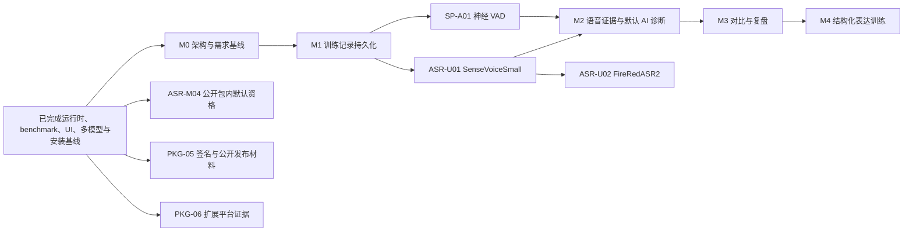

# Expression Trainer Roadmap

> 状态：Active
> 更新日期：2026-09-18
> 当前模式：内部开发/测试；公开模型分发、签名和扩展平台支持仍受外部条件约束。

## 1. 排序原则

- **P0**：没有它就无法安全继续，或会产生明显正确性、数据、构建或发布风险。
- **P1**：目标版本所需，但不阻塞最近一步。
- **P2**：稳定发布后再评估的增强。
- 每个阶段保持应用可运行，不同时重写 UI、Audio、ASR、模型和打包。
- 新增依赖、流程、门禁或抽象必须对应当前具体风险，并说明何时可以移除。
- 内部 benchmark 只服务模型选择与复评，不扩张为公开评测平台或审计系统。

## 2. 当前依赖关系

```mermaid
flowchart LR
  B[已完成运行时、benchmark、UI、多模型与安装基线] --> M0[M0 架构与需求基线]
  M0 --> M1[M1 训练记录持久化]
  M1 --> V1[SP-A01 神经 VAD]
  M1 --> U1[ASR-U01 SenseVoiceSmall]
  V1 --> M2[M2 语音证据与默认 AI 诊断]
  U1 --> M2
  M2 --> M3[M3 对比与复盘]
  M3 --> M4P[M4 结构化表达训练]
  B --> M4[ASR-M04 公开包内默认资格]
  B --> P5[PKG-05 签名与公开发布材料]
  B --> P6[PKG-06 扩展平台证据]
  U1 --> U2[ASR-U02 FireRedASR2]
```

M0/M1 是当前产品关键路径。M2 接入 SenseVoiceSmall 作为可选主 ASR，并在持久化音频之上加入神经 VAD 证据与默认 AI 诊断。ASR-M04 受模型再分发许可和公开制品条件约束，可作为独立外部门禁跟进；FireRedASR2 仍不进入当前关键路径。

## 3. 已完成基线

逐任务步骤和阶段 handoff 由 Git 历史承担；这里仅保留继续开发所需的结果。

| 范围 | 已完成结果 | Canonical 证据 |
|---|---|---|
| Phase 0-1 | 可复现开发基线、核心测试、安全渲染、设置迁移、LLM 请求控制、Electron smoke | [开发与验证](development.md)、[当前架构](architecture/current.md) |
| Phase 2-3 | 冻结语料、可复跑 benchmark、七候选比较、Zipformer Large 技术默认 | [Harness](benchmark/harness.md)、[BM-04 结果](benchmark/bm04-seven-model-comparison-2026-08-30.md)、[ADR-0009](architecture/adr/0009-productize-multiple-asr-models.md) |
| Phase 4 | ASR session/event、AudioCapture/AudioWorklet、有界传输、utility process、Model Manager、配置与诊断边界 | [当前架构](architecture/current.md) |
| Phase 5 | Windows x64 Forge/Squirrel 制品、真实模型首次安装、离线二次启动、升级和卸载数据保留 | [支持矩阵](support-matrix.md)、[ADR-0007](architecture/adr/0007-package-with-electron-forge.md) |
| CONV-01～03 | 文档职责收敛、benchmark writer 竞态修复、LLM provider 配置迁移 | [CHANGELOG](../CHANGELOG.md)、Git 历史 |
| UI-01～02 | 四套主题、双布局、窗口同步和响应式尺寸 | [当前架构](architecture/current.md) |
| ASR-M01～M03、ASR-M04a | 三模型 Catalog/Factory、选择恢复、安装切换与内部包内默认资格 | [当前架构](architecture/current.md)、[ADR-0009](architecture/adr/0009-productize-multiple-asr-models.md) |

## 4. 当前执行轨道

### 4.1 Product baseline and persistence

| ID | P | 状态 | 任务 | 完成标准 |
|---|---|---|---|---|
| M0 | P0 | Complete | 冻结需求、目标架构、训练数据模型、训练/报告流程、Speech Engine 契约、Backlog 和 M1 范围 | 于 2026-09-16 完成基线一致性审查；M1 无需重议产品目标、数据模型和主要架构边界即可开发 |
| M1 | P0 | In progress | Training Persistence：SQLite/音频存储基础已实现，待接入 Application API、录音完成与历史界面 | 满足 [M1 milestone](milestones/m1-training-persistence.md) 的 AC-M1-01～10 |

M0 的 Complete 记录上述历史完成事件；[当时的审查](archive/reviews/m0-consistency-review-2026-09-16.md)已归档，不证明后续修订仍通过审查。后续修订按[文档维护规则](README.md#维护规则)验证。

目标交互与 Screen Structure 统一见 [Training Flow](product/training-flow.md)，阶段切片见 M1/M2 milestone。本轮已确认的结构和导航不再作为开放选项；当前 Screen / State 结构已收口，deferred 定位与实现细节分别由该文档 §13.5/§14 维护；Processing timeout 交付跟随 M2 AC-M2-05，未来视觉/设备选择跟随 Backlog B-13～B-15。后续原型只细化既有未决项，不把 M2–M4、Focus Mode 或交互细节自动加入 M1；暂缓/待决项及重开条件见 [Backlog](product/backlog.md)。

### 4.2 Streaming ASR public delivery

| ID | P | 状态 | 任务 | 完成标准 |
|---|---|---|---|---|
| ASR-M04 | P1 | External gate | Zipformer Large 公开包内默认资格（内部资格 ASR-M04a 已完成） | 剩余：获得再分发批准；公开候选制品通过离线首次导入、native 初始化、二次启动和升级保留验证；公开发布条件见 §4.4 |

### 4.3 M2 speech evidence and default AI diagnosis

| ID | P | 状态 | 任务 | 完成标准 |
|---|---|---|---|---|
| TIME-M201 | P0 | Planned / M2 | 契约化绝对时间与质量事件 | 按 [M2 AC-M2-01](milestones/m2-speech-evidence-and-ai-diagnosis.md#acceptance-criteria) 验收 |
| SP-A01 | P0 | Planned / M2 | 神经 VAD 语音活动与静音区间 | 按 [R-A09](product/requirements.md#6-m2表达证据ai-分析与雷达图)、M2 AC-M2-02 验收；关闭 D-07 |
| ASR-U01 | P1 | Planned / M2 | SenseVoiceSmall 可选主 ASR | 按 [R-A10](product/requirements.md#6-m2表达证据ai-分析与雷达图)、M2 AC-M2-02/06 验收；关闭 D-08 |
| METRIC-M201 | P0 | Planned / M2 | 时间度量与 Common Analysis | 按 M2 AC-M2-03 验收；关闭 D-03/D-04 的对应定义 |
| AI-M201 | P0 | Planned / M2 | 默认结构化 AI 诊断与建议 | 按 M2 AC-M2-04 验收；关闭 D-09/D-10 |
| REPORT-M201 | P1 | Planned / M2 | 统一报告与证据驱动雷达图 | 按 M2 AC-M2-05 验收；重练执行仍归 M4 |
| ASR-U02 | P2 | Deferred | FireRedASR2 多来源安装和 utterance UX | SenseVoiceSmall 实施完成后，产品证据表明第二个 utterance 模型能改变用户结果 |

### 4.4 Delivery and maintenance

| ID | P | 状态 | 任务 | 触发/完成条件 |
|---|---|---|---|---|
| PKG-05 | P1 | Planned | 代码签名、checksums 和 release notes | 公开发布前具备凭据并验证来源与完整性 |
| PKG-06 | P1 | Planned | 扩展支持矩阵 | 每个提升支持等级的平台均有对应 package/smoke 证据 |
| OPS-01 | P1 | Deferred | 最小 CI/内测取包自动化 | 跨机取包成为反复痛点时增加可移除的手工 Windows workflow |
| OPS-03 | P1 | Ongoing | 受控运行时与依赖升级 | 只因具体安全或兼容风险升级，并重跑能发现实质回归的验证 |
| OPS-04 | P1 | Planned | 模型生命周期 | 定义 current/deprecated/removed、兼容期和回退 |
| OPS-06 | P2 | Deferred | 自动更新评估 | 至少两个稳定手工发布后用 ADR 决定是否采用 |

## 5. 里程碑

| 里程碑 | 状态 | 包含 | 结果 |
|---|---|---|---|
| M0 Architecture & Requirements Baseline | Complete | Gap、Requirements、Data Model、Training Flow、Speech Contract、Target、Backlog、M1、Consistency Review | M1 有稳定、可追踪的实施边界 |
| M1 Training Persistence | In progress | R-P01～R-P09 | 按 [M1 milestone](milestones/m1-training-persistence.md) 交付持久化闭环与入口收敛 |
| M2 Speech Evidence & AI Diagnosis | Planned | R-A01～R-A11 | 按 [M2 milestone](milestones/m2-speech-evidence-and-ai-diagnosis.md) 依次交付时间/语音证据、确定性度量、Common Analysis、具有远程知情边界的默认结构化 AI 诊断、统一报告和证据驱动雷达图 |
| M3 Comparison & Review | Planned | R-R01～R-R02；R-R03/R-R04 deferred | 按 [Training Flow §13.2–§13.4](product/training-flow.md#132-history-与-comparison--review) 交付 History 发起的 Comparison 与 Report 下钻返回；Comparison Compatibility 细化见 D-13；趋势与 Finding-scoped AI 对话按 B-16/B-17 重开，不作为当前 Comparison 完成依赖 |
| M4 Structured Training | Planned | R-F01～R-F08 | Free/Structured 选择、PREP/STAR/Pyramid、Framework Analysis 与问题重练闭环（复用 M3 比较能力；重练不强制选择框架） |
| Streaming ASR public delivery | In progress | ASR-M01～M04（含 M04a 内部资格） | 已完成部分见 §3；剩余公开交付任务及门槛见 §4.2；这是并行交付轨道，不占用产品里程碑编号 |
| Public desktop delivery | External gate | PKG-05、PKG-06 | 签名、许可和目标平台证据满足公开发布；这是外部门禁，不是 M4 的后续产品里程碑 |

## 6. 明确不做

当前阶段排除项见 [M1 Out of Scope](milestones/m1-training-persistence.md#out-of-scope) 与 [M2 Out of Scope](milestones/m2-speech-evidence-and-ai-diagnosis.md#out-of-scope)；长期暂缓事项与重开条件只由 [Backlog](product/backlog.md#not-now) 维护。不得因排期或文档整理新增产品/技术范围。

## 7. 外部跟进

- 真实可配置麦克风和接近 4-core/8-GB/3-GB 资格线设备的运行证据。
- Zipformer Large 等模型的公开再分发许可。
- Windows 签名凭据；macOS/Linux/ARM64 对应构建与 native 模型证据。

## 8. 维护规则

遵循 [唯一文档治理入口](README.md#维护规则)。本文件只保留未完成工作、依赖、外部门禁和已完成基线摘要；逐任务日志由 Git 历史承担。
